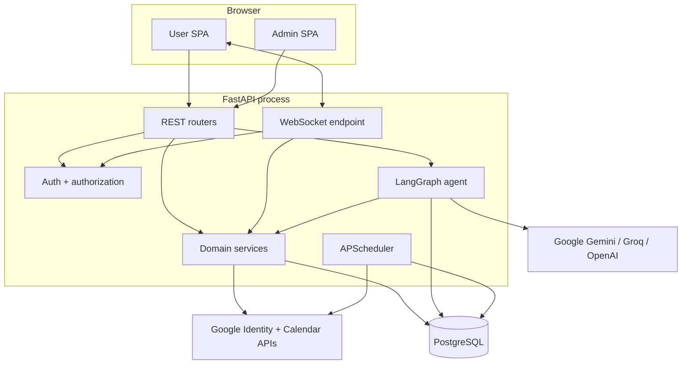
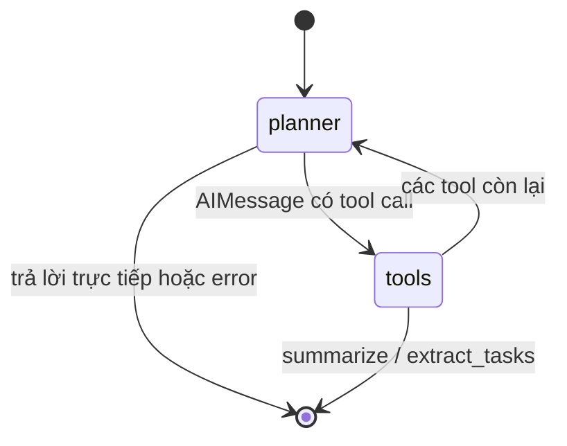
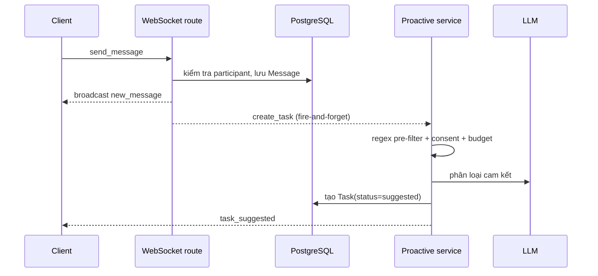
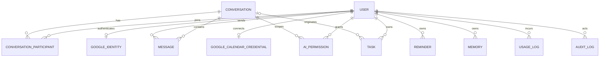
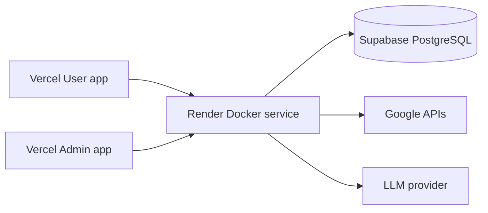

# Kiến trúc hệ thống Orbit

> Tài liệu kỹ thuật “as implemented”, đối chiếu trực tiếp với code ngày 15/08/2026. Tài liệu này mô
> tả boundary, runtime, dữ liệu và rủi ro; [SYSTEM_OVERVIEW.md](SYSTEM_OVERVIEW.md) là bản nhập môn.

## 1. Mục tiêu và nguyên tắc kiến trúc

Orbit là một **modular monolith** có realtime và AI agent. Kiến trúc hiện tại ưu tiên:

- một backend async dùng chung cho REST, WebSocket, agent và background jobs;
- PostgreSQL làm nguồn dữ liệu bền vững duy nhất ở runtime;
- xác thực danh tính tách khỏi authorization theo resource;
- yêu cầu người dùng xác nhận trước mọi agent tool có tác dụng phụ;
- cô lập dữ liệu theo user/participant, không cấp admin quyền đọc chat mặc định;
- hỗ trợ thay LLM provider mà không thay luồng agent.

## 2. Context và container



Mọi khối trong `Backend` cùng process và cùng vòng đời FastAPI. Không có queue, Redis, worker riêng
hay event bus phân tán.

## 3. Boundary trong code

| Layer | Vị trí | Trách nhiệm |
| --- | --- | --- |
| Bootstrap | `src/main.py`, `src/config.py` | Khởi tạo app, CORS, lifespan, settings |
| Transport | `src/api/`, `src/websocket/` | HTTP/WS contract, dependency injection, status code |
| Identity | `src/auth/` | JWT, bcrypt, Google ID-token, current-user dependency |
| Authorization | `src/services/authorization_service.py` | Platform role và conversation resource role |
| Domain/integration | `src/services/` | Chat, Calendar, credentials, reminders, usage, audit, proactive AI |
| Agent | `src/agents/` | StateGraph, planner và tool registry |
| Persistence | `src/db/` | ORM models, async session, migration |
| Contracts | `src/models/` | Pydantic schemas |
| Presentation | `Frontend/` | Hai SPA và source UI dùng chung |

Route nhìn chung mỏng và gọi service, nhưng một phần orchestration vẫn nằm trực tiếp trong route,
đáng chú ý ở agent chat và task side effects.

## 4. Runtime lifecycle

`src.main:app` dùng FastAPI lifespan:

1. Đọc `Settings` từ environment/`.env` (được cache bằng `lru_cache`).
2. Development/test gọi `Base.metadata.create_all()`; production cố ý bỏ qua.
3. Tải AI configuration đã lưu trong `platform_settings` và áp vào Settings đang cache.
4. Tạo `AsyncConnectionPool`, chạy `AsyncPostgresSaver.setup()` và compile LangGraph.
5. Khởi động APScheduler, đăng ký job `calendar_poll` dạng interval.
6. Khi shutdown: dừng scheduler và đóng checkpoint pool.

Hệ quả: request `/chat` chỉ hợp lệ sau khi lifespan hoàn tất. Lỗi kết nối database/checkpointer làm
startup thất bại, health check không lên.

## 5. API surface

Tất cả route nghiệp vụ nằm dưới `/api/v1`; `/health` nằm ở root.

| Prefix | Nhóm chức năng | Authorization |
| --- | --- | --- |
| `/auth` | register/login, Google login, profile, đổi mật khẩu | Public hoặc current user tùy route |
| `/conversations`, `/users` | danh sách user, hội thoại, message, read marker, AI consent | JWT + participant/resource role |
| `/chat`, `/chat/resume` | chạy/resume LangGraph | JWT; thêm participant + consent nếu có conversation |
| `/ws` | gửi/nhận event realtime | JWT trong query string + resource check mỗi message |
| `/tasks` | CRUD/status task | JWT + owner; conversation link được kiểm tra khi có |
| `/calendar` | OAuth connection và Calendar event | JWT, trừ OAuth callback dùng signed state |
| `/reminders` | list/create/cancel reminder | JWT + owner |
| `/memories` | CRUD memory | JWT + owner |
| `/admin` | health, users, AI config/usage, audit | `platform_admin` |
| `/platform/stats` | thống kê toàn nền tảng | `platform_admin` |

FastAPI tự sinh OpenAPI/Swagger tại `/docs` khi không bị hạ tầng ngoài chặn.

## 6. Identity và authorization

### 6.1 Danh tính

- Email/password: bcrypt hash trong `users.password_hash`.
- Google sign-in: frontend nhận ID token; backend xác minh audience/signature rồi liên kết qua
  `google_identities.google_sub`.
- Cả hai flow phát cùng loại JWT, subject là `user_id`.
- User bị `is_active=false` nhận 403 dù JWT còn hạn.

### 6.2 Hai trục quyền độc lập

```text
Platform:     user | platform_admin
Conversation: viewer < participant < manager
AI consent:   granted true/false cho từng (conversation, user)
```

`platform_admin` quản lý vận hành nhưng không bypass `require_conversation_access`. Conversation
không tồn tại hoặc user không phải participant đều trả 404 để giảm khả năng enumerate resource.
Participant có `revoked_at` cũng bị loại khỏi truy cập và broadcast.

Để AI đọc một hội thoại, caller phải vừa là participant vừa có `ai_permissions.granted=true` của
chính họ. Consent không yêu cầu tất cả thành viên trong nhóm đồng ý.

## 7. Kiến trúc agent

### 7.1 Graph



Graph có hai node:

- `planner`: dựng system prompt có thời gian theo `calendar_timezone`, bind 9 tool, gọi LLM và ghi
  usage.
- `tools`: `ToolNode(ALL_TOOLS)` thực thi tool call.

`summarize_conversation` và `extract_tasks` là terminal tool; output của chúng được trả thẳng để
tránh thêm một lượt LLM. Các tool khác quay lại planner để diễn đạt kết quả.

### 7.2 State và checkpoint

`AgentState` dùng reducer `add_messages` và chứa `context`, `user_id`, `conversation_id`, `error`
cùng một số draft field. `user_id` và `conversation_id` được server inject, không phải argument do
LLM tự chọn.

Runtime thật dùng `AsyncPostgresSaver`, checkpoint theo `configurable.thread_id`. Test dùng
`MemorySaver`. Checkpoint giúp resume sau `interrupt()` và giữ lịch sử agent qua restart.

### 7.3 Tool registry

| Tool | Read/write | Cần xác nhận |
| --- | --- | --- |
| `summarize_conversation` | Gọi LLM trên context | Không |
| `extract_tasks` | Gọi LLM, trả JSON task draft | Không |
| `search_messages` | PostgreSQL `ILIKE` trong conversation hiện tại | Không |
| `list_calendar_events` | Đọc Google Calendar của user | Không |
| `create_calendar_event` | Tạo Google Calendar event | Có |
| `update_calendar_event` | Sửa Google Calendar event | Có |
| `delete_calendar_event` | Xóa Google Calendar event | Có |
| `list_reminders` | Đọc reminder của user | Không |
| `create_reminder` | Ghi DB + schedule job | Có |

Human-in-the-loop dùng `interrupt(payload)` và `Command(resume=...)`. Client có thể approve, reject
hoặc gửi edits; tool chỉ thực hiện side effect sau khi graph được resume với `approved=true`.

### 7.4 Provider và ngân sách

`get_llm()` hỗ trợ `google`, `groq`, `openai`. Admin có thể chọn provider/model/temperature từ allowlist;
cấu hình được lưu vào `platform_settings` và áp dụng cho các call tiếp theo trong process.

Mỗi call ghi prompt/completion/total token vào `usage_logs`, không ghi prompt content. Ngưỡng 80%
và 100% tạo cảnh báo realtime cho admin. `/chat` mới và proactive detection bị chặn khi vượt budget;
`/chat/resume` vẫn được phép để hoàn tất flow đã chờ xác nhận.

## 8. Chat realtime và proactive AI

WebSocket manager giữ `dict[user_id, set[WebSocket]]` trong RAM. Client reconnect sau 2 giây. Các
event chính gồm message mới, task suggestion/update, calendar change, reminder fired và budget alert.

Luồng gửi message:



REST gửi message cũng khởi chạy proactive detection bằng FastAPI `BackgroundTasks`. Mọi exception
trong flow proactive được log và không làm thất bại việc gửi tin.

## 9. Calendar và scheduler

`google_identities` chỉ phục vụ đăng nhập. `google_calendar_credentials` là flow riêng, giữ refresh
token/access token được mã hóa Fernet, scope và incremental `sync_token` cho từng user.

Calendar service gọi Google API trong threadpool vì client Google là synchronous. Thay đổi qua app
được broadcast ngay; thay đổi trực tiếp trên Google được job `calendar_poll` phát hiện. Poll chỉ chạy
cho user đang có WebSocket và đã kết nối Calendar. HTTP 410 làm reset sync token và full sync lại.

APScheduler dùng `SQLAlchemyJobStore` qua psycopg sync. Reminder có hai lớp persistence:

- row domain trong `reminders` giữ nội dung/trạng thái;
- row trong `apscheduler_jobs` giữ lịch thực thi.

Scheduler và web server cùng process, do đó uptime của web service quyết định độ đúng giờ.

## 10. Persistence model



### Trạng thái và constraint đáng chú ý

- Conversation: `direct | group`.
- Resource role: `viewer | participant | manager`.
- Task: source `manual | ai_extracted | proactive`; status `suggested | pending | in_progress |
  completed | dismissed`.
- Reminder: source `manual | agent | proactive`; status `scheduled | fired | cancelled`.
- User platform role: logic ứng dụng dùng `user | platform_admin`.

Không có vector store đang hoạt động. `chroma_persist_dir` là cấu hình dư; lịch sử agent nằm trong
checkpoint và message search là keyword search trong PostgreSQL.

## 11. Schema lifecycle

Alembic có chuỗi migration từ `20260803_01` đến `20260813_08`. Revision mới nhất xóa workspace,
external contacts và các bảng liên quan; downgrade cố ý không hỗ trợ vì mất dữ liệu không thể phục hồi.

- Development: startup gọi `create_all()`, tiện cho database mới nhưng không nâng cấp bảng đã tồn tại.
- Production: startup không gọi `create_all()`; phải chạy `alembic upgrade head` trước khi start app.
- Test: cho phép SQLite in-memory cho unit test; integration checkpointer cần PostgreSQL riêng.

**Khoảng trống hiện tại:** `Dockerfile`, `render.yaml` và workflow deploy chưa có bước Alembic. Deploy
vào database trống hoặc schema cũ có thể fail ở startup/runtime. Pipeline cần một migration step có
quyền DB, chạy một lần trước khi chuyển traffic.

## 12. Frontend architecture

Hai Vite app có entry point/package riêng nhưng import chung code trong `Frontend/src`:

- `Frontend/user`: route sản phẩm cho user, port dev 5173.
- `Frontend/admin`: route vận hành nền tảng, port dev 5174.
- `Frontend/src/api/client.js`: chuẩn hóa base URL, Bearer header và lỗi API.
- `AuthContext`: giữ JWT/user; `ProtectedRoute` và `AdminGuard` bảo vệ UI.
- `AppLayout`: sở hữu WebSocket dùng chung, phân phối `subscribe/sendJson` qua outlet context.

UI guard chỉ phục vụ trải nghiệm; backend dependency luôn là lớp authorization quyết định.

## 13. Deployment topology



Đây là topology được cấu hình trong repo, không phải bằng chứng môi trường thật đang online.
`docker-compose.yml` cung cấp backend + PostgreSQL local. Render build `Dockerfile`; Vercel dùng SPA
rewrite. GitHub Actions lint/test với PostgreSQL, gọi Render deploy hook sau CI và có keep-alive cron.

## 14. Security posture

### Đã triển khai

- JWT authentication, bcrypt password hash, account disable check.
- Resource authorization cho conversation và owner check cho dữ liệu cá nhân.
- Per-user consent trước khi AI đọc chat.
- Fernet encryption cho Calendar credential at rest.
- Human confirmation cho agent side effects.
- Pydantic validation và production settings validation.
- Audit metadata loại bỏ một số key nhạy cảm; usage log không lưu prompt content.
- System prompt có chỉ dẫn chống prompt injection từ conversation/tool data.

### Rủi ro còn lại

| Mức | Rủi ro | Ảnh hưởng / hướng xử lý |
| --- | --- | --- |
| Cao | Owner của `thread_id` chỉ lưu trong `_thread_owners` RAM, trong khi checkpoint bền vững và `thread_id` do client gửi | Sau restart/multi-worker, thread biết trước có thể bị process khác nhận. Lưu `(thread_id, owner_id)` trong DB và kiểm tra trước cả invoke/resume |
| Cao | Production deploy không tự chạy Alembic | Database mới/cũ có thể thiếu schema. Thêm pre-deploy migration và backup/rollback procedure |
| Trung bình | WebSocket manager chỉ in-memory | Multi-instance không broadcast chéo. Dùng Redis pub/sub hoặc một realtime service |
| Trung bình | APScheduler nằm trong mọi web process | Sleep làm reminder trễ; nhiều replica có thể chạy poll/job cạnh tranh. Tách dedicated worker và leader lock |
| Trung bình | JWT truyền trong WebSocket query string | Token có thể xuất hiện trong proxy/access log. Dùng short-lived WS ticket hoặc cookie/header phù hợp hạ tầng |
| Trung bình | Chưa rate limit API/LLM/auth | Có thể brute force hoặc đốt quota. Thêm rate limit theo IP/user/route |
| Thấp | Không có E2E encryption | Server/database/LLM provider nhìn thấy plaintext cần thiết cho xử lý; phải mô tả rõ trong privacy policy |

Ngoài ra, không nên scale backend trên một worker cho tới khi ba trạng thái process-local (WebSocket,
thread ownership, scheduler leadership) được thay thế hoặc điều phối.

## 15. Observability và kiểm thử

- `/health` chỉ xác nhận process trả lời và environment, không probe DB/LLM/scheduler.
- `/api/v1/admin/system-health` kiểm tra DB, scheduler, WebSocket count và cấu hình LLM cho admin.
- Logging chủ yếu dùng Python logging; chưa có structured log, trace, metrics exporter hoặc error tracker.
- CI chạy Ruff và toàn bộ pytest với PostgreSQL service; unit test có thể dùng SQLite/MemorySaver.
- `scripts/eval_extract_tasks.py` là eval LLM thủ công, không nằm trong test deterministic.

## 16. Quyết định kiến trúc hiện tại

| Quyết định | Lý do | Trade-off |
| --- | --- | --- |
| Modular monolith | Đơn giản triển khai và phát triển | Background/realtime khó scale độc lập |
| PostgreSQL-only runtime | Dùng chung persistence cho domain, scheduler, checkpoints | Setup local nặng hơn SQLite |
| LangGraph | Có state/checkpoint/interrupt cho HITL | Thread lifecycle và ownership phải quản trị chặt |
| Per-user Calendar OAuth | Cô lập đúng tài khoản từng user | Quản lý token, polling và quota phức tạp |
| Multi-provider LLM | Đổi model khi quota/chi phí thay đổi | Khác biệt tool-calling giữa provider cần test |
| Không vector store | Tránh thêm hạ tầng khi chưa có use case rõ | Chưa có semantic search xuyên hội thoại |
| Admin không đọc chat | Privacy mặc định tốt hơn | Khó hỗ trợ/điều tra nội dung khi có sự cố |

## 17. Ưu tiên kỹ thuật đề xuất

1. Thêm Alembic pre-deploy step và kiểm chứng deploy trên database trống.
2. Persist agent thread ownership, ràng buộc thread với user và thêm test restart/cross-user.
3. Tách scheduler thành một worker duy nhất hoặc thêm distributed lock.
4. Thêm Redis/pub-sub trước khi chạy nhiều backend replica.
5. Thêm rate limiting, short-lived WebSocket ticket và security headers.
6. Nâng `/health` thành liveness/readiness riêng; thêm structured logging và error monitoring.
