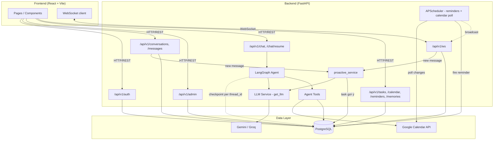
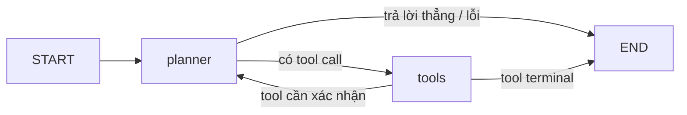
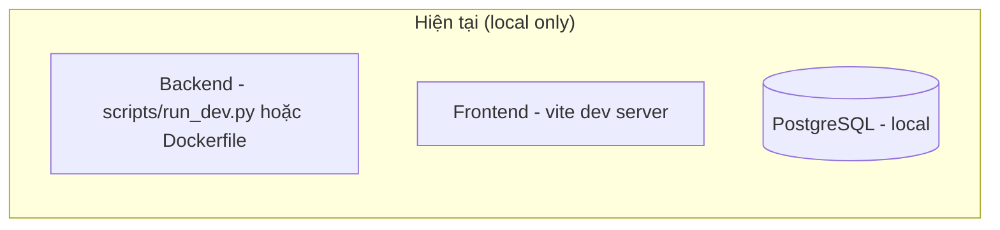

# Architecture Document

## System Overview

Orbit là AI agent nhúng trong ứng dụng chat: FastAPI + LangGraph ở backend, React + Vite ở
frontend, **PostgreSQL** làm database (SQLite vẫn được hỗ trợ cho dev nhanh không cần cài gì, xem
mục Database). Backend có auth thật (JWT + bcrypt), nhắn tin 1-1/nhóm realtime qua WebSocket, phân
quyền role user/admin, và agent LangGraph (LLM: Google Gemini hoặc Groq, đổi qua `.env`) với các
tool có human-in-the-loop (calendar, reminder) cùng tool tóm tắt/trích xuất task. Toàn bộ tính
năng người dùng (Tasks, Calendar, Reminders, Memory, Profile, AI Assistant, Admin) đã nối API thật
— không còn trang nào dùng mock data.

## Architecture Diagram

## Components

### 1. Frontend (React + Vite)
- **Purpose:** SPA cho toàn bộ trải nghiệm người dùng — auth, chat realtime, AI assistant, quản lý
  cá nhân (task/lịch/nhắc việc/memory/hồ sơ), admin.
- **Trang chính** (`Frontend/src/pages/`): `LoginPage`/`RegisterPage`, `ChatPage`, `TaskPage`,
  `CalendarPage`, `ReminderPage`, `MemoryPage`, `ProfilePage`, `PersonalAssistantPage` (`/assistant`
  — chat trực tiếp với agent, có nút Xác nhận/Huỷ khi agent cần human-in-the-loop), và 4 trang admin
  (`admin/AdminDashboardPage`, `AdminUsersPage`, `AdminConversationsPage`, `AdminUserDataPage` —
  quản lý Task/Reminder/Memory toàn hệ thống). Tất cả gọi API thật qua `Frontend/src/api/`, không
  còn trang nào dùng `Frontend/src/data/mockData.js`.
- **Panel AI trong chat** (`AIPanel.jsx`): Summarize, Extract tasks, Find schedule, Deadlines,
  Suggest reminder (có nút Xác nhận/Huỷ ngay trong panel), và ô tự do "Ask Orbit".
- **State Management:** React Context (`AuthContext` cho JWT/user hiện tại) + hook riêng theo tính
  năng (`useConversations`, `useMessages`), kênh WebSocket dùng chung qua `AppLayout.jsx` (Outlet
  context `subscribe`/`sendJson`) thay vì mỗi trang tự mở kết nối riêng.

### 2. Backend (FastAPI)
- **Purpose:** REST API + WebSocket cho auth, nhắn tin, quản trị, dữ liệu cá nhân, và cổng vào AI
  agent.
- **API Design:** RESTful, mounted dưới `/api/v1` — `auth_routes.py`, `chat_routes.py`,
  `admin_routes.py`, `routes.py` (agent chat), `task_routes.py`, `calendar_routes.py`,
  `reminder_routes.py`, `memory_routes.py`. Route mỏng — business logic nằm ở `src/services/`.
- **Authentication:** JWT (PyJWT), password hash bcrypt (`src/auth/`). `get_current_user` +
  `require_admin` dependency cho phân quyền 2 role (`user`/`admin`). `/api/v1/chat` verify thêm
  người gọi có phải participant của `conversation_id` (nếu có truyền) trước khi cho agent xử lý.

### 3. AI Agent (LangGraph)
- **Agent Type:** Plan-and-execute dạng đơn giản — 1 node `planner` (LLM bound tools) ⇄ 1 node
  `tools` (`ToolNode`), lặp tới khi planner trả lời không kèm tool call. Tool không cần xác nhận
  (`summarize_conversation`, `extract_tasks`) dừng ngay sau khi chạy — dùng thẳng output làm câu trả
  lời, không gọi LLM lần 2 để "relay" lại (từng gây lỗi 400 do model tự hallucinate cú pháp tool call).
- **State:** `AgentState` (TypedDict, `total=False`) — `messages` (reducer `add_messages`),
  `context`, `summary`, `error`, `user_id`, ... (`src/agents/state.py`).
- **Nodes:** `planner_node` (`src/agents/nodes/planner_node.py`) — bind `ALL_TOOLS`, inject ngày
  giờ hiện tại theo `calendar_timezone` vào system prompt (tránh agent đoán sai "tomorrow"/"next
  Monday"), ghi token usage qua `usage_service.log_usage`, bắt exception vào `state["error"]`.
- **Tools** (`src/agents/tools/`, registry `ALL_TOOLS` trong `tools/__init__.py`):
  - `summarize_conversation`, `extract_tasks` — đọc `state["context"]`, không cần xác nhận.
  - `create_calendar_event` / `list_calendar_events` / `update_calendar_event` /
    `delete_calendar_event` — Google Calendar thật qua `google-api-python-client`; mọi thao tác có
    tác dụng phụ đều bắt buộc `interrupt()` chờ xác nhận người dùng trước khi gọi API thật.
  - `create_reminder` / `list_reminders` — tương tự, `create_reminder` bắt buộc `interrupt()` trước
    khi lên lịch qua APScheduler (`SQLAlchemyJobStore`, bền vững qua restart).
- **Checkpointer (memory hội thoại):** `MemorySaver` (mất khi restart) khi `DATABASE_URL` là
  SQLite; `AsyncPostgresSaver` (bền vững qua restart) khi là Postgres — xây trong
  `init_checkpointer()` lúc FastAPI lifespan khởi động, vì cần chạy trong event loop đang hoạt động
  (`src/agents/graph.py`).
- **Flow:**

### 4. Agent chủ động (Proactive)
- **Purpose:** phát hiện cam kết/lịch hẹn/hạn chót ngay khi tin nhắn mới tới, không cần người dùng
  chủ động yêu cầu — mục "Nâng cao" của đề bài.
- **Cách hoạt động** (`src/services/proactive_service.py::maybe_suggest_task`): chạy nền
  (fire-and-forget) sau mỗi tin nhắn gửi qua REST (`chat_routes.py`, `BackgroundTasks`) hoặc
  WebSocket (`websocket/routes.py`, `asyncio.create_task` giữ tham chiếu tránh bị GC). Pre-filter
  rẻ bằng regex (EN+VI) trước khi gọi LLM để tiết kiệm chi phí; nếu qua bộ lọc, hỏi LLM xác nhận có
  cam kết thật không, rồi tạo `Task` (`status="suggested"`, `source="proactive"`) và đẩy WebSocket
  `task_suggested` → toast `TaskSuggestedToast.jsx` + mục "AI suggestions" trong `/tasks` để người
  dùng Accept/Dismiss. Toàn bộ bọc try/except — lỗi không bao giờ chặn việc gửi tin nhắn.

### 5. Database
- **Type hiện tại:** **PostgreSQL** qua SQLAlchemy async (`asyncpg`), cấu hình qua `DATABASE_URL`
  trong `.env`. SQLite (`sqlite+aiosqlite`) vẫn được hỗ trợ song song cho dev nhanh không cần cài gì
  (`src/db/session.py::_async_url()` tự chọn driver theo scheme) — khi dùng SQLite, agent checkpoint
  rơi về `MemorySaver` (mất khi restart) thay vì `AsyncPostgresSaver`.
- **Windows + Postgres:** bắt buộc chạy bằng `python scripts/run_dev.py` thay vì `uvicorn` CLI trực
  tiếp — `AsyncPostgresSaver` cần `SelectorEventLoop`, nhưng CLI `uvicorn` trên Windows luôn chọn
  `ProactorEventLoop` trước khi app được import, không cờ nào sửa được; `run_dev.py` gọi
  `uvicorn.run()` trực tiếp bằng Python để chỉ định đúng loại event loop.
- **Migration:** không dùng Alembic — schema mới vá bằng `ALTER TABLE` tay trong
  `src/db/session.py::_add_missing_user_columns()` (chỉ áp dụng nhánh SQLite, cho cột thêm vào
  `User`); bảng hoàn toàn mới thì `Base.metadata.create_all()` tạo tự động trên cả hai driver, không
  cần patch riêng.
- **Tables hiện có** (`src/db/models.py`): `User` (role, is_active, job_title, timezone,
  preferences), `Conversation`, `ConversationParticipant`, `Message`, `Task` (status
  suggested/pending/in_progress/completed/dismissed, source manual/proactive), `Reminder` (status
  scheduled/fired/cancelled), `Memory` (ghi chú cá nhân người dùng tự thêm — category/title/detail,
  **khác** với agent checkpoint memory ở trên), `UsageLog` (token mỗi lần gọi LLM),
  `CalendarSyncState` (1 dòng, lưu `syncToken` cho polling đồng bộ Google Calendar). Ngoài ra
  APScheduler tự quản bảng `apscheduler_jobs`, và khi dùng Postgres, LangGraph tự quản các bảng
  `checkpoints`/`checkpoint_blobs`/`checkpoint_writes`/`checkpoint_migrations`.

### 6. Vector Store
- **Hiện tại:** chưa nối — `chroma_persist_dir` khai báo sẵn trong `src/config.py` nhưng không nơi
  nào trong code thực sự dùng embedding/vector search.
- **Đánh giá:** yêu cầu "Cơ bản" về memory hội thoại đã đạt qua `AsyncPostgresSaver` (memory theo
  từng thread), và "Memory cá nhân" (sở thích, thói quen...) đã đạt qua tính năng Memory (ghi chú do
  người dùng tự thêm, `/memory`). Đề bài chỉ liệt kê Qdrant/pgvector ở mục "Tech stack gợi ý", không
  phải yêu cầu đầu ra bắt buộc — nên vector store dài hạn hiện **không còn là việc cần làm rõ ràng**,
  chỉ cân nhắc nếu sau này cần semantic search xuyên nhiều hội thoại cũ.

## Data Flow

1. User gửi tin nhắn/thao tác từ Frontend qua REST hoặc WebSocket.
2. Route xác thực (JWT) và validate input (Pydantic schema trong `src/models/`).
3. Với tin nhắn người-với-người: broadcast realtime qua `src/websocket/` tới thành viên khác, đồng
   thời chạy nền `proactive_service.maybe_suggest_task` để phát hiện cam kết/lịch hẹn.
4. Với tin nhắn agent (`POST /api/v1/chat`): verify participant nếu có `conversation_id`, build
   `AgentState`, chạy qua LangGraph (`src/agents/graph.py::agent`, checkpoint theo `thread_id`).
5. Planner gọi LLM (Gemini/Groq); nếu cần hành động có tác dụng phụ (calendar/reminder), graph dừng
   lại ở `interrupt()` chờ xác nhận qua `POST /api/v1/chat/resume`.
6. Song song, APScheduler chạy 2 job nền: bắn `reminder_fired` đúng giờ hẹn, và poll Google Calendar
   mỗi `CALENDAR_POLL_INTERVAL_SECONDS` (mặc định 20s) để bắt thay đổi tạo trực tiếp trong Google
   Calendar (ngoài app) — cả hai đẩy kết quả qua WebSocket cho người liên quan.

## Deployment Architecture

`Dockerfile` (multi-stage, non-root, healthcheck `/health`) và `docker-compose.yml` định nghĩa
service `backend` nhưng **chưa deploy online thật** — chưa có domain public, chưa có CD workflow
ngoài `ci.yml` (lint + test trên GitHub Actions). Đây là hạng mục lớn nhất còn thiếu so với đề bài.

## Security

- API key/secret đọc từ `.env` (không commit), ví dụ `GOOGLE_API_KEY`, `GROQ_API_KEY`, `SECRET_KEY`.
- Input validation qua Pydantic ở mọi route.
- Password hash bcrypt, JWT cho auth — xem quy ước "không tự ý đổi cơ chế" trong `CLAUDE.md`.
- CORS cấu hình qua `cors_origins` trong `.env`.
- Human-in-the-loop bắt buộc cho mọi tool có tác dụng phụ (calendar, reminder) — không được bỏ
  qua kể cả để test nhanh (quy ước trong `CLAUDE.md`).
- `/api/v1/chat` verify current_user là participant của `conversation_id` trước khi agent xử lý —
  chặn user A mượn nội dung hội thoại của user B qua request tự chế.
- Rate limiting: **chưa có** trên API endpoints — cân nhắc nếu deploy thật và mở public.
- Quyền AI đọc hội thoại: **vẫn chỉ là toggle UI cục bộ** trong `AIPanel.jsx` (chưa gắn backend) —
  đây là gap thật sự còn lại so với ràng buộc "agent chỉ đọc hội thoại được cấp quyền" trong đề bài,
  panel đã bổ sung dòng minh bạch báo người dùng biết nội dung sẽ được gửi sang Gemini/Groq, nhưng
  chưa có cơ chế chặn ở backend nếu quyền bị thu hồi.
- Không có mã hoá đầu-cuối (E2E) — quyết định có chủ đích, xem `ROADMAP.md`.

## Design Decisions

| Decision | Choice | Reason |
| --- | --- | --- |
| Backend framework | FastAPI | Async, auto-docs (`/docs`), type-safe qua Pydantic |
| Agent orchestration | LangGraph | Quản lý state + human-in-the-loop (`interrupt`) sẵn có, phù hợp yêu cầu xác nhận trước hành động |
| LLM provider | Google Gemini hoặc Groq (`src/services/llm.py::get_llm()`, đổi qua `LLM_PROVIDER`) | Đổi được khi 1 bên hết quota — thực tế đã cần dùng đến (Gemini free-tier từng về 0 quota) |
| Database | PostgreSQL (SQLite vẫn hỗ trợ cho dev nhanh) | Cần cho agent memory bền vững qua restart (`AsyncPostgresSaver`) và các bảng mới chịu tải tốt hơn |
| Vector store | Không triển khai | Yêu cầu memory đã đạt qua checkpointer + tính năng Memory ghi chú; không có nhu cầu semantic search rõ ràng để biện minh thêm 1 service |
| Frontend framework | React + Vite | Giữ nguyên so với đề bài gợi ý Next.js — tránh viết lại toàn bộ frontend không tương xứng lợi ích |
| Realtime | WebSocket thuần (FastAPI) | Dùng chung 1 kênh cho chat, reminder-fired, proactive-suggestion, calendar sync — không mở kênh song song |
| Scheduler | APScheduler (`SQLAlchemyJobStore`) | Bền vững qua restart, dùng chung cho reminder-fire và calendar-poll thay vì đổi hẳn sang BullMQ/Node |
| Đồng bộ Google Calendar | Polling định kỳ với `syncToken` (không phải webhook `events.watch`) | Webhook thật của Google cần domain public HTTPS mà project chưa deploy — polling là lựa chọn thực tế, có thể nâng cấp lên webhook sau khi deploy |

Tiến độ triển khai theo giai đoạn và các hạng mục còn lại: xem [ROADMAP.md](ROADMAP.md).
