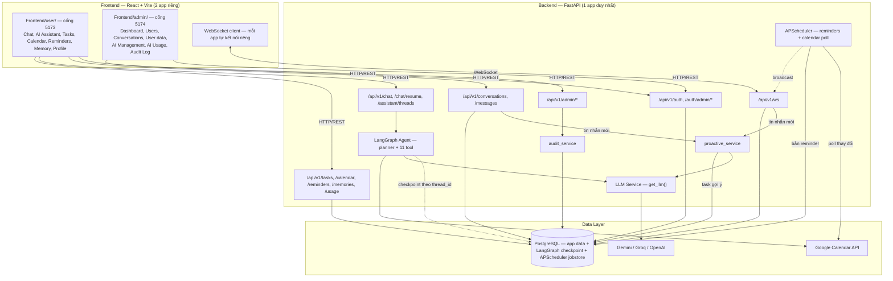
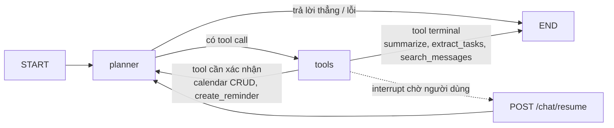

# Architecture Diagram

> **Đây là bản sao của [`/docs/architecture_diagram.md`](../docs/architecture_diagram.md)**, gom vào `Deliverables/` cho tiện xem cùng README và Manual Test Cases. File gốc ở `/docs/architecture_diagram.md` mới là vị trí chính thức theo checklist khoá học ("Architecture Diagram" → `/docs/architecture_diagram.md`) — sửa nội dung thì sửa ở đó trước, đồng bộ lại đây sau.
>
> Bản đầy đủ (Data Flow, Security, Design Decisions, bảng field-level từng model DB) nằm ở
> [../ARCHITECTURE.md](../ARCHITECTURE.md) — file này là bản rút gọn cho deliverable "System diagram +
> Component descriptions" của khoá học, giữ đồng bộ thủ công với file kia khi kiến trúc đổi.

## System Overview

## Agent Flow (LangGraph)

## Component Details

| Component | Technology | Purpose |
|-----------|-----------|---------|
| Frontend (user) | React 18, Vite, React Router, Bootstrap 5 | UI cho người dùng cuối — chat, AI assistant, task/lịch/nhắc việc/memory/hồ sơ |
| Frontend (admin) | React 18, Vite (app Vite riêng, không chung router với app user) | UI quản trị hệ thống — user, hội thoại, cấu hình AI, chi phí token, audit log |
| Backend | FastAPI (async), 1 process duy nhất phục vụ cả 2 frontend | REST API + WebSocket gateway, xác thực JWT/bcrypt |
| Agent orchestration | LangGraph | Vòng lặp planner ⇄ tool, human-in-the-loop qua `interrupt()`, checkpoint bền vững theo `thread_id` |
| LLM | Google Gemini / Groq / OpenAI (đổi qua `LLM_PROVIDER`, hoặc qua UI "AI Management" lúc đang chạy) | Sinh nội dung tóm tắt/trích task/trả lời chat |
| Database | PostgreSQL (bắt buộc — không còn hỗ trợ SQLite) qua SQLAlchemy async | Toàn bộ dữ liệu app + checkpoint LangGraph + jobstore APScheduler trong cùng 1 database |
| Realtime | WebSocket thuần (FastAPI), 1 kênh dùng chung cho chat/reminder/task/calendar/usage-alert | Đẩy sự kiện tới đúng người liên quan, không polling |
| Scheduler | APScheduler + `SQLAlchemyJobStore` | Bắn reminder đúng giờ, poll thay đổi Google Calendar định kỳ — cả hai bền vững qua restart |
| External API | Google Calendar API (OAuth per-user), Google/Groq/OpenAI LLM API | Lịch cá nhân thật + suy luận AI |
| Vector Store | Không triển khai (quyết định có chủ đích) | Yêu cầu memory đã đạt qua LangGraph checkpointer + tính năng Memory ghi chú — xem [../ARCHITECTURE.md](../ARCHITECTURE.md) mục Vector Store |

Chi tiết Data Flow, Security, Design Decisions và ERD field-level từng bảng: xem
[../ARCHITECTURE.md](../ARCHITECTURE.md). Tiến độ so với đề bài: xem [../ROADMAP.md](../ROADMAP.md).
