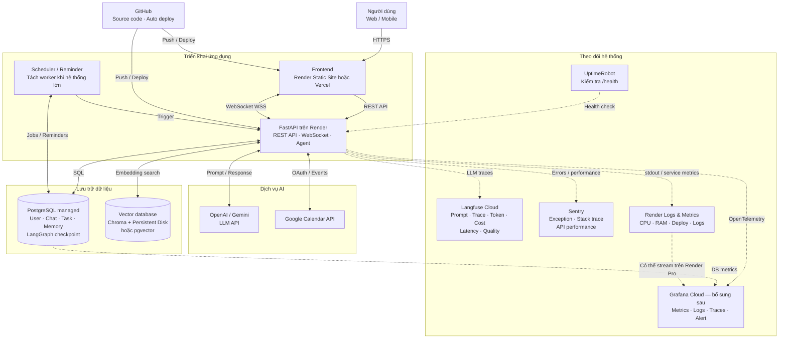

# Kiến trúc triển khai và theo dõi hệ thống



## Kiến trúc đề xuất cho MVP

- **Render Web Service:** chạy FastAPI, REST API, WebSocket và agent.
- **PostgreSQL managed:** lưu user, hội thoại, tin nhắn, task, memory, reminder, LangGraph checkpoint và scheduler job.
- **Langfuse Cloud:** theo dõi prompt, agent trace, tool call, token, chi phí, độ trễ và chất lượng đầu ra.
- **Sentry:** theo dõi exception, stack trace và hiệu năng API.
- **Render Logs & Metrics:** theo dõi log triển khai, log ứng dụng, CPU và RAM.
- **UptimeRobot:** gọi endpoint `/health` để phát hiện downtime.

## Vai trò của từng công cụ theo dõi

| Công cụ | Mục đích |
|---|---|
| Langfuse | Theo dõi hành vi và chất lượng của AI/LLM |
| Sentry | Phát hiện và phân tích lỗi trong code |
| Render Logs & Metrics | Theo dõi sức khỏe container và quá trình deploy |
| UptimeRobot | Kiểm tra dịch vụ còn hoạt động hay không |
| Grafana Cloud | Tổng hợp metrics, logs, traces và cảnh báo chuyên sâu |

## Lộ trình triển khai

### Giai đoạn demo hoặc đồ án

```text
GitHub
   │ Auto deploy
   ▼
Render FastAPI
   ├── PostgreSQL managed (Neon, Supabase hoặc Render Postgres)
   ├── Langfuse Cloud Free
   ├── Sentry Free
   ├── Render Logs
   └── UptimeRobot Free
```

Ở giai đoạn này chưa cần Grafana. Render, Langfuse và Sentry đã đủ để kiểm tra phần lớn lỗi vận hành và lỗi AI.

### Giai đoạn production nhỏ

- Chuyển Render Web Service sang gói luôn hoạt động, không sleep.
- Sử dụng PostgreSQL có backup và không hết hạn.
- Thiết lập cảnh báo lỗi trong Sentry và cảnh báo chi phí/latency trong Langfuse.
- Tách scheduler thành một worker riêng nếu cần chạy nhiều backend instance.
- Dùng `pgvector` thay Chroma local hoặc gắn Persistent Disk nếu vẫn sử dụng Chroma.

### Giai đoạn cần giám sát chuyên sâu

Bổ sung Grafana Cloud và OpenTelemetry:

```text
FastAPI
  └── OpenTelemetry
       ├── Metrics → Grafana Prometheus
       ├── Logs    → Grafana Loki
       └── Traces  → Grafana Tempo
```

Các dashboard nên theo dõi:

- Request mỗi phút và tỷ lệ lỗi HTTP `5xx`.
- P50, P95 và P99 latency.
- Số WebSocket đang kết nối.
- LLM latency, failure rate, token và chi phí.
- PostgreSQL connection count và query latency.
- Scheduler job thất bại.
- Reminder bị trễ hoặc không kích hoạt.
- CPU, RAM và số lần container restart.

## Lưu ý bảo mật

- Không gửi JWT, password, API key hoặc Google refresh token lên hệ thống quan sát.
- Hash hoặc ẩn danh `user_id` và `conversation_id` trước khi gửi trace.
- Cân nhắc che nội dung prompt/message chứa dữ liệu cá nhân.
- Tách cấu hình `staging` và `production` trong Langfuse và Sentry.
- Gắn Git commit SHA vào trace để xác định chính xác phiên bản gây lỗi.
