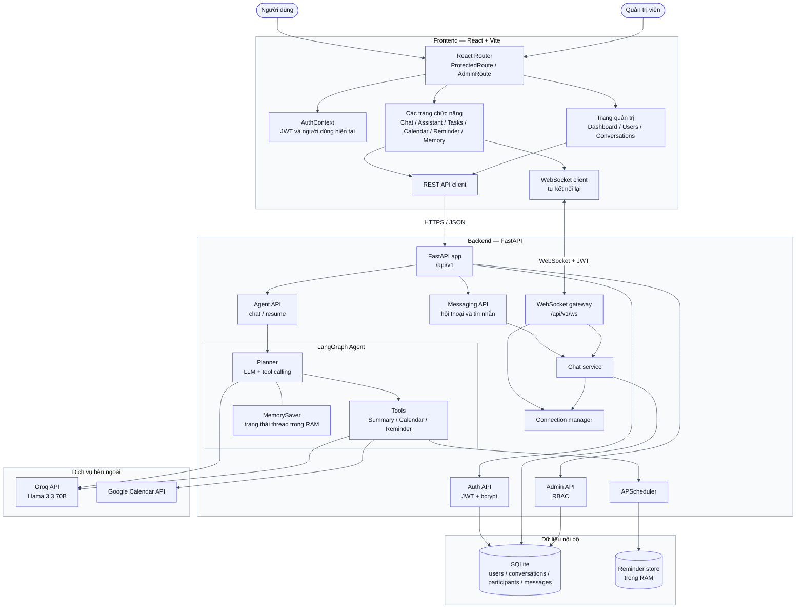
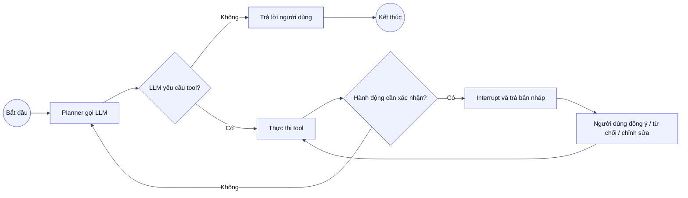
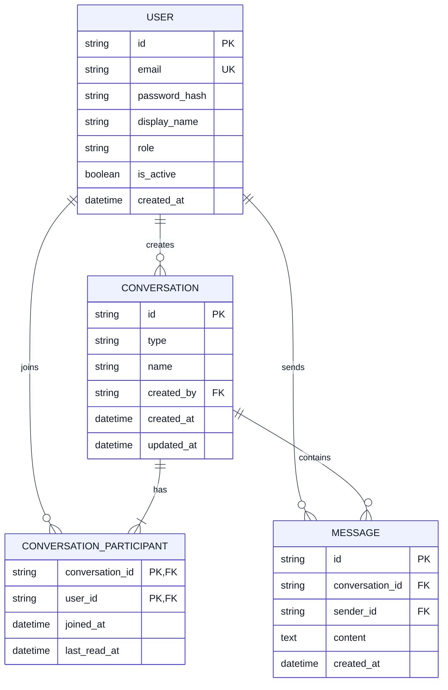

# P-132 — Tổng quan hệ thống và tài liệu chức năng

> Tài liệu phản ánh mã nguồn trên nhánh `tuan` tại commit `b4ae636` (02/08/2026).
> Trạng thái được xác định từ code đang chạy, không chỉ từ giao diện hoặc kế hoạch trong roadmap.

## 1. Giới thiệu

**Orbit** là trợ lý AI cá nhân được nhúng trong một ứng dụng chat. Hệ thống hướng tới việc giúp người dùng:

- nhắn tin 1-1 và theo nhóm theo thời gian thực;
- tóm tắt hội thoại bằng AI;
- tạo và xem sự kiện Google Calendar;
- tạo nhắc việc có bước xác nhận của người dùng;
- quản trị người dùng và kiểm duyệt hội thoại.

Repository gồm hai ứng dụng chạy độc lập:

- **Frontend:** React 18 + Vite trong `Frontend/`, mặc định chạy tại `http://localhost:5173`.
- **Backend:** FastAPI + LangGraph trong `src/`, mặc định chạy tại `http://localhost:8000`.

### Quy ước trạng thái

| Trạng thái | Ý nghĩa |
| --- | --- |
| ✅ Hoạt động | Đã có luồng frontend, backend và dữ liệu thật cần thiết cho chức năng chính |
| 🟡 Một phần | Đã có một phần xử lý thật nhưng còn thiếu tích hợp, lưu trữ hoặc giao diện |
| 🎨 UI mẫu | Có giao diện nhưng dùng dữ liệu tĩnh/local state, chưa nối backend |

## 2. Sơ đồ tổng quan hệ thống

## 3. Các khối kiến trúc

### 3.1 Frontend

Frontend là SPA dùng React Router. `ProtectedRoute` chặn các trang nghiệp vụ khi chưa đăng nhập; `AdminRoute` chặn trang quản trị nếu tài khoản không có role `admin`.

Các khối chính:

- `context/AuthContext.jsx`: giữ JWT và thông tin người dùng; token được lưu trong `localStorage`.
- `api/`: client gọi REST API và tạo WebSocket.
- `hooks/`: tải danh sách hội thoại và lịch sử tin nhắn.
- `components/chat/`: danh sách hội thoại, vùng tin nhắn, tạo hội thoại và panel AI.
- `pages/admin/`: dashboard, quản lý người dùng và kiểm duyệt hội thoại.
- `pages/` còn lại: giao diện trợ lý, task, lịch, nhắc việc, memory và profile.

### 3.2 Backend

FastAPI cung cấp ba nhóm xử lý chính:

1. **REST API:** xác thực, chat, quản trị và AI agent.
2. **WebSocket:** nhận/gửi tin nhắn thời gian thực cho các thành viên hội thoại.
3. **Lifespan services:** khởi tạo database và bật/tắt APScheduler cùng vòng đời ứng dụng.

Business logic của chat được tách vào `src/services/chat_service.py`. SQLAlchemy async làm việc với SQLite qua session trong `src/db/session.py`.

### 3.3 AI Agent

Agent sử dụng LangGraph với vòng lặp đơn giản:

Các tool đang được đăng ký:

| Tool | Chức năng | Xác nhận | Lưu ý |
| --- | --- | --- | --- |
| `summarize_conversation` | Tóm tắt phần hội thoại được truyền vào theo kiểu ngắn, chi tiết hoặc bullet | Không | Gọi Groq lần thứ hai để tạo bản tóm tắt |
| `create_calendar_event` | Tạo sự kiện Google Calendar từ bản nháp | Bắt buộc | Cần OAuth token Google hợp lệ |
| `list_calendar_events` | Liệt kê sự kiện trong khoảng thời gian | Không | Đọc trực tiếp từ Google Calendar |
| `create_reminder` | Lên lịch nhắc trước thời hạn | Bắt buộc | Chỉ lưu trong RAM và callback hiện mới ghi log |
| `list_reminders` | Liệt kê reminder trong bộ nhớ hiện tại | Không | Dữ liệu mất khi backend restart |

LangGraph dùng `MemorySaver`, vì vậy state theo `thread_id` cũng chỉ tồn tại trong process hiện tại và mất khi backend restart.

### 3.4 Dữ liệu

Database mặc định là `sqlite:///./data/app.db`. Hiện chưa có bảng cho task, calendar, reminder, memory, quyền đọc hội thoại của AI hoặc thống kê chi phí LLM.

## 4. Tài liệu chức năng

### 4.1 Xác thực và phân quyền — ✅ Hoạt động

- Đăng ký bằng email, tên hiển thị và mật khẩu.
- Kiểm tra email trùng trước khi tạo tài khoản.
- Hash mật khẩu bằng bcrypt; backend không lưu mật khẩu thô.
- Đăng nhập và cấp JWT có thời hạn cấu hình được.
- Khôi phục phiên bằng endpoint `/auth/me` khi tải lại trang.
- Đăng xuất phía frontend bằng cách xóa JWT khỏi `localStorage`.
- Hai role: `user` và `admin`.
- Email khớp `INITIAL_ADMIN_EMAIL` được gán role admin khi đăng ký.
- Backend dùng dependency riêng để bảo vệ API admin; frontend dùng `AdminRoute` để bảo vệ màn hình.

### 4.2 Chat 1-1 và chat nhóm — ✅ Hoạt động

- Tìm người dùng theo tên hoặc email.
- Tạo hội thoại trực tiếp với đúng một người khác.
- Nếu hội thoại trực tiếp đã tồn tại, service trả lại hội thoại đó thay vì tạo bản trùng.
- Tạo nhóm với tên nhóm và nhiều thành viên.
- Danh sách hội thoại được sắp xếp theo lần cập nhật gần nhất.
- Tải lịch sử tin nhắn theo trang, tối đa 200 tin/lần và hỗ trợ con trỏ `before`.
- Gửi tin nhắn qua WebSocket; REST endpoint gửi tin cũng tồn tại.
- Backend kiểm tra người gửi có phải thành viên hội thoại hay không.
- Broadcast tin nhắn mới tới các kết nối đang mở của thành viên.
- Client tự kết nối lại WebSocket sau 2 giây khi mất kết nối.
- Đánh dấu hội thoại đã đọc và hiển thị số tin chưa đọc.

### 4.3 AI tóm tắt hội thoại trong Chat — ✅ Hoạt động

- Người dùng mở panel AI từ một hội thoại đang chọn.
- Có thể gửi 20 hoặc 50 tin gần nhất làm context cho agent.
- Panel gọi `/api/v1/chat`, LangGraph chọn tool tóm tắt và Groq tạo kết quả.
- Kết quả được hiển thị lại trong panel.
- Prompt hiện yêu cầu chỉ trả đúng một bản tóm tắt, không lặp lại dưới nhiều định dạng.

Giới hạn hiện tại:

- Scope “Unread messages”, “Today's messages” và “Custom time range” chưa được ánh xạ thành bộ lọc riêng; hiện chúng dẫn tới dùng toàn bộ mảng tin đã tải.
- Các nút “Extract tasks”, “Find schedule” và “Deadlines” chưa gắn handler.
- Ô “Ask Orbit” trong panel chưa gửi yêu cầu.
- Toggle cấp quyền AI chỉ là state cục bộ trên frontend, chưa được lưu hoặc kiểm tra ở backend.

### 4.4 Google Calendar qua Agent — 🟡 Một phần

Backend đã có tool để:

- liệt kê sự kiện trong một khoảng thời gian;
- tạo bản nháp sự kiện;
- tạm dừng graph để chờ người dùng đồng ý, từ chối hoặc chỉnh sửa;
- tạo sự kiện thật qua Google Calendar API sau khi được đồng ý.

Phần còn thiếu:

- Trang `/calendar` vẫn đọc `mockData.js`, chưa gọi Google Calendar.
- Frontend chưa có hàm gọi `/chat/resume`, nên chưa hoàn tất được bước xác nhận từ UI.
- Cần chạy OAuth setup và có `credentials.json`/`token.json` hợp lệ trên backend.

### 4.5 Reminder — 🟡 Một phần

Backend có thể tạo bản nháp reminder, chờ xác nhận và đưa job vào APScheduler. Tuy nhiên:

- reminder chỉ nằm trong dictionary trong RAM;
- job mất khi backend restart;
- callback khi đến giờ mới đổi trạng thái và ghi log, chưa đẩy thông báo tới frontend;
- trang `/reminders` dùng dữ liệu seed và chỉ bật/tắt bằng local state;
- frontend chưa nối luồng xác nhận `/chat/resume`.

### 4.6 Quản trị — ✅ Hoạt động

Chỉ tài khoản `admin` được phép:

- xem tổng số người dùng, hội thoại, tin nhắn và số người dùng mới trong 7 ngày;
- tìm kiếm người dùng;
- đổi role `user`/`admin` của tài khoản khác;
- khóa hoặc mở khóa tài khoản khác;
- xem danh sách hội thoại và số thành viên/tin nhắn;
- xem toàn bộ tin nhắn của một hội thoại;
- xóa hội thoại và các participant/message liên quan.

Admin không thể tự đổi role hoặc tự khóa chính mình qua các API tương ứng.

### 4.7 Các màn hình đang là UI mẫu — 🎨 UI mẫu

| Màn hình | Nội dung hiện tại | Chưa có |
| --- | --- | --- |
| `/assistant` | Prompt gợi ý, danh sách session và phản hồi mẫu | Chưa gọi agent/backend thật |
| `/tasks` | Bảng task và gợi ý ưu tiên từ `mockData.js` | Chưa có model, API hoặc lưu trữ task |
| `/calendar` | FullCalendar với sự kiện mẫu | Chưa nối Google Calendar/tool agent |
| `/reminders` | Danh sách seed, bật/tắt cục bộ | Chưa nối APScheduler và thông báo realtime |
| `/memory` | Danh sách memory tĩnh và tìm kiếm phía client | Chưa có vector store/database/API |
| `/profile` | Form và nút lưu mô phỏng | Chưa cập nhật hồ sơ hoặc cài đặt ở backend |

## 5. Danh sách API hiện tại

Tất cả endpoint nghiệp vụ nằm dưới prefix `/api/v1`, ngoại trừ `/health`.

| Method | Endpoint | Chức năng | Quyền hiện tại |
| --- | --- | --- | --- |
| `GET` | `/health` | Kiểm tra backend | Public |
| `POST` | `/api/v1/auth/register` | Đăng ký và nhận JWT | Public |
| `POST` | `/api/v1/auth/login` | Đăng nhập và nhận JWT | Public |
| `GET` | `/api/v1/auth/me` | Lấy người dùng hiện tại | JWT |
| `GET` | `/api/v1/users` | Tìm người dùng khác | JWT |
| `GET` | `/api/v1/conversations` | Danh sách hội thoại | JWT |
| `POST` | `/api/v1/conversations` | Tạo chat trực tiếp/nhóm | JWT |
| `GET` | `/api/v1/conversations/{id}/messages` | Lịch sử tin nhắn | JWT + thành viên |
| `POST` | `/api/v1/conversations/{id}/messages` | Gửi tin nhắn qua REST | JWT + thành viên |
| `POST` | `/api/v1/conversations/{id}/read` | Đánh dấu đã đọc | JWT + thành viên |
| `WS` | `/api/v1/ws?token=...` | Chat realtime | JWT query parameter |
| `POST` | `/api/v1/chat` | Chạy AI agent | Public ở backend hiện tại |
| `POST` | `/api/v1/chat/resume` | Tiếp tục sau bước xác nhận | Public ở backend hiện tại |
| `GET` | `/api/v1/status` | Trạng thái agent | Public |
| `GET` | `/api/v1/admin/stats` | Thống kê hệ thống | Admin |
| `GET` | `/api/v1/admin/users` | Danh sách/tìm người dùng | Admin |
| `PATCH` | `/api/v1/admin/users/{id}/role` | Đổi role | Admin |
| `PATCH` | `/api/v1/admin/users/{id}/status` | Khóa/mở khóa | Admin |
| `GET` | `/api/v1/admin/conversations` | Danh sách hội thoại | Admin |
| `GET` | `/api/v1/admin/conversations/{id}/messages` | Xem tin nhắn | Admin |
| `DELETE` | `/api/v1/admin/conversations/{id}` | Xóa hội thoại | Admin |

## 6. Luồng dữ liệu chính

### 6.1 Gửi tin nhắn realtime

1. Frontend mở WebSocket bằng JWT.
2. Backend giải mã JWT, kiểm tra user và đăng ký kết nối theo `user_id`.
3. Client gửi `conversation_id` và `content`.
4. Backend kiểm tra membership, ghi `Message` vào SQLite và cập nhật thời gian hội thoại.
5. Connection manager broadcast payload `new_message` tới các thành viên.
6. Frontend cập nhật vùng chat, đưa hội thoại lên đầu và tăng unread count khi cần.

### 6.2 Tóm tắt hội thoại

1. Người dùng chọn hội thoại và mở AI Panel.
2. Frontend lấy tập tin nhắn theo scope rồi gọi `/api/v1/chat`.
3. Backend tạo `thread_id`, chuyển các tin nhắn thành context và gọi LangGraph.
4. Planner dùng Groq quyết định gọi `summarize_conversation`.
5. Tool gửi context tới Groq để tạo đúng một bản tóm tắt.
6. Planner trả kết quả cuối; frontend hiển thị trong panel.

### 6.3 Hành động cần xác nhận

1. Planner tạo tool call cho calendar hoặc reminder.
2. Tool gọi `interrupt()` với bản nháp.
3. `/chat` trả `status: interrupted`, `thread_id` và nội dung bản nháp.
4. Client phải gọi `/chat/resume` với quyết định và phần chỉnh sửa nếu có.
5. Tool chỉ thực hiện hành động thật khi `approved = true`.

Bước 4 chưa được frontend hiện tại triển khai.

## 7. Cấu hình và triển khai

Các biến môi trường quan trọng:

| Biến | Mục đích |
| --- | --- |
| `GROQ_API_KEY` | Gọi LLM Groq |
| `MODEL_NAME` | Model LLM, mặc định `llama-3.3-70b-versatile` |
| `DATABASE_URL` | Kết nối database, mặc định SQLite |
| `SECRET_KEY` | Ký JWT |
| `ACCESS_TOKEN_EXPIRE_MINUTES` | Thời hạn JWT |
| `INITIAL_ADMIN_EMAIL` | Tự gán admin khi đăng ký đúng email |
| `CORS_ORIGINS` | Danh sách origin frontend được phép |
| `GOOGLE_CREDENTIALS_PATH` | OAuth client credentials Google |
| `GOOGLE_TOKEN_PATH` | OAuth token Google đã cấp quyền |
| `GOOGLE_CALENDAR_ID` | Calendar đích |
| `CALENDAR_TIMEZONE` | Múi giờ tạo sự kiện |
| `SCHEDULER_TIMEZONE` | Múi giờ của scheduler |
| `VITE_API_BASE_URL` | REST URL mà frontend sử dụng |
| `VITE_WS_BASE_URL` | WebSocket URL mà frontend sử dụng |

`Dockerfile` và `docker-compose.yml` hiện chỉ đóng gói backend. Frontend được chạy riêng bằng Vite; repository chưa định nghĩa frontend service trong Compose.

## 8. Bảo mật và giới hạn cần lưu ý

- Mật khẩu được hash bằng bcrypt và API nghiệp vụ chính dùng JWT.
- API admin có kiểm tra role ở backend, không chỉ ẩn giao diện.
- Membership được kiểm tra trước khi đọc hoặc gửi tin nhắn trong hội thoại.
- Tool tạo calendar/reminder bắt buộc xác nhận ở cấp LangGraph.
- Hai endpoint `/api/v1/chat` và `/api/v1/chat/resume` **chưa yêu cầu JWT ở backend** dù frontend có gửi token.
- Toggle quyền cho AI đọc hội thoại mới tồn tại ở frontend; backend chưa có bảng hoặc policy thực thi quyền này.
- Nội dung được chọn để tóm tắt được gửi tới Groq; chưa có cơ chế E2E hoặc vùng xử lý riêng như yêu cầu đề bài.
- Reminder và checkpoint AI đang nằm trong RAM nên không bền vững qua restart và không phù hợp khi chạy nhiều backend instance.
- Chưa có rate limiting, audit log cho thao tác admin/AI, database migration chuẩn hoặc vector store.
- Tài khoản bị đặt `is_active = false` không thể dùng dependency xác thực cho API bảo vệ, nhưng endpoint login hiện vẫn có thể cấp token trước khi các API sau từ chối token đó.

## 9. Bản đồ mã nguồn

| Khu vực | Đường dẫn |
| --- | --- |
| FastAPI entry point | `src/main.py` |
| REST routes | `src/api/` |
| WebSocket | `src/websocket/` |
| Auth/JWT | `src/auth/` |
| SQLAlchemy models/session | `src/db/` |
| LangGraph graph, node và tools | `src/agents/` |
| LLM, scheduler và chat services | `src/services/` |
| Pydantic schemas | `src/models/` |
| React app | `Frontend/src/` |
| Frontend API clients | `Frontend/src/api/` |
| Frontend routing | `Frontend/src/router/` |
| Backend tests | `tests/` |
