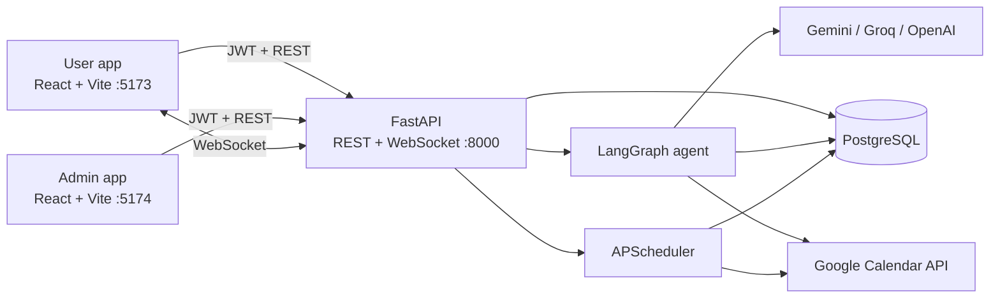

# Tổng quan hệ thống Orbit

> Cập nhật theo code tại repository ngày 15/08/2026. Khi tài liệu khác với code, code và migration
> Alembic là nguồn sự thật.

## 1. Orbit là gì?

Orbit là ứng dụng cộng tác có trợ lý AI, gồm hai giao diện web độc lập và một backend dùng chung:

- **User app**: chat 1-1/nhóm, trợ lý cá nhân, task, lịch, nhắc việc, memory và hồ sơ.
- **Admin app**: quản lý tài khoản, cấu hình model AI, theo dõi mức dùng và audit log.
- **Backend**: REST API, WebSocket, LangGraph agent, scheduler và lớp truy cập PostgreSQL.

Tên sản phẩm trên giao diện là **Orbit**; metadata của FastAPI hiện vẫn dùng tên **AI20K Agent**.

## 2. Bức tranh tổng thể



Backend được tổ chức như một **modular monolith**: API, agent và background jobs chạy trong cùng
một process FastAPI. PostgreSQL là database bắt buộc cho development/production; SQLite chỉ được
cho phép trong test.

## 3. Chức năng đã có trong code

### User app

| Khu vực | Chức năng chính |
| --- | --- |
| `/assistant` | Chat trực tiếp với agent; xác nhận hoặc từ chối hành động có tác dụng phụ |
| `/chat` | Chat 1-1/nhóm realtime, lịch sử tin nhắn, quyền cho AI đọc từng hội thoại |
| `/tasks` | Tạo/quản lý task, nhận gợi ý do AI phát hiện hoặc trích xuất |
| `/tasks/inbox` | Gom task cần quyết định, quá hạn, sắp đến hạn và ưu tiên cao |
| `/calendar` | Kết nối Google Calendar riêng từng user; xem/tạo/sửa/xóa event |
| `/reminders` | Tạo và hủy reminder; nhận thông báo realtime khi đến giờ |
| `/memory` | CRUD ghi chú cá nhân mà user muốn Orbit lưu |
| `/profile` | Cập nhật hồ sơ, preferences và mật khẩu |

### Admin app

| Khu vực | Chức năng chính |
| --- | --- |
| `/users` | Tìm user, đổi `platform_role`, bật/tắt tài khoản |
| `/ai-management` | Xem/đổi provider, model, temperature; xem consent và số liệu proactive |
| `/ai-usage` | Báo cáo token/request theo ngày và model |
| `/audit-log` | Tra cứu các hành động quản trị đã ghi nhận |

Admin là vai trò vận hành nền tảng, **không có quyền mặc định đọc nội dung hội thoại**. Quyền đọc
hội thoại chỉ đến từ participant đang hoạt động trong chính hội thoại đó.

## 4. Các luồng quan trọng

### Chat giữa người dùng

1. User đăng nhập và nhận JWT.
2. Frontend mở `/api/v1/ws?token=...` và dùng REST để tải dữ liệu ban đầu.
3. Khi gửi tin nhắn, backend kiểm tra user là participant có tối thiểu role `participant`, lưu
   `messages`, rồi broadcast `new_message` tới các participant đang kết nối.
4. Một background task kiểm tra tin nhắn có dấu hiệu cam kết/hạn chót. Nó chỉ gọi LLM khi regex
   pre-filter khớp, user đã cấp quyền AI và ngân sách ngày chưa hết.
5. Nếu phát hiện cam kết, backend tạo task `suggested` cho người gửi và phát `task_suggested`.

### Hỏi trợ lý AI

1. Frontend gọi `POST /api/v1/chat` cùng câu hỏi, `thread_id` tùy chọn và context tùy chọn.
2. Nếu gắn với hội thoại thật, backend kiểm tra cả membership và consent trong `ai_permissions`.
3. LangGraph gọi planner, planner có thể trả lời hoặc gọi một trong 9 tool.
4. Các thao tác tạo/sửa/xóa Calendar và tạo Reminder gọi `interrupt()` trước khi thay đổi dữ liệu.
5. Frontend gửi quyết định qua `POST /api/v1/chat/resume`; graph tiếp tục từ PostgreSQL checkpoint.

### Calendar và Reminder

- Google login và Google Calendar là hai OAuth flow độc lập. Calendar dùng authorization-code flow,
  refresh token được mã hóa Fernet trước khi lưu.
- Calendar luôn là `primary` calendar của user đã kết nối; không có tài khoản Calendar dùng chung.
- Scheduler poll incremental Calendar cho user vừa kết nối Calendar vừa online, mặc định mỗi 20 giây.
- Reminder được lưu trong bảng ứng dụng và có APScheduler job lưu trong `apscheduler_jobs` để sống
  qua restart. Khi đến giờ, backend đổi trạng thái và phát `reminder_fired` qua WebSocket.

## 5. Dữ liệu chính

| Nhóm | Bảng |
| --- | --- |
| Danh tính | `users`, `google_identities` |
| Chat và consent | `conversations`, `conversation_participants`, `messages`, `ai_permissions` |
| Dữ liệu cá nhân | `tasks`, `reminders`, `memories`, `google_calendar_credentials` |
| Vận hành | `usage_logs`, `audit_logs`, `platform_settings` |
| Hạ tầng thư viện | `apscheduler_jobs`, các bảng checkpoint do LangGraph tạo |

Không có workspace trong mô hình hiện tại. Migration `20260813_08` đã loại bỏ workspace và các
principal bên ngoài; participant của hội thoại phải là user đã đăng ký.

## 6. Phân quyền và bảo mật

- REST dùng Bearer JWT; mật khẩu được hash bằng bcrypt.
- `platform_role` gồm `user` và `platform_admin`.
- Quyền resource trong hội thoại gồm `viewer`, `participant`, `manager`; participant bị revoke
  không còn quyền truy cập.
- Consent cho AI có khóa `(conversation_id, user_id)` và độc lập giữa các participant.
- Calendar token được mã hóa khi lưu; API key và secret lấy từ environment.
- Production từ chối secret mặc định, wildcard CORS và provider không có API key.
- Prompt của agent đánh dấu nội dung hội thoại/tool result là dữ liệu không tin cậy.
- Chưa có rate limiting, security headers tập trung hoặc mã hóa đầu-cuối nội dung chat.

## 7. Công nghệ và cấu trúc repository

```text
src/
  agents/       LangGraph state, planner, graph và tools
  api/          REST route theo domain
  auth/         JWT, bcrypt, Google ID-token và dependencies
  db/           SQLAlchemy models, session và Alembic migrations
  models/       Pydantic request/response schemas
  services/     Business logic và integration
  websocket/    Connection manager và WebSocket endpoint
Frontend/
  user/         Entry point/build của User app
  admin/        Entry point/build của Admin app
  src/          Component, page, hook và API client dùng chung
tests/          Backend tests
```

Backend dùng Python 3.11+, FastAPI, SQLAlchemy async, LangGraph và APScheduler. Hai frontend dùng
React 18, Vite 5, React Router và Bootstrap; User app dùng thêm FullCalendar.

## 8. Chạy và triển khai

Local cần PostgreSQL, backend cổng `8000`, User app `5173`, Admin app `5174`. Trên Windows phải chạy:

```powershell
python scripts/run_dev.py
```

Launcher này ép `SelectorEventLoop` để psycopg async/LangGraph checkpointer hoạt động đúng.

Repository có sẵn cấu hình cho Docker Compose, Render, Vercel và GitHub Actions. Tuy nhiên trạng thái
đã deploy thật hay chưa không thể kết luận từ source code. Một điểm vận hành quan trọng: production
không gọi `Base.metadata.create_all()`, trong khi Docker/CD hiện chưa tự chạy `alembic upgrade head`.
Vì vậy database production phải được migrate riêng trước khi app khởi động; đây là khoảng trống cần
khắc phục trong pipeline.

## 9. Giới hạn cần biết

- WebSocket connection registry và ownership map của agent thread nằm trong memory của process.
  Hệ thống hiện phù hợp một backend instance/worker, chưa hỗ trợ scale ngang an toàn.
- APScheduler chạy cùng web process; instance ngủ hoặc nhiều replica sẽ ảnh hưởng độ đúng giờ và có
  thể tạo job trùng.
- `thread_id` do client có thể gửi và owner chỉ được nhớ trong process; restart/multi-worker làm mất
  ràng buộc này. Cần lưu owner bền vững và kiểm tra ở mọi chat/resume trước khi coi là production-safe.
- Calendar dùng polling thay vì Google push notification nên có độ trễ và tiêu tốn quota theo số
  user online.
- `chroma_persist_dir` chỉ là cấu hình chưa sử dụng; tìm kiếm tin nhắn hiện là PostgreSQL `ILIKE`,
  không phải semantic/vector search.

Chi tiết kỹ thuật, boundary và các quyết định thiết kế nằm trong [ARCHITECTURE.md](ARCHITECTURE.md).
