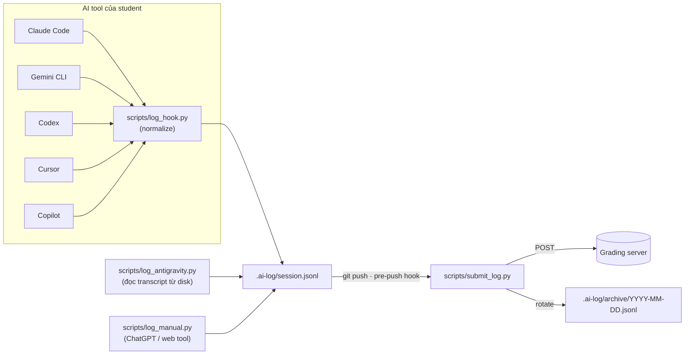

# AI Log Setup — Repo P-132

> Bằng chứng và hướng dẫn hệ thống ghi log sử dụng AI · Cập nhật 2026-08-04
> Repo: https://github.com/AI20K-Build-Phase-Cohort-3/P-132

---

## 1. Trạng thái

🟢 **Đã setup và đang chạy tự động.** Toàn bộ prompt và tool-call của AI agent trong repo được ghi
lại tự động, không cần thao tác thủ công sau mỗi task.

| Chỉ số | Giá trị |
| --- | --- |
| Tổng số entry đã ghi | **2.285** |
| Khoảng thời gian | 2026-07-30 → 2026-08-04 |
| Phân bổ theo ngày | 07-30: 25 · 07-31: 444 · 08-01: 21 · 08-02: 519 · 08-03: 1.242 · 08-04: 34 |
| Loại sự kiện | `PostToolUse` 2.087 · `UserPromptSubmit` 109 · `Stop` 89 |
| File | `.ai-log/session.jsonl` (đang chạy) + `.ai-log/archive/YYYY-MM-DD.jsonl` (đã submit) |

## 2. Cơ chế hoạt động



**Điểm mấu chốt:** hook được cấu hình sẵn cho 5 AI tool, mỗi tool có file config riêng nhưng đều gọi
chung một script normalize → mọi entry đổ về cùng một định dạng.

| Tool | File cấu hình | Sự kiện bắt |
| --- | --- | --- |
| Claude Code | `.claude/settings.json` | `UserPromptSubmit`, `PostToolUse`, `Stop` |
| Gemini CLI | `.gemini/settings.json` | `BeforeAgent`, `AfterModel`, `SessionEnd` |
| Codex | `.codex/hooks.json` | `UserPromptSubmit`, `Stop` |
| Cursor | `.cursor/hooks.json` | `beforeSubmitPrompt`, `stop` |
| GitHub Copilot | `.github/hooks/hooks.json` | `userPromptSubmitted`, `sessionEnd` |
| Antigravity IDE | quét qua `scripts/log_antigravity.py` lúc pre-push | đọc thẳng `transcript.jsonl` từ disk |
| ChatGPT / web tool | `scripts/log_manual.py` | thủ công (xem `.agents/workflows/log.md`) |

Mỗi hook chạy qua launcher đa nền tảng `scripts/_pyrun.sh` / `scripts/_pyrun.cmd` để hoạt động được
cả trên Git Bash, cmd.exe lẫn PowerShell (tìm `python3` → `python` → `py`).

## 3. Định dạng log entry

Một dòng JSONL, ví dụ thật (đã rút gọn giá trị dài):

```json
{
  "ts": "2026-08-02T16:12:20.966280+07:00",
  "tool": "claude",
  "event": "PostToolUse",
  "session_id": "4ac1d94e-8435-4d0d-959e-e44ffdfa73e9",
  "model": "",
  "repo": "P-132",
  "branch": "tuan",
  "commit": "b4ae636",
  "student": "phamquoctuan2308@gmail.com",
  "prompt": "",
  "tool_name": "Bash",
  "tool_input": "{'command': 'cd ... && git commit -m ...'}",
  "tool_response": "{'stdout': '[tuan b4ae636] ... 5 files changed, 216 insertions ...'}"
}
```

Mỗi entry gắn với **repo + branch + commit + student**, nên log truy vết được về đúng thời điểm và
đúng người trong lịch sử git.

## 4. Submit & rotate

Git pre-push hook (cài bằng `scripts/setup_hooks.sh` hoặc `setup_hooks.ps1`) chạy 2 bước:

1. `scripts/log_antigravity.py --auto` — quét prompt Antigravity trong 24h gần nhất.
2. `scripts/submit_log.py` — POST `.ai-log/session.jsonl` lên grading server (`AI_LOG_SERVER`,
   `AI_LOG_API_KEY` đọc từ `.env`), tối đa 500 entry mỗi lần.

Sau khi submit thành công, log được **rotate** vào `.ai-log/archive/YYYY-MM-DD.jsonl` (append, không
bao giờ ghi đè). Nếu POST thất bại, file pending được khôi phục — **không mất dữ liệu**.

Hook **không bao giờ chặn `git push`** (`exit 0` kể cả khi lỗi) — logging không được phép cản trở
công việc.

## 5. Quyền riêng tư & git

`.gitignore` cấu hình theo nguyên tắc **"tracked structure, ignored content"**:

```gitignore
# AI logs — tracked structure, ignored content
.ai-log/*.jsonl
.ai-log/archive/
```

Thư mục `.ai-log/` được giữ trong repo qua `.gitkeep`, còn **nội dung log không commit** — tránh đẩy
nội dung prompt/response (có thể chứa dữ liệu nhạy cảm) lên GitHub. Log đi thẳng tới grading server
qua pre-push hook.

## 6. Cài đặt cho thành viên mới

```bash
git clone https://github.com/AI20K-Build-Phase-Cohort-3/P-132
cd P-132

# Cài git pre-push hook (chạy 1 lần sau khi clone)
bash scripts/setup_hooks.sh          # Git Bash / macOS / Linux
# hoặc trên PowerShell:
powershell -ExecutionPolicy Bypass -File scripts/setup_hooks.ps1

# Điền thông tin submit vào .env
cp .env.example .env
# AI_LOG_SERVER=...
# AI_LOG_API_KEY=...
```

Hook của từng AI tool (`.claude/`, `.gemini/`, `.codex/`, `.cursor/`, `.github/hooks/`) **đã có sẵn
trong repo** — không cần cấu hình thêm.

## 7. Quy tắc cho AI agent

`.agents/rules/ai-log-hook.md` (activation: always-on) chỉ thị rõ cho mọi AI agent làm việc trong
repo:

- ❌ **Không** tự gọi `scripts/log_antigravity.py "<summary>"` sau mỗi task — sẽ tạo entry giả dạng
  "TaskComplete" thay vì prompt thật của user.
- ❌ **Không** sửa/xoá file trong `.ai-log/` — do hook và submit script quản lý.
- ❌ **Không** tự bypass hook bằng `git push --no-verify` khi gặp lỗi; báo lại cho user.

Nguyên tắc: log phải phản ánh **prompt thật của người dùng**, không phải bản tóm tắt do AI tự viết.

## 8. Các thành phần khác của repo setup

| Hạng mục | Trạng thái | Vị trí |
| --- | --- | --- |
| CI (ruff + pytest) | 🟢 | `.github/workflows/ci.yml` — chạy trên push `main`/`develop` và PR vào `main` |
| PR template | 🟢 | `.github/PULL_REQUEST_TEMPLATE.md` |
| Hướng dẫn cho AI agent | 🟢 | `CLAUDE.md`, `.agents/rules/`, `.agents/workflows/` |
| Worklog theo ngày | 🟢 | `WORKLOG.md` |
| Docker | 🟢 (chưa deploy) | `Dockerfile`, `docker-compose.yml` |
| CD / deploy workflow | 🔴 | Chưa có — xem [../ROADMAP.md](../ROADMAP.md) mục #1 |
