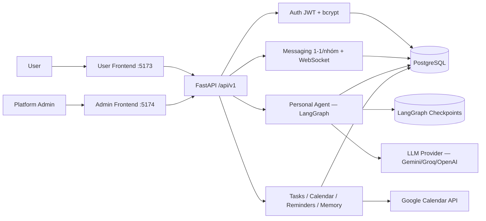

# Architecture — Orbit

> **Trạng thái:** Canonical v2.0 — thay thế bản v1.0 ("Orbit Multi-Agent theo Workspace").
>
> **Cập nhật:** 2026-08-25 — viết lại sau khi gỡ bỏ toàn bộ subsystem Multi-Agent/Agent Workspace
> (Company Root, Product Delivery/Quality Assurance/Executive Agent, WorkspaceBrief, deterministic
> router, specialist HITL). Tài liệu này mô tả kiến trúc thật đang chạy: Personal Agent nhúng trong
> ứng dụng chat, không phải mô hình multi-agent theo phòng ban.
>
> **Product requirements:** [PRD](PRD.md) · **Trạng thái theo yêu cầu đề bài:** [ROADMAP.md](../ROADMAP.md)

## 1. Tổng quan

Orbit là một AI agent cá nhân nhúng trong ứng dụng chat 1-1/nhóm, giúp người dùng tóm tắt hội
thoại, trích xuất công việc/lịch hẹn, tạo nhắc nhở và quản lý lịch Google Calendar — luôn có bước
xác nhận của con người (human-in-the-loop) trước khi thực hiện hành động có tác dụng phụ.

Repo là monorepo gồm hai phần độc lập:

- **Backend**: FastAPI + LangGraph, thư mục `src/`.
- **Frontend**: hai ứng dụng React/Vite riêng dùng chung `Frontend/src/` — `Frontend/user/` (cổng
  5173, trải nghiệm người dùng) và `Frontend/admin/` (cổng 5174, quản trị nền tảng).

## 2. System context



Admin Frontend và User Frontend là hai ứng dụng Vite riêng, cùng gọi một FastAPI backend duy nhất —
backend là nguồn sự thật duy nhất cho identity, quyền và dữ liệu.

## 3. Backend layout

```text
src/
├── agents/             # LangGraph Personal Agent
│   ├── graph.py           # planner -> tools -> compact_thread -> END, Postgres checkpointer
│   ├── state.py            # AgentState (TypedDict)
│   ├── nodes/                # context_node, guardrail_node, planner_node, compact_node
│   └── tools/                  # calendar/reminder/memory/search/summarize/task/people/policy/context
├── api/                # REST routes — mỏng, gọi services/
├── auth/                # Hash mật khẩu (bcrypt), tạo/kiểm tra JWT
├── db/                    # SQLAlchemy models (async) + Alembic migrations
├── models/                  # Pydantic request/response schemas
├── services/                  # Business logic: chat, calendar, reminder, memory, usage, scheduler, ...
├── websocket/                   # Kênh real-time cho chat/nhắc nhở/proactive/usage alert
└── main.py                        # FastAPI app, lifespan, router registration
```

## 4. Personal Agent (LangGraph)

`POST /api/v1/chat` và `POST /api/v1/chat/resume` (`src/api/routes.py`) là điểm vào duy nhất của
agent. Graph (`src/agents/graph.py`) chạy `context_node -> guardrail_node -> planner_node -> tools
-> compact_node -> END`, dùng `AsyncPostgresSaver` làm checkpointer trên PostgreSQL (bền vững qua
restart) hoặc `MemorySaver` cho test/dev nhẹ.

11 tool hiện có, đăng ký tại `src/agents/tools/__init__.py`:

- **Đọc-only**: `search_messages`, `list_tasks`, `list_memories`, `summarize_conversation`,
  `extract_tasks`.
- **Có tác dụng phụ — bắt buộc qua `interrupt()` chờ xác nhận người dùng**:
  `create_calendar_event`, `update_calendar_event`, `delete_calendar_event`, `create_reminder`,
  cùng các thao tác ghi/xoá Memory.

Xác nhận (approve/reject) đi qua `POST /chat/resume`, dùng `Command(resume=...)` của LangGraph —
không có bảng "proposal" durable riêng; trạng thái chờ xác nhận sống trong chính LangGraph
checkpoint của thread đó.

`Quick Action` (nút Summarize/Extract tasks trong `AIPanel.jsx`) bỏ qua bước planner LLM và gọi
thẳng logic tool tương ứng — 1 lệnh gọi LLM thay vì 2, vì lựa chọn tool trong hai trường hợp này là
cố định.

## 5. Domain services

| Miền | Route chính | Service | Ghi chú |
|---|---|---|---|
| Auth | `auth_routes.py` | `src/auth/` | JWT + bcrypt; role `user`/`admin`; đăng nhập Google qua bảng `google_identities` riêng |
| Messaging | `chat_routes.py`, `websocket/` | `chat_service.py`, `conversation_service.py` | 1-1/nhóm real-time, lịch sử, đếm tin chưa đọc |
| Tasks | `task_routes.py` | — | CRUD + đồng bộ Google Calendar 2 chiều cho task có `due_at` |
| Calendar | `calendar_routes.py` | `calendar_service.py` | OAuth per-user, CRUD 2 chiều, polling `syncToken` (chưa có domain public cho webhook thật) |
| Reminders | `reminder_routes.py` | `reminder_service.py`, `scheduler.py` | Bền vững qua restart (APScheduler + PostgreSQL) |
| Memory | `memory_routes.py` | `memory_service.py`, `memory_maintenance_service.py` | Ghi chú người dùng tự thêm + heartbeat bảo trì |
| Proactive detection | — | `proactive_service.py` | Regex pre-filter rồi hỏi LLM, tạo Task gợi ý kèm provenance |
| Usage/budget | — | `usage_service.py` | Chặn cuộc gọi LLM mới khi vượt `DAILY_TOKEN_BUDGET`; cảnh báo WebSocket tới admin |
| Admin dashboard | `admin_routes.py` | — | Stats, users, conversations, tasks/reminders/memories, AI config, audit log |
| AI consent | — | `consent_service.py` | Bảng `ai_permissions` — agent chỉ đọc hội thoại khi được cấp quyền (`granted`) tách biệt với quyền xử lý tin nhắn của từng người gửi (`contribution_allowed`) |

## 6. Data model (điểm chính)

`src/db/models.py`. `Workspace`/`WorkspaceMembership` là boundary cá nhân/tổ chức chung (mỗi user
có một personal workspace; tổ chức là tính năng phụ, không bắt buộc) — không nhầm với subsystem
Multi-Agent đã gỡ bỏ. Các bảng nghiệp vụ chính: `users`, `conversations` + `messages` +
`conversation_participants`, `tasks`, `reminders`, `event_candidates`, `memories`,
`assistant_threads`, `google_calendar_credentials`, `usage_logs`, `audit_logs`,
`conversation_rolling_summaries`.

## 7. Human-in-the-loop

Mọi tool có tác dụng phụ (tạo/sửa/xoá sự kiện lịch, tạo nhắc nhở) bắt buộc dừng ở `interrupt()`
trong graph, trả `status="interrupted"` kèm `InterruptPayload` (loại hành động + draft) cho
frontend hiển thị, và chỉ thực thi thật sau khi người dùng gọi `POST /chat/resume` với
`approved=true`. Đây là yêu cầu thiết kế cốt lõi, không phải chi tiết có thể lược bỏ.

## 8. Deployment

Chưa deploy online (xem [ROADMAP.md](../ROADMAP.md)). PostgreSQL bắt buộc cho dev/prod qua
`DATABASE_URL` (không có SQLite fallback ngoài unit test). Backend chạy single-process
(`scripts/run_dev.py` trên Windows — cần SelectorEventLoop cho `AsyncPostgresSaver`); WebSocket và
APScheduler đều process-local, nên chưa scale ngang nhiều worker.

## 9. Tài liệu liên quan

- [Product Brief](BRIEF.md)
- [PRD](PRD.md)
- [Deployment Guide](deploy.md)
- [Roadmap theo đề bài](../ROADMAP.md)
- [Worklog](../WORKLOG.md)
