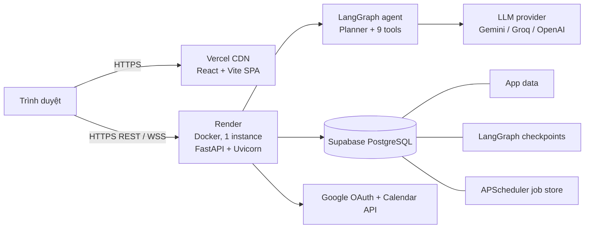
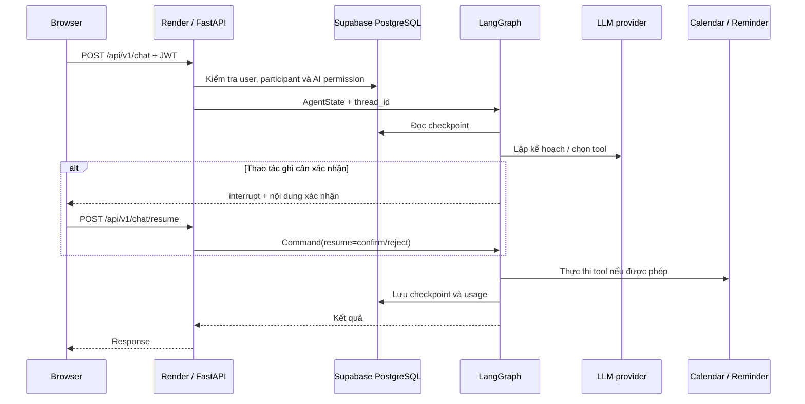
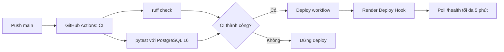

# Kiến trúc triển khai Orbit

## 1. Tổng quan

Production dùng một frontend SPA trên Vercel, một backend Docker đơn instance trên Render và một PostgreSQL bên ngoài trên Supabase. Thiết kế đơn instance là ràng buộc hiện tại vì WebSocket connection manager và rate limiter lưu state trong memory, còn APScheduler phải chỉ có một tiến trình thực thi job.

## 2. Thành phần và trách nhiệm

| Thành phần | Trách nhiệm | Trạng thái |
|---|---|---|
| Vercel | Build và phục vụ SPA, cung cấp URL public | Stateless |
| Render | Chạy container backend, REST, WebSocket, scheduler và agent | 1 instance |
| Supabase PostgreSQL | Dữ liệu ứng dụng, agent checkpoint và scheduler jobs | Persistent |
| LLM provider | Suy luận planner, tóm tắt và trích xuất | External dependency |
| Google APIs | Đăng nhập Google và thao tác Calendar | External dependency |
| GitHub Actions | Lint, test và kích hoạt deploy backend | CI/CD control plane |

Backend khởi tạo database, `AsyncPostgresSaver` và scheduler trong FastAPI lifespan. Endpoint `/health` là health check của Render và bước xác minh sau deploy.

## 3. Luồng request agent

`thread_id` tách memory hội thoại; dữ liệu checkpoint tồn tại qua restart. Thao tác ghi như tạo reminder hoặc Calendar event phải đi qua human-in-the-loop. Quyền truy cập hội thoại được kiểm tra ở API trước khi context được đưa tới agent.

## 4. CI/CD

- `.github/workflows/ci.yml` chạy lint và test khi push vào `main`/`develop` và khi mở pull request vào `main`.
- `.github/workflows/deploy.yml` chỉ gọi Render Deploy Hook sau khi CI trên `main` thành công, hoặc khi chạy thủ công.
- Vercel kết nối repository và build frontend với các biến `VITE_*` tại build time.
- `render.yaml` mô tả backend; Render auto-deploy phải tắt để tránh hai đường deploy song song.

## 5. Network, secret và dữ liệu

- Chỉ public frontend qua HTTPS và backend qua HTTPS/WSS; PostgreSQL chỉ nhận kết nối bằng `DATABASE_URL` có SSL phù hợp.
- CORS chỉ cho phép origin frontend production.
- Secret được cấu hình trong Render/Vercel/GitHub, không commit vào repository: database URL, JWT secret, credential encryption key, API key LLM, OAuth secret và deploy hook.
- Google credential được mã hóa trước khi lưu. Log không được chứa JWT, OAuth token, calendar credential hoặc nội dung hội thoại thô.
- Supabase giữ ba nhóm dữ liệu trong cùng PostgreSQL: bảng ứng dụng, bảng checkpoint do LangGraph quản lý và bảng job của APScheduler.

## 6. Ràng buộc scale và độ tin cậy

Không tăng worker hoặc số Render instance trong kiến trúc hiện tại. Scale ngang sẽ làm WebSocket broadcast và rate limit không nhất quán, đồng thời có thể chạy trùng scheduler job. Trước khi scale cần:

1. Chuyển WebSocket pub/sub và rate-limit storage sang Redis hoặc dịch vụ dùng chung.
2. Tách scheduler thành worker singleton có cơ chế leader election/locking.
3. Kiểm tra mọi side effect có idempotency key.
4. Load test REST, WebSocket, connection pool và quota của các provider.

Render restart không làm mất agent memory vì checkpoint nằm trong PostgreSQL. Tuy nhiên kết nối WebSocket sẽ ngắt và frontend phải reconnect. Lỗi LLM hoặc Google API cần được xử lý thành phản hồi có thể retry, không làm hỏng checkpoint.

## 7. Cấu hình môi trường tối thiểu

| Nơi cấu hình | Nhóm biến chính |
|---|---|
| Render | `DATABASE_URL`, `SECRET_KEY`, `CREDENTIAL_ENCRYPTION_KEY`, khóa LLM, Google OAuth/Calendar, `CORS_ORIGINS`, `FRONTEND_ORIGIN` |
| Vercel | Base URL REST và WebSocket (`VITE_*`); thay đổi cần build lại |
| GitHub Actions | `RENDER_DEPLOY_HOOK_URL`; variable `RENDER_URL` |
| Runtime | `APP_ENV=production`, provider/model, timezone, rate limit và `DAILY_TOKEN_BUDGET` |

Danh sách đầy đủ và quy trình thao tác dashboard nằm trong [`DEPLOYMENT.md`](../DEPLOYMENT.md); file này chỉ mô tả topology và các quyết định kiến trúc.

## 8. Kiểm tra sau deploy và rollback

Sau mỗi deploy cần xác minh `/health`, đăng nhập, một lượt agent không dùng tool, một lượt tool đọc, luồng xác nhận/hủy thao tác ghi, WebSocket reconnect và dữ liệu checkpoint sau restart. Theo dõi Render logs cho traceback, timeout database, lỗi provider và tỷ lệ 429.

Nếu health check hoặc smoke test thất bại, rollback về deploy ổn định gần nhất trên Render. Với frontend, redeploy build ổn định gần nhất trên Vercel. Không sửa trực tiếp production database để rollback schema nếu chưa có backup và câu lệnh đảo migration được kiểm chứng.
