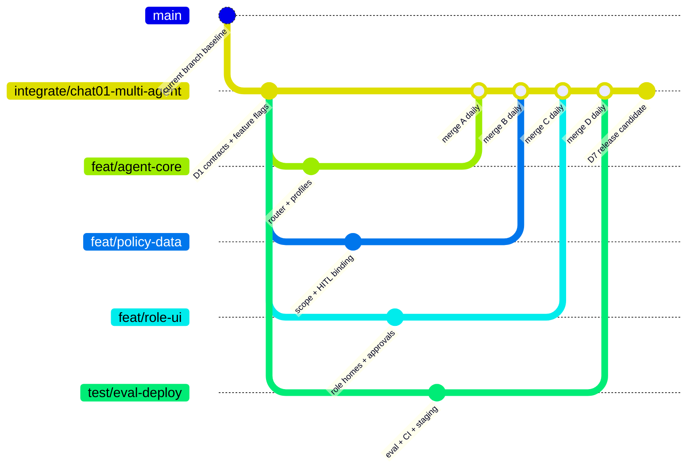
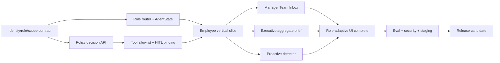

# Kế hoạch triển khai 7 ngày — 4 người

> Mục tiêu: có một vertical slice deploy online chứng minh ba role-agent, policy/HITL, proactive
> suggestion, UI theo role và benchmark. Không viết lại nền tảng hiện có.

## 1. Giả định và phạm vi

- Tận dụng FastAPI, planner/tool registry, Postgres, Redis, Google Calendar, WebSocket, user/admin UI,
  consent, authorization, HITL và audit đang có.
- Ba agent là ba prompt/policy/tool profile trên một core chung, không tách ba service.
- Business roles Sếp/Trưởng phòng/Nhân viên map tạm vào workspace role + department entitlement.
- Demo dùng dữ liệu nội bộ synthetic/de-identified; không nhập dữ liệu nhân viên thật.
- Mỗi ngày merge vào integration branch và deploy staging; không để đến ngày cuối mới tích hợp.

## 2. Chia 4 người

| Thành viên | Vai trò tuần này | Trách nhiệm chính | Backup/reviewer |
|---|---|---|---|
| **A — AI/Backend lead** | Orchestration | AgentState, role router, LangGraph nodes, prompt profiles, output schema, model routing | Review D policy/eval |
| **B — Security/Data backend** | Policy & data | Role/scope resolver, department mapping, consent, tool policy, HITL binding, audit, migrations | Review A graph/tools |
| **C — Frontend/Product** | User + admin UX | Role home, Assistant/source/action card, Team Inbox, Executive Brief, approval/error states | Review API contracts |
| **D — Quality/Integration/DevOps** | Eval & release | Golden dataset, unit/integration/e2e/security tests, observability, CI, staging/deploy, demo seed | Review all DoD/gates |

Không chia “mỗi người làm một agent” vì sẽ nhân bản graph/policy và tạo ba kiến trúc lệch nhau. A+B
xây trục chung; C xây component chung; D khóa chất lượng xuyên suốt.

## 3. Chiến lược Git ít nhánh

Dùng một integration branch và tối đa bốn short-lived workstream branch:

Quy tắc:

- Không tạo branch theo từng màn hình/tool nhỏ.
- Nhánh sống tối đa 1–2 ngày; rebase/merge integration mỗi sáng, PR nhỏ trước 17:00.
- Migration/contract chung merge đầu tiên; feature flag giữ main flow không gãy.
- Integration owner luân phiên: A ngày lẻ, D ngày chẵn.
- Chỉ merge release candidate vào nhánh của team sau khi toàn bộ gates P0 pass.

## 4. Dependency và critical path

Critical path là scope/policy → Employee flow → shared UI/tool contracts → ba demo flow → security
eval. Vector DB và sync Google Calendar hai chiều không được phép chặn critical path.

## 5. Kế hoạch từng ngày

### Ngày 1 — Contract, baseline và skeleton

**Mục tiêu:** cả đội code trên cùng một contract, đo được baseline.

| Owner | Việc | Deliverable cuối ngày |
|---|---|---|
| A | Mở rộng AgentState; định nghĩa router/result schemas; tạo prompt registry versioned | Skeleton nodes + unit test route |
| B | Chốt mapping role/department/entitlement; policy decisions; migration tối thiểu | Scope resolver contract + DENY tests |
| C | Audit UI hiện có; tạo role-home routes/components và mock contract | Clickable shell cho 3 role |
| D | Seed synthetic data; 50 golden cases; CI matrix; baseline test/build | Eval v0 + baseline report |

**Integration gate:** API schemas được review chéo A/B/C; không còn field quyền do client tự quyết;
current tests vẫn pass.

### Ngày 2 — Router, policy và Employee read flow

**Mục tiêu:** summarize/search/extract của Employee đi qua scope thật.

| Owner | Việc | Deliverable cuối ngày |
|---|---|---|
| A | Implement classify → policy precheck → employee profile → validate output | Employee read-only graph |
| B | Resource authorization + consent filter trước retrieval; audit metadata | Cross-user/chat denial pass |
| C | Assistant scope badge, source chips, extraction/action cards | Employee assistant wired API |
| D | Routing/permission/injection tests; evaluator extraction | Routing ≥90%, leak=0 trên v0 |

**Demo nội bộ:** nhân viên tóm tắt một chat consent-enabled; guessed conversation ID bị từ chối.

### Ngày 3 — HITL và Employee action flow

**Mục tiêu:** task/reminder/calendar chạy end-to-end, không có side effect trước confirm.

| Owner | Việc | Deliverable cuối ngày |
|---|---|---|
| A | Clarification/quality gate; proposal output; model routing small/large | Extract → proposal behavior |
| B | Approval object, payload hash/expiry/actor binding, idempotency; calendar error path | Secure executor + audit trace |
| C | Approval card, edit/reconfirm, success/failure/expired states; My Day | Employee vertical slice UI |
| D | HITL/double-click/retry tests; extraction tuning | 100% HITL matrix, precision ≥0.85 |

**Demo nội bộ:** “chiều mai” hỏi lại; user confirm tạo đúng một event; sửa giờ buộc xác nhận lại.

### Ngày 4 — Manager, Executive và proactive

**Mục tiêu:** đủ ba nhánh demo trên cùng core.

| Owner | Việc | Deliverable cuối ngày |
|---|---|---|
| A | Manager/Executive prompt profiles; team/aggregate output schemas | Ba role-agent selectable |
| B | Team/aggregate tools, department policies; async proactive gate/dedupe | Policy-safe team/aggregate/proactive |
| C | Team Inbox, Executive Brief, notification/action suggestion | Ba role homes wired |
| D | Role fixtures, cross-department tests, WebSocket/e2e | Ba happy + denial flows automated |

**Demo nội bộ:** trưởng phòng thấy đúng team inbox; sếp thấy aggregate brief; nhân viên không truy cập
hai scope này; message send không chờ model.

### Ngày 5 — Memory, guardrail và frozen benchmark

**Mục tiêu:** khóa privacy/safety và đạt ngưỡng chất lượng.

| Owner | Việc | Deliverable cuối ngày |
|---|---|---|
| A | Prompt-injection handling, bounded plan, fallback/partial response | Agent hardening |
| B | Memory owner/purpose/TTL/consent revoke; redaction scanner | Revoke invalidates retrieval/cache |
| C | Memory/Consent UI, deny/clarify/partial/budget states, mobile pass | Safe edge-case UX |
| D | Freeze dataset v1 100–150 cases; full eval/security suite | Release-gate report v1 |

**Gate:** task precision ≥0.90, recall ≥0.80, routing ≥0.95, privacy leak=0, HITL=100%. Nếu chưa đạt,
fix failure clusters; không thêm feature P1.

### Ngày 6 — Integration, performance, cost và deploy

**Mục tiêu:** release candidate chạy trên staging tương tự production.

| Owner | Việc | Deliverable cuối ngày |
|---|---|---|
| A | Optimize context/cache/model route; fix regression | P95 interactive <5s target |
| B | Migration/rollback rehearsal; rate limit, secret/OAuth review | Security/reliability checklist |
| C | Accessibility/responsive/cross-browser; polish demo only after correctness | UI acceptance pass |
| D | Staging deploy, load/cost benchmark, observability/budget alerts | Online URL + performance report |

**Gate:** backend test, user/admin lint/build, e2e, migrations, health checks pass; alert nhìn thấy trên
dashboard; không raw content trong logs.

### Ngày 7 — Bug burn-down, evidence và demo

**Mục tiêu:** không code tính năng mới; hoàn thiện chứng cứ và phương án dự phòng.

| Owner | Việc | Deliverable cuối ngày |
|---|---|---|
| A | Fix P0 agent/routing failures; pin prompt/model versions | Stable agent RC |
| B | Fix P0 policy/HITL issues; export sanitized audit evidence | Security sign-off |
| C | Fix P0 UX; chuẩn bị seeded demo accounts cho 3 role | Demo-ready UI |
| D | Full regression, backup demo data/video, release notes/runbook | Final report + release tag/commit |

**Final demo order:** Employee summarize/action → proactive suggestion → Manager Team Inbox → Executive
Brief → denial/privacy → Admin usage/audit. Demo denial là tính năng cốt lõi, không phải tình huống phụ.

## 6. Work breakdown theo epic

| Epic | P | A | B | C | D | Done when |
|---|---:|:---:|:---:|:---:|:---:|---|
| Role/scope contracts | P0 | R | A | C | C | DB-derived role, negative tests pass |
| Orchestrator/router | P0 | A/R | C | C | C | Route + trace + bounded graph |
| Policy/tool/HITL | P0 | C | A/R | C | C | No bypass, payload binding/idempotency |
| Employee vertical slice | P0 | R | R | A/R | C | Summary → source → task → confirm |
| Manager Team Inbox | P0 | R | R | A/R | C | Correct department, denied elsewhere |
| Executive Brief | P0 | R | R | A/R | C | Aggregate facts/risks/gaps, no raw leak |
| Proactive | P0 | R | A/R | R | C | Async, deduped, user-controlled |
| Eval/security | P0 | C | C | C | A/R | Frozen suite and gates |
| Deploy/observability | P0 | C | C | C | A/R | URL, alerts, rollback/runbook |
| Vector search | P1 | R | C | — | C | Only if baseline search insufficient |
| Two-way calendar sync | P1 | R | R | R | C | Only after all P0 gates |

R = Responsible, A = Accountable, C = Consulted.

## 7. Daily working rhythm

- 08:45: 15 phút sync dependency/blocker và chọn một integration owner.
- 09:00: pull integration, chạy smoke tests, làm theo workstream.
- 13:30: contract check A/B/C; D cập nhật failure report.
- Trước 16:00: PR nhỏ có tests, screenshot hoặc eval evidence.
- 16:00–17:00: merge integration theo thứ tự migration → backend contract → frontend → tests.
- 17:00: deploy staging và 20 phút demo đúng scenario ngày.
- Sau gate: cập nhật risk/cut list; không giữ nhánh dài qua hai ngày.

## 8. Definition of Ready cho một task

Task chỉ bắt đầu khi có owner, input/output contract, scope/authorization rule, expected UI state và test
case. Thay đổi schema/API chung cần review A+B+C trước implement để tránh frontend/backend lệch nhau.

## 9. Definition of Done

- Code + migration + rollback/compatibility phù hợp.
- Authorization/policy/HITL không chỉ nằm trong prompt.
- Happy path, denial, ambiguity và tool-error tests.
- Audit/metrics không chứa raw content.
- UI loading/empty/error/approval/mobile states.
- Prompt/model/policy versions được trace.
- Docs/API contract cập nhật; staging smoke pass.

## 10. Cut order khi trễ

Cắt theo thứ tự, không hy sinh policy/HITL/test:

1. Biểu đồ Executive nâng cao → giữ KPI cards + text brief.
2. pgvector/Qdrant → keyword/time-window search hiện có.
3. Google Calendar sync hai chiều → giữ create + local status/pull refresh.
4. Approval liên phòng tổng quát → giữ một scenario manager → employee.
5. Memory suy luận nâng cao → giữ preference + episodic summary có consent.

Không cắt: authorization, consent, HITL, source grounding, audit redaction và regression tests.

## 11. Rủi ro tuần và trigger xử lý

| Trigger | Quyết định ngay |
|---|---|
| D2 router chưa ổn | Dùng deterministic role/scope route trước, LLM chỉ classify intent |
| D3 Calendar OAuth lỗi | Demo task/reminder HITL trước; calendar dùng test account, không fake success |
| D4 Manager data chưa đủ | Dùng task records + permitted summaries, không đọc raw chat thay thế |
| D5 precision thấp | Tăng threshold/clarify để giữ precision; chấp nhận recall thấp tới gate 0.80 |
| P95 >5s | Search-first, giảm context, small model, async non-critical steps |
| Chi phí vượt budget | Giảm large-model routes, cache summary, giới hạn steps/tokens |

## 12. Checklist release

- [ ] Ba seeded accounts và role/scope đúng DB.
- [ ] Sáu demo scenarios trong Brief chạy trên staging.
- [ ] Permission/prompt-injection/HITL suites pass.
- [ ] Benchmark report có commit + dataset/prompt/model/policy versions.
- [ ] Backend tests; user/admin lint/build; e2e pass.
- [ ] Migration rehearsal và rollback/runbook hoàn tất.
- [ ] Token/cost/error/queue alerts hoạt động.
- [ ] Logs/audit scan không có raw message/PII/token.
- [ ] P1 feature được flag off nếu chưa đạt DoD.
