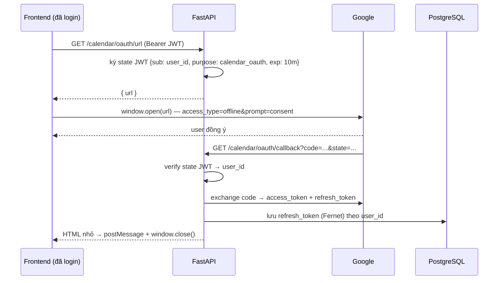

# Per-user Google Calendar — Phương án đầy đủ & cách làm

> Mục tiêu: mỗi user đăng nhập Orbit có **calendar Google thật của chính họ** (hiện trên điện thoại họ, đồng bộ 2 chiều), thay vì dùng chung một account như hiện tại.
>
> Quyết định đã chốt:
> - **Bỏ hẳn** `secrets/token.json` (không giữ fallback dùng chung).
> - **Mã hoá** refresh token trong DB bằng Fernet.
>
> Tài liệu này là hướng dẫn tự implement. Mọi đoạn code đều bám sát convention có sẵn của repo (route mỏng → service → model, `InjectedState` cho agent tool, `apiFetch` cho frontend).

---

## Mục lục

- [0. Vì sao hiện tại chưa riêng biệt](#0-vì-sao-hiện-tại-chưa-riêng-biệt)
- [1. Kiến trúc đích](#1-kiến-trúc-đích)
- [2. Bước 0 — Google Cloud Console](#2-bước-0--google-cloud-console)
- [3. Bước 1 — requirements & config & .env](#3-bước-1--requirements--config--env)
- [4. Bước 2 — Model DB mới](#4-bước-2--model-db-mới)
- [5. Bước 3 — Lớp mã hoá Fernet](#5-bước-3--lớp-mã-hoá-fernet)
- [6. Bước 4 — Service quản lý credential](#6-bước-4--service-quản-lý-credential)
- [7. Bước 5 — Route OAuth connect / callback](#7-bước-5--route-oauth-connect--callback)
- [8. Bước 6 — Refactor calendar_service theo user_id](#8-bước-6--refactor-calendar_service-theo-user_id)
- [9. Bước 7 — calendar_routes](#9-bước-7--calendar_routes)
- [10. Bước 8 — Poll & broadcast đúng người](#10-bước-8--poll--broadcast-đúng-người)
- [11. Bước 9 — Agent tools](#11-bước-9--agent-tools)
- [12. Bước 10 — Frontend](#12-bước-10--frontend)
- [13. Bước 11 — Dọn dẹp & migration](#13-bước-11--dọn-dẹp--migration)
- [14. Bước 12 — Tests](#14-bước-12--tests)
- [15. Checklist nghiệm thu](#15-checklist-nghiệm-thu)
- [16. Bẫy thường gặp](#16-bẫy-thường-gặp)

---

## 0. Vì sao hiện tại chưa riêng biệt

Ba nguyên nhân độc lập, phải sửa cả ba:

| # | Nơi | Vấn đề |
|---|-----|--------|
| 1 | `src/services/calendar_service.py:19-26` | `get_calendar_service()` load **một file duy nhất** `settings.google_token_path` (`secrets/token.json`). Token này sinh từ OAuth flow kiểu **Desktop app** chạy một lần lúc setup → toàn bộ app thao tác trên đúng một Google account. |
| 2 | `src/auth/google_oauth.py` | "Sign in with Google" chỉ **verify ID token** (`verify_oauth2_token`). ID token chỉ chứng minh danh tính, **không phải** access token, **không có refresh token**, **không có scope calendar** → không dùng để gọi Calendar API được. |
| 3 | `calendar_service.broadcast_change()` | Push tới `list(manager.active.keys())` — **mọi user đang online**. Kể cả khi đã tách credential, user A vẫn nhận được event của user B nếu không sửa chỗ này. |

Ngoài ra `CalendarSyncState` là bảng 1 dòng (`id="default"`) → một cursor sync cho cả hệ thống, không thể dùng cho N calendar.

---

## 1. Kiến trúc đích

### Luồng kết nối (một lần cho mỗi user)



### Luồng dùng hằng ngày

```
Request (Bearer JWT) → get_current_user → user.id
   → get_calendar_credentials(user.id)   # load DB, tự refresh nếu hết hạn
   → build("calendar","v3", credentials=creds)
   → calendarId="primary"                # = calendar chính CỦA user đó
```

`calendarId="primary"` giờ tự động trỏ đúng calendar riêng, vì credential đã là của user đó. Không cần lưu calendar id.

### File sẽ thêm / sửa

| Loại | Đường dẫn |
|------|-----------|
| ➕ Thêm | `src/auth/crypto.py` |
| ➕ Thêm | `src/services/google_credentials.py` |
| ➕ Thêm | `src/models/calendar_schemas.py` (bổ sung schema) |
| ✏️ Sửa | `src/db/models.py`, `src/config.py`, `src/services/calendar_service.py`, `src/api/calendar_routes.py`, `src/agents/tools/calendar_tool.py`, `src/main.py` |
| ✏️ Sửa | `Frontend/src/api/calendar.js`, `Frontend/src/pages/CalendarPage.jsx` |
| ➕ Thêm | `Frontend/src/components/calendar/ConnectCalendarCard.jsx` |
| 🗑️ Xoá | `secrets/token.json`, model `CalendarSyncState`, config `google_token_path` / `google_credentials_path` / `google_calendar_id` |

---

## 2. Bước 0 — Google Cloud Console

Làm trước, vì các bước sau cần Client ID/Secret.

1. **Enable API**: Console → *APIs & Services* → *Library* → tìm **Google Calendar API** → **Enable**.

2. **OAuth consent screen**:
   - User type: **External**
   - *Scopes* → **Add or remove scopes** → thêm `https://www.googleapis.com/auth/calendar`
   - Đây là **sensitive scope**. App chưa qua Google verification chỉ chạy ở chế độ **Testing**, giới hạn **100 test user**.
   - *Test users* → **thêm email của từng người sẽ test** (bao gồm email của bạn). Ai không có trong danh sách này sẽ nhận lỗi `access_denied` ở màn hình consent.

3. **Credentials** → *Create Credentials* → *OAuth client ID*:
   - Application type: **Web application** (⚠️ không phải Desktop như token cũ)
   - Name: `Orbit Calendar`
   - **Authorized redirect URIs** → thêm chính xác:
     ```
     http://localhost:8000/api/v1/calendar/oauth/callback
     ```
   - Lưu lại **Client ID** và **Client secret**.

> ⚠️ Client này **khác** client đang dùng cho "Sign in with Google" (`GOOGLE_OAUTH_CLIENT_ID`). Cái cũ chỉ verify ID token nên không cần secret; cái mới phải đổi authorization code lấy refresh token nên **bắt buộc có secret**. Có thể dùng chung một client nếu nó là kiểu Web application và bạn thêm cả hai redirect URI — nhưng tách riêng thì rõ ràng và dễ debug hơn.

---

## 3. Bước 1 — requirements & config & .env

### `requirements.txt`

`google-auth-oauthlib` đã có sẵn (dòng 20). Thêm:

```txt
cryptography>=43.0.0
```

### Sinh khoá mã hoá

```bash
python -c "from cryptography.fernet import Fernet; print(Fernet.generate_key().decode())"
# ví dụ: i8r0Id4UKr_fCiVg0tMH2-SwIfLpcHZMylq7KJ9LU8A=
```

> Khoá này **không được đổi** sau khi đã có user kết nối — đổi khoá = mọi refresh token trong DB thành rác, tất cả user phải kết nối lại.

### `.env` và `.env.example`

```dotenv
# --- Google Calendar per-user OAuth (Web application client) ---
GOOGLE_CALENDAR_CLIENT_ID=xxxxx.apps.googleusercontent.com
GOOGLE_CALENDAR_CLIENT_SECRET=GOCSPX-xxxxx
GOOGLE_CALENDAR_REDIRECT_URI=http://localhost:8000/api/v1/calendar/oauth/callback

# Khoá Fernet mã hoá refresh token trong DB. Sinh bằng:
#   python -c "from cryptography.fernet import Fernet; print(Fernet.generate_key().decode())"
CREDENTIAL_ENCRYPTION_KEY=

# Origin của frontend, dùng cho postMessage sau khi OAuth callback xong
FRONTEND_ORIGIN=http://localhost:5173
```

`.env.example` để trống 3 giá trị bí mật (chỉ ghi placeholder). **Không commit `.env` thật.**

### `src/config.py`

```python
    # --- Google Calendar: OAuth per-user (thay cho token dùng chung cũ) ---
    # Web application client: cần cả secret vì phải đổi authorization code lấy refresh token.
    # Khác google_oauth_client_id (đăng nhập) - cái đó chỉ verify ID token, không cần secret.
    google_calendar_client_id: str = ""
    google_calendar_client_secret: str = ""
    google_calendar_redirect_uri: str = "http://localhost:8000/api/v1/calendar/oauth/callback"

    # Fernet key mã hoá refresh token trước khi ghi DB. Đổi key = mọi user phải kết nối lại.
    credential_encryption_key: str = ""

    # Origin frontend, dùng làm targetOrigin cho postMessage ở trang callback.
    frontend_origin: str = "http://localhost:5173"
```

**Xoá** 3 dòng cũ:

```python
    google_credentials_path: str = "./secrets/credentials.json"   # ❌ xoá
    google_token_path: str = "./secrets/token.json"               # ❌ xoá
    google_calendar_id: str = "primary"                           # ❌ xoá (luôn là "primary" của chính user)
```

`calendar_timezone` — xem [Bước 6](#8-bước-6--refactor-calendar_service-theo-user_id), nên chuyển sang dùng `user.timezone` (cột đã có sẵn trong model `User`) và giữ `calendar_timezone` làm giá trị mặc định.

---

## 4. Bước 2 — Model DB mới

Repo **không dùng Alembic**, `init_db()` chỉ chạy `Base.metadata.create_all()` → **tạo bảng mới thì tự động**, nhưng **sửa/xoá bảng cũ phải chạy SQL tay**. Vì vậy: bảng mới hoàn toàn, đúng như pattern `GoogleIdentity` đã làm.

`src/db/models.py`:

```python
class GoogleCalendarCredential(Base):
    """OAuth credential Google Calendar của TỪNG user (authorization-code flow, access_type=offline).

    Khác GoogleIdentity: bảng kia chỉ ghi nhận "user này đăng nhập bằng Google account nào"
    (ID token, không gọi API được). Bảng này giữ refresh token thật để gọi Calendar API thay mặt
    user. Một user có thể có GoogleIdentity mà không có bảng này (đăng nhập Google nhưng chưa
    kết nối calendar), và ngược lại (đăng nhập mật khẩu nhưng đã kết nối calendar).

    refresh_token_enc/access_token_enc được mã hoá Fernet (src/auth/crypto.py) - refresh token là
    bí mật dài hạn, lộ ra là đọc/sửa được calendar của user vô thời hạn.
    """

    __tablename__ = "google_calendar_credentials"

    id: Mapped[str] = mapped_column(primary_key=True, default=_uuid)
    user_id: Mapped[str] = mapped_column(ForeignKey("users.id"), unique=True, index=True)
    google_email: Mapped[str] = mapped_column(default="")  # account đã kết nối, để hiện trên UI
    refresh_token_enc: Mapped[str] = mapped_column(Text)
    access_token_enc: Mapped[str | None] = mapped_column(Text, default=None)
    token_expiry: Mapped[datetime | None] = mapped_column(DateTime(timezone=True), default=None)
    scopes: Mapped[str] = mapped_column(default="")  # cách nhau bởi dấu cách

    # Cursor sync tăng dần của RIÊNG calendar này (thay bảng calendar_sync_state 1-dòng cũ,
    # vốn chỉ đủ cho một calendar dùng chung).
    sync_token: Mapped[str | None] = mapped_column(Text, default=None)

    created_at: Mapped[datetime] = mapped_column(DateTime(timezone=True), default=_utcnow)
    updated_at: Mapped[datetime] = mapped_column(DateTime(timezone=True), default=_utcnow, onupdate=_utcnow)

    user: Mapped["User"] = relationship()
```

**Xoá** class `CalendarSyncState` (dòng ~150) — `sync_token` đã dời vào bảng trên, quan hệ 1-1 với credential nên không cần bảng riêng.

---

## 5. Bước 3 — Lớp mã hoá Fernet

File mới `src/auth/crypto.py`:

```python
from functools import lru_cache

from cryptography.fernet import Fernet, InvalidToken

from src.config import get_settings


class CredentialCryptoError(Exception):
    """Không giải mã được credential đã lưu - gần như luôn do CREDENTIAL_ENCRYPTION_KEY bị đổi
    sau khi dữ liệu đã được ghi. Caller nên coi như user chưa kết nối và bắt họ kết nối lại."""


@lru_cache
def _fernet() -> Fernet:
    settings = get_settings()
    if not settings.credential_encryption_key:
        raise RuntimeError(
            "CREDENTIAL_ENCRYPTION_KEY chưa được đặt trong .env. Sinh bằng: "
            'python -c "from cryptography.fernet import Fernet; print(Fernet.generate_key().decode())"'
        )
    return Fernet(settings.credential_encryption_key.encode())


def encrypt_secret(plain: str) -> str:
    return _fernet().encrypt(plain.encode()).decode()


def decrypt_secret(token: str) -> str:
    try:
        return _fernet().decrypt(token.encode()).decode()
    except InvalidToken as exc:
        raise CredentialCryptoError("Không giải mã được credential đã lưu") from exc
```

---

## 6. Bước 4 — Service quản lý credential

File mới `src/services/google_credentials.py`. Đây là trái tim của phương án.

```python
import logging
from datetime import UTC, datetime, timedelta

import jwt
from google.auth.exceptions import RefreshError
from google.auth.transport.requests import Request as GoogleRequest
from google.oauth2.credentials import Credentials
from google_auth_oauthlib.flow import Flow
from sqlalchemy import select

from src.auth.crypto import CredentialCryptoError, decrypt_secret, encrypt_secret
from src.config import get_settings
from src.db import session as db_session
from src.db.models import GoogleCalendarCredential

logger = logging.getLogger(__name__)

SCOPES = ["https://www.googleapis.com/auth/calendar"]
_AUTH_URI = "https://accounts.google.com/o/oauth2/auth"
_TOKEN_URI = "https://oauth2.googleapis.com/token"
_STATE_PURPOSE = "calendar_oauth"
_STATE_TTL_MINUTES = 10


class CalendarNotConnected(Exception):
    """User chưa kết nối Google Calendar, hoặc đã revoke quyền phía Google. Route layer đổi
    thành 409 để frontend hiện nút "Kết nối", chứ không phải 401 (JWT của app vẫn hợp lệ)."""


class OAuthStateError(Exception):
    """state trả về từ Google không hợp lệ (hết hạn, sai chữ ký, hoặc là token khác loại)."""


# ---------------------------------------------------------------- OAuth flow

def _client_config() -> dict:
    settings = get_settings()
    if not settings.google_calendar_client_id or not settings.google_calendar_client_secret:
        raise RuntimeError("GOOGLE_CALENDAR_CLIENT_ID/SECRET chưa được đặt trong .env")
    return {
        "web": {
            "client_id": settings.google_calendar_client_id,
            "client_secret": settings.google_calendar_client_secret,
            "auth_uri": _AUTH_URI,
            "token_uri": _TOKEN_URI,
        }
    }


def _build_flow(state: str | None = None) -> Flow:
    settings = get_settings()
    return Flow.from_client_config(
        _client_config(),
        scopes=SCOPES,
        redirect_uri=settings.google_calendar_redirect_uri,
        state=state,
    )


def make_oauth_state(user_id: str) -> str:
    """Popup OAuth không mang được header Authorization, nên danh tính user phải đi kèm trong
    tham số `state` và quay về nguyên vẹn ở callback. Ký JWT (không chỉ là user_id trần) để
    người ngoài không tự chế state trỏ vào user khác. `purpose` ngăn dùng nhầm access token
    thường của app làm state và ngược lại; TTL ngắn vì consent chỉ mất vài chục giây."""
    settings = get_settings()
    payload = {
        "sub": user_id,
        "purpose": _STATE_PURPOSE,
        "exp": datetime.now(UTC) + timedelta(minutes=_STATE_TTL_MINUTES),
    }
    return jwt.encode(payload, settings.secret_key, algorithm=settings.jwt_algorithm)


def read_oauth_state(state: str) -> str:
    settings = get_settings()
    try:
        payload = jwt.decode(state, settings.secret_key, algorithms=[settings.jwt_algorithm])
    except jwt.PyJWTError as exc:
        raise OAuthStateError("state không hợp lệ hoặc đã hết hạn") from exc
    if payload.get("purpose") != _STATE_PURPOSE:
        raise OAuthStateError("state sai mục đích")
    return payload["sub"]


def build_authorization_url(user_id: str) -> str:
    """access_type=offline: xin refresh token (không có nó thì hết 1 giờ là mất quyền).
    prompt=consent: BẮT BUỘC - mặc định Google chỉ trả refresh_token ở lần cấp quyền ĐẦU TIÊN;
    user kết nối lại lần hai sẽ nhận response không có refresh_token và code sẽ ghi đè mất
    token cũ bằng None."""
    flow = _build_flow(state=make_oauth_state(user_id))
    url, _ = flow.authorization_url(
        access_type="offline",
        prompt="consent",
        include_granted_scopes="true",
    )
    return url


def exchange_code(code: str) -> Credentials:
    """Blocking (HTTP tới Google). Gọi từ async route phải qua run_in_threadpool."""
    flow = _build_flow()
    flow.fetch_token(code=code)
    return flow.credentials


def fetch_google_email(creds: Credentials) -> str:
    """Lấy email của account vừa kết nối để hiện trên UI. Dùng chính Calendar API
    (calendarList.get("primary").id chính là địa chỉ email) thay vì xin thêm scope
    userinfo.email - ít scope hơn thì consent screen nhẹ hơn và tránh lỗi "Scope has changed"."""
    from googleapiclient.discovery import build

    try:
        service = build("calendar", "v3", credentials=creds)
        return service.calendarList().get(calendarId="primary").execute().get("id", "")
    except Exception:
        logger.warning("Không lấy được email của calendar vừa kết nối", exc_info=True)
        return ""


# ---------------------------------------------------------------- Lưu / đọc / xoá

async def save_credentials(user_id: str, creds: Credentials, google_email: str = "") -> None:
    async with db_session.async_session_maker() as db:
        row = (
            await db.execute(
                select(GoogleCalendarCredential).where(GoogleCalendarCredential.user_id == user_id)
            )
        ).scalar_one_or_none()
        if row is None:
            row = GoogleCalendarCredential(user_id=user_id)
            db.add(row)
        if creds.refresh_token:
            # Chỉ ghi đè khi Google thực sự trả refresh_token mới - xem chú thích prompt=consent.
            row.refresh_token_enc = encrypt_secret(creds.refresh_token)
            row.sync_token = None  # calendar có thể đã đổi account -> cursor cũ vô nghĩa
        row.access_token_enc = encrypt_secret(creds.token) if creds.token else None
        row.token_expiry = creds.expiry.replace(tzinfo=UTC) if creds.expiry else None
        row.scopes = " ".join(creds.scopes or SCOPES)
        if google_email:
            row.google_email = google_email
        await db.commit()


async def get_connection_info(user_id: str) -> dict:
    async with db_session.async_session_maker() as db:
        row = (
            await db.execute(
                select(GoogleCalendarCredential).where(GoogleCalendarCredential.user_id == user_id)
            )
        ).scalar_one_or_none()
    if row is None:
        return {"connected": False, "google_email": None, "connected_at": None}
    return {"connected": True, "google_email": row.google_email or None, "connected_at": row.created_at}


async def disconnect(user_id: str) -> None:
    """Revoke phía Google rồi mới xoá row - xoá không thôi thì app vẫn còn quyền treo trong
    danh sách "Third-party access" của user, dù không dùng nữa. Revoke lỗi không chặn việc xoá."""
    import httpx

    async with db_session.async_session_maker() as db:
        row = (
            await db.execute(
                select(GoogleCalendarCredential).where(GoogleCalendarCredential.user_id == user_id)
            )
        ).scalar_one_or_none()
        if row is None:
            return
        try:
            token = decrypt_secret(row.refresh_token_enc)
            async with httpx.AsyncClient(timeout=10) as http:
                await http.post("https://oauth2.googleapis.com/revoke", data={"token": token})
        except Exception:  # gồm cả CredentialCryptoError khi key đã bị đổi
            logger.warning("Revoke token Google thất bại, vẫn xoá bản ghi local", exc_info=True)
        await db.delete(row)
        await db.commit()


async def get_credentials(user_id: str) -> Credentials:
    """Dựng Credentials sẵn sàng dùng cho user này, tự refresh và ghi lại access token mới nếu
    đã hết hạn. Raise CalendarNotConnected nếu chưa kết nối / đã bị revoke."""
    settings = get_settings()
    async with db_session.async_session_maker() as db:
        row = (
            await db.execute(
                select(GoogleCalendarCredential).where(GoogleCalendarCredential.user_id == user_id)
            )
        ).scalar_one_or_none()
        if row is None:
            raise CalendarNotConnected(f"User {user_id} chưa kết nối Google Calendar")
        try:
            refresh_token = decrypt_secret(row.refresh_token_enc)
            access_token = decrypt_secret(row.access_token_enc) if row.access_token_enc else None
        except CredentialCryptoError as exc:
            raise CalendarNotConnected("Credential đã lưu không giải mã được") from exc
        expiry = row.token_expiry

    creds = Credentials(
        token=access_token,
        refresh_token=refresh_token,
        token_uri=_TOKEN_URI,
        client_id=settings.google_calendar_client_id,
        client_secret=settings.google_calendar_client_secret,
        scopes=(row.scopes or " ".join(SCOPES)).split(),
        # google-auth so sánh expiry với datetime.utcnow() (naive), truyền datetime aware vào
        # sẽ nổ TypeError "can't compare offset-naive and offset-aware datetimes".
        expiry=expiry.astimezone(UTC).replace(tzinfo=None) if expiry else None,
    )

    if not creds.valid:
        try:
            creds.refresh(GoogleRequest())
        except RefreshError as exc:
            # refresh_token chết hẳn: user đã revoke quyền trong Google Account, hoặc đổi mật
            # khẩu, hoặc app ở chế độ Testing quá 7 ngày. Xoá luôn để UI hiện nút kết nối lại.
            logger.info("Refresh token của user %s không dùng được nữa, xoá kết nối", user_id)
            await disconnect(user_id)
            raise CalendarNotConnected("Quyền truy cập Google Calendar đã bị thu hồi") from exc
        await save_credentials(user_id, creds)

    return creds


async def list_connected_user_ids() -> list[str]:
    async with db_session.async_session_maker() as db:
        rows = (await db.execute(select(GoogleCalendarCredential.user_id))).scalars().all()
    return list(rows)


async def get_sync_token(user_id: str) -> str | None:
    async with db_session.async_session_maker() as db:
        row = (
            await db.execute(
                select(GoogleCalendarCredential).where(GoogleCalendarCredential.user_id == user_id)
            )
        ).scalar_one_or_none()
    return row.sync_token if row else None


async def set_sync_token(user_id: str, sync_token: str | None) -> None:
    async with db_session.async_session_maker() as db:
        row = (
            await db.execute(
                select(GoogleCalendarCredential).where(GoogleCalendarCredential.user_id == user_id)
            )
        ).scalar_one_or_none()
        if row is not None:
            row.sync_token = sync_token
            await db.commit()
```

> **Vì sao service này tự mở session thay vì nhận `db` từ Depends?** Vì agent tool (`calendar_tool.py`) chạy trong LangGraph, không có DI của FastAPI. `poll_calendar_changes` hiện tại đã dùng đúng pattern `async with db_session.async_session_maker()` — giữ nhất quán.

---

## 7. Bước 5 — Route OAuth connect / callback

Thêm vào `src/api/calendar_routes.py`. Lưu ý router hiện tại khai báo `dependencies=[Depends(get_current_user)]` ở cấp router — **callback không được đi qua đó** (Google redirect trình duyệt, không có Bearer token). Vì vậy tách thành hai router.

```python
import logging

from fastapi import APIRouter, Depends, HTTPException, Query, status
from fastapi.responses import HTMLResponse
from starlette.concurrency import run_in_threadpool

from src.auth.dependencies import get_current_user
from src.config import get_settings
from src.db.models import User
from src.services import calendar_service, google_credentials
from src.services.google_credentials import CalendarNotConnected

logger = logging.getLogger(__name__)

# Router chính: mọi route đều cần đăng nhập (giữ nguyên như hiện tại).
router = APIRouter(dependencies=[Depends(get_current_user)])

# Router công khai: chỉ chứa callback của Google. Danh tính user đi qua tham số `state`
# đã ký, không qua Bearer token - Google redirect trình duyệt thẳng tới đây.
public_router = APIRouter()


@router.get("/calendar/connection")
async def calendar_connection(current_user: User = Depends(get_current_user)) -> dict:
    return await google_credentials.get_connection_info(current_user.id)


@router.get("/calendar/oauth/url")
async def calendar_oauth_url(current_user: User = Depends(get_current_user)) -> dict:
    try:
        return {"url": google_credentials.build_authorization_url(current_user.id)}
    except RuntimeError as e:
        raise HTTPException(status_code=status.HTTP_503_SERVICE_UNAVAILABLE, detail=str(e))


@router.delete("/calendar/connection", status_code=status.HTTP_204_NO_CONTENT)
async def calendar_disconnect(current_user: User = Depends(get_current_user)) -> None:
    await google_credentials.disconnect(current_user.id)


_CALLBACK_HTML = """<!doctype html><meta charset="utf-8"><title>Google Calendar</title>
<body style="font-family:system-ui;padding:2rem;text-align:center">
<p>{message}</p>
<script>
  if (window.opener) window.opener.postMessage({{type:"calendar_oauth",ok:{ok}}}, "{origin}");
  setTimeout(function(){{ window.close(); }}, 800);
</script></body>"""


@public_router.get("/calendar/oauth/callback", response_class=HTMLResponse)
async def calendar_oauth_callback(
    code: str | None = Query(default=None),
    state: str | None = Query(default=None),
    error: str | None = Query(default=None),
) -> HTMLResponse:
    settings = get_settings()

    def page(ok: bool, message: str, status_code: int = 200) -> HTMLResponse:
        html = _CALLBACK_HTML.format(
            message=message, ok="true" if ok else "false", origin=settings.frontend_origin
        )
        return HTMLResponse(html, status_code=status_code)

    if error or not code or not state:
        return page(False, f"Kết nối thất bại: {error or 'thiếu tham số'}.", 400)

    try:
        user_id = google_credentials.read_oauth_state(state)
    except google_credentials.OAuthStateError:
        return page(False, "Phiên kết nối đã hết hạn. Vui lòng thử lại.", 400)

    try:
        # fetch_token/discovery build đều là HTTP đồng bộ - chạy trong threadpool để không
        # chặn event loop (cùng lý do auth_routes.google_auth đã làm với verify_google_id_token).
        creds = await run_in_threadpool(google_credentials.exchange_code, code)
        email = await run_in_threadpool(google_credentials.fetch_google_email, creds)
    except Exception:
        logger.exception("Đổi authorization code thất bại")
        return page(False, "Không đổi được mã uỷ quyền với Google.", 502)

    if not creds.refresh_token:
        return page(False, "Google không trả refresh token. Hãy thử kết nối lại.", 400)

    await google_credentials.save_credentials(user_id, creds, google_email=email)
    return page(True, "Đã kết nối Google Calendar. Bạn có thể đóng cửa sổ này.")
```

Đăng ký `public_router` trong `src/main.py`, **cùng prefix** với router calendar hiện tại:

```python
from src.api.calendar_routes import public_router as calendar_public_router, router as calendar_router
...
app.include_router(calendar_router, prefix="/api/v1", tags=["calendar"])
app.include_router(calendar_public_router, prefix="/api/v1", tags=["calendar"])
```

> Redirect URI trong `.env` phải khớp **từng ký tự** với ô đã khai trong Google Console, kể cả `http` vs `https` và dấu `/` cuối.

---

## 8. Bước 6 — Refactor `calendar_service` theo `user_id`

Điểm thay đổi lớn: các hàm đang là `def` (đồng bộ) → chuyển thành `async def` vì phải `await` việc load credential từ DB. Mọi caller (route, agent tool, poll job) đều đã là async nên chuyển được sạch sẽ.

```python
import logging
from datetime import UTC, datetime, timedelta

from googleapiclient.discovery import build
from googleapiclient.errors import HttpError
from starlette.concurrency import run_in_threadpool

from src.config import get_settings
from src.services.google_credentials import CalendarNotConnected, get_credentials  # noqa: F401
from src.services import google_credentials
from src.websocket.manager import manager

logger = logging.getLogger(__name__)

# calendarId luôn là "primary": credential đã là của chính user đó, nên "primary" trỏ đúng
# calendar chính của họ. Không còn google_calendar_id dùng chung trong config.
_PRIMARY = "primary"


async def _service(user_id: str):
    creds = await google_credentials.get_credentials(user_id)
    return await run_in_threadpool(build, "calendar", "v3", credentials=creds)


async def list_events(user_id: str, time_min_iso: str, time_max_iso: str, max_results: int = 50) -> list[dict]:
    service = await _service(user_id)

    def _call():
        return (
            service.events()
            .list(
                calendarId=_PRIMARY,
                timeMin=time_min_iso,
                timeMax=time_max_iso,
                maxResults=max_results,
                singleEvents=True,
                orderBy="startTime",
            )
            .execute()
        )

    resp = await run_in_threadpool(_call)
    return resp.get("items", [])


async def create_event(
    user_id: str,
    summary: str,
    start_iso: str,
    end_iso: str,
    description: str = "",
    attendees: list[str] | None = None,
    timezone: str | None = None,
) -> dict:
    tz = timezone or get_settings().calendar_timezone
    service = await _service(user_id)
    body = {
        "summary": summary,
        "description": description,
        "start": {"dateTime": start_iso, "timeZone": tz},
        "end": {"dateTime": end_iso, "timeZone": tz},
        "attendees": [{"email": a} for a in (attendees or [])],
    }
    return await run_in_threadpool(
        lambda: service.events().insert(calendarId=_PRIMARY, body=body).execute()
    )
```

`update_event` / `delete_event` sửa tương tự: thêm `user_id` làm tham số đầu, `calendarId=_PRIMARY`, bọc `run_in_threadpool`.

**Broadcast — sửa quan trọng nhất về quyền riêng tư:**

```python
async def broadcast_change(user_id: str, event_type: str, payload: dict) -> None:
    """Chỉ đẩy tới CHÍNH chủ calendar. Trước đây broadcast tới mọi user online vì calendar là
    một account dùng chung; giờ mỗi người một calendar riêng nên gửi rộng là rò rỉ tiêu đề
    lịch của người khác."""
    await manager.broadcast_to_users([user_id], {"type": event_type, **payload})
```

`to_out_dict()` giữ nguyên, không đổi gì.

> **Timezone**: model `User` đã có cột `timezone`. Nên truyền `timezone=current_user.timezone` từ route và `state["user_timezone"]` từ agent, để user ở múi giờ khác không bị ép về `Asia/Ho_Chi_Minh`. `settings.calendar_timezone` lùi về vai trò giá trị mặc định.

---

## 9. Bước 7 — `calendar_routes`

Mọi route lấy `current_user`, truyền `current_user.id` xuống service, và map `CalendarNotConnected` → **409**.

```python
def _not_connected() -> HTTPException:
    # 409 chứ không phải 401/403: JWT của app vẫn hợp lệ, chỉ là chưa nối Google.
    # Frontend dựa vào status này để hiện thẻ "Kết nối Google Calendar".
    return HTTPException(
        status_code=status.HTTP_409_CONFLICT,
        detail={"code": "calendar_not_connected", "message": "Chưa kết nối Google Calendar"},
    )


@router.get("/calendar/events", response_model=list[CalendarEventOut])
async def list_events(
    time_min: str | None = Query(default=None),
    time_max: str | None = Query(default=None),
    current_user: User = Depends(get_current_user),
) -> list[CalendarEventOut]:
    now = datetime.now(UTC)
    try:
        items = await calendar_service.list_events(
            current_user.id, time_min or now.isoformat(),
            time_max or (now + timedelta(days=60)).isoformat(), max_results=100,
        )
    except CalendarNotConnected:
        raise _not_connected()
    except Exception as e:
        raise HTTPException(status_code=status.HTTP_502_BAD_GATEWAY, detail=f"Google Calendar error: {e}")
    return [_to_out(e) for e in items]


@router.post("/calendar/events", response_model=CalendarEventOut, status_code=status.HTTP_201_CREATED)
async def create_event(
    request: CalendarEventCreateRequest, current_user: User = Depends(get_current_user)
) -> CalendarEventOut:
    try:
        created = await calendar_service.create_event(
            current_user.id,
            summary=request.summary, start_iso=request.start_iso, end_iso=request.end_iso,
            description=request.description, attendees=request.attendees,
            timezone=current_user.timezone,
        )
    except CalendarNotConnected:
        raise _not_connected()
    except Exception as e:
        raise HTTPException(status_code=status.HTTP_502_BAD_GATEWAY, detail=f"Google Calendar error: {e}")
    out = _to_out(created)
    await calendar_service.broadcast_change(current_user.id, "calendar_event_created", {"event": out.model_dump()})
    return out
```

PATCH và DELETE làm y hệt: thêm `current_user`, truyền `current_user.id` vào service **và** vào `broadcast_change`.

> **Bảo mật ngầm nhưng quan trọng**: không cần kiểm tra "event này có thuộc user không". Vì service dựng từ credential của chính user đó, Google sẽ trả 404 nếu họ đưa `event_id` của người khác. Quyền được thực thi ở phía Google, không phải ở app.

---

## 10. Bước 8 — Poll & broadcast đúng người

```python
async def _fetch_changes(user_id: str, sync_token: str | None) -> tuple[list[dict], str | None]:
    service = await _service(user_id)
    kwargs: dict = {"calendarId": _PRIMARY, "singleEvents": True}
    if sync_token:
        kwargs["syncToken"] = sync_token
    else:
        kwargs["timeMin"] = (datetime.now(UTC) - timedelta(days=1)).isoformat()

    items: list[dict] = []
    next_sync_token = None
    page_token = None
    while True:
        resp = await run_in_threadpool(lambda: service.events().list(**kwargs, pageToken=page_token).execute())
        items.extend(resp.get("items", []))
        page_token = resp.get("nextPageToken")
        if not page_token:
            next_sync_token = resp.get("nextSyncToken")
            break
    return items, next_sync_token


async def _poll_one_user(user_id: str) -> None:
    sync_token = await google_credentials.get_sync_token(user_id)
    try:
        items, next_sync_token = await _fetch_changes(user_id, sync_token)
    except CalendarNotConnected:
        return  # user vừa revoke - get_credentials đã dọn bản ghi
    except HttpError as e:
        if sync_token and e.resp.status == 410:
            logger.warning("Sync token của user %s hết hạn, sync lại từ đầu", user_id)
            items, next_sync_token = await _fetch_changes(user_id, None)
        else:
            logger.exception("Poll calendar thất bại cho user %s", user_id)
            return

    for event in items:
        if event.get("status") == "cancelled":
            await broadcast_change(user_id, "calendar_event_deleted", {"event_id": event["id"]})
        else:
            await broadcast_change(user_id, "calendar_event_updated", {"event": to_out_dict(event)})

    await google_credentials.set_sync_token(user_id, next_sync_token)


async def poll_calendar_changes() -> None:
    """Job định kỳ của APScheduler. Chỉ poll user ĐANG online: một job 20 giây × N user là
    N×4320 request/ngày, mà thay đổi lịch của user offline không cần push realtime - frontend
    tự gọi lại /calendar/events khi họ mở trang. Không bao giờ raise: một lần poll hỏng không
    được làm chết scheduler."""
    connected = set(await google_credentials.list_connected_user_ids())
    online = [uid for uid in list(manager.active.keys()) if uid in connected]
    for user_id in online:
        try:
            await _poll_one_user(user_id)
        except Exception:
            logger.exception("Poll calendar thất bại cho user %s", user_id)
```

Trong `src/main.py`, `scheduler.add_job(...)` **giữ nguyên** — chữ ký hàm không đổi.

Xoá import `CalendarSyncState` khỏi `calendar_service.py`.

---

## 11. Bước 9 — Agent tools

`src/agents/tools/calendar_tool.py` — lấy `user_id` từ state đúng như `reminder_tool.py`:

```python
from typing import Annotated

from langchain_core.tools import tool
from langgraph.prebuilt import InjectedState
from langgraph.types import interrupt

from src.agents.state import AgentState
from src.services import calendar_service
from src.services.google_credentials import CalendarNotConnected

_NOT_CONNECTED_MSG = (
    "Người dùng chưa kết nối Google Calendar. Hãy bảo họ vào trang Calendar và bấm "
    "'Kết nối Google Calendar' trước khi thử lại."
)


@tool
async def create_calendar_event(
    summary: str,
    start_iso: str,
    end_iso: str,
    description: str = "",
    attendees: list[str] | None = None,
    state: Annotated[AgentState, InjectedState] = None,  # type: ignore[assignment]
) -> str:
    """Draft a Google Calendar event. Requires the user's explicit confirmation before it is
    actually created.
    ... (docstring giữ nguyên phần Args)
    """
    user_id = (state or {}).get("user_id")
    if not user_id:
        return _NOT_CONNECTED_MSG

    draft = {...}
    decision = interrupt({"type": "calendar_event", "draft": draft})
    if not decision or not decision.get("approved"):
        return "Calendar event was not created (user declined)."

    draft.update(decision.get("edits") or {})
    try:
        created = await calendar_service.create_event(
            user_id,
            summary=draft["summary"], start_iso=draft["start"], end_iso=draft["end"],
            description=draft["description"], attendees=draft["attendees"],
        )
    except CalendarNotConnected:
        return _NOT_CONNECTED_MSG
    await calendar_service.broadcast_change(
        user_id, "calendar_event_created", {"event": calendar_service.to_out_dict(created)}
    )
    return f"Event created: {created.get('htmlLink', created.get('id'))}"
```

Áp dụng đúng khuôn đó cho `list_calendar_events`, `update_calendar_event`, `delete_calendar_event`.

> ⚠️ **Giữ nguyên `interrupt()`** ở cả ba tool có tác dụng phụ. Human-in-the-loop là yêu cầu thiết kế cốt lõi (xem `CLAUDE.md`), việc đổi sang per-user không được làm mất bước xác nhận.
>
> `list_calendar_events` là read-only nên không cần `interrupt()`, nhưng vẫn cần `user_id`.

Kiểm tra `user_id` đã thực sự được nạp vào state khi invoke graph từ `chat_routes` — `reminder_tool` đang chạy đúng, nên nhiều khả năng đã có sẵn; nếu không, thêm `"user_id": current_user.id` vào dict initial state.

---

## 12. Bước 10 — Frontend

### `Frontend/src/api/calendar.js`

Các hàm cũ **không đổi** (backend tự suy ra user từ JWT). Thêm:

```js
export const getCalendarConnection = (token) => apiFetch('/calendar/connection', { token })

export const getCalendarOAuthUrl = (token) => apiFetch('/calendar/oauth/url', { token })

export const disconnectCalendar = (token) =>
  apiFetch('/calendar/connection', { method: 'DELETE', token })
```

### `Frontend/src/components/calendar/ConnectCalendarCard.jsx` (mới)

```jsx
import { useState } from 'react'
import { useAuth } from '../../context/AuthContext'
import { getCalendarOAuthUrl } from '../../api/calendar'

export default function ConnectCalendarCard({ onConnected }) {
  const { token } = useAuth()
  const [busy, setBusy] = useState(false)
  const [error, setError] = useState('')

  const connect = async () => {
    setBusy(true); setError('')
    try {
      const { url } = await getCalendarOAuthUrl(token)
      const popup = window.open(url, 'google-calendar-oauth', 'width=520,height=640')

      // Trang callback của backend postMessage về rồi tự đóng. Nghe theo origin để không
      // nhận message từ tab lạ.
      const onMessage = (e) => {
        if (e.origin !== window.location.origin && !e.data?.type) return
        if (e.data?.type !== 'calendar_oauth') return
        window.removeEventListener('message', onMessage)
        setBusy(false)
        if (e.data.ok) onConnected?.()
        else setError('Kết nối Google Calendar thất bại.')
      }
      window.addEventListener('message', onMessage)

      // Dự phòng: user đóng popup thủ công thì không có message nào tới.
      const timer = setInterval(() => {
        if (popup?.closed) { clearInterval(timer); window.removeEventListener('message', onMessage); setBusy(false) }
      }, 500)
    } catch (err) {
      setError(err.detail?.message || err.detail || 'Không mở được cửa sổ uỷ quyền.')
      setBusy(false)
    }
  }

  return (
    <section className="content-card text-center p-5">
      <i className="bi bi-calendar-plus display-5 text-muted d-block mb-3" />
      <h5>Kết nối Google Calendar của bạn</h5>
      <p className="text-muted small mb-4">
        Orbit cần quyền truy cập calendar của bạn để hiển thị và tạo sự kiện. Lịch của bạn
        không ai khác trong ứng dụng nhìn thấy được.
      </p>
      {error && <div className="auth-error mb-3">{error}</div>}
      <button className="btn btn-primary" onClick={connect} disabled={busy}>
        {busy ? 'Đang chờ Google...' : 'Kết nối Google Calendar'}
      </button>
    </section>
  )
}
```

> **Lưu ý origin**: trang callback do **backend** (`localhost:8000`) render nên `e.origin` sẽ là origin backend, không phải frontend. Điều kiện kiểm tra ở trên nên thay bằng so sánh với `API_BASE_URL` để chặt chẽ:
> ```js
> const BACKEND_ORIGIN = new URL(API_BASE_URL).origin
> if (e.origin !== BACKEND_ORIGIN) return
> ```

### `Frontend/src/pages/CalendarPage.jsx`

```jsx
const [connected, setConnected] = useState(null)   // null = chưa biết

const refresh = () => {
  setLoading(true); setError('')
  listCalendarEvents(token)
    .then(list => { setConnected(true); setEvents(list.map(e => ({ ...e, color: getColor(e.id) }))) })
    .catch(err => {
      if (err.status === 409) { setConnected(false); return }   // chưa kết nối, không phải lỗi
      setError(err.detail?.message || err.detail || 'Could not load Google Calendar events.')
    })
    .finally(() => setLoading(false))
}
```

Trong phần render, trước khối `<FullCalendar>`:

```jsx
{connected === false
  ? <ConnectCalendarCard onConnected={refresh} />
  : /* ... layout calendar hiện tại ... */}
```

Sửa luôn comment cũ trong `useEffect` subscribe — nó đang ghi *"the connected Google Calendar is shared"*, giờ không còn đúng:

```jsx
// Realtime: mỗi user có calendar Google riêng, backend chỉ push tới đúng chủ sở hữu.
// Nguồn thay đổi: UI này, tab khác, agent trong chat, hoặc sửa trực tiếp trên Google Calendar
// (poll bằng syncToken bắt được).
```

Nên thêm nút **Ngắt kết nối** ở `ProfilePage.jsx` hoặc header trang Calendar, gọi `disconnectCalendar` rồi `setConnected(false)`.

---

## 13. Bước 11 — Dọn dẹp & migration

### Xoá file & config

```bash
rm secrets/token.json          # token dùng chung, không còn dùng
# secrets/credentials.json: xoá nếu là client Desktop cũ
```

Xoá khỏi `.env` / `.env.example`: `GOOGLE_TOKEN_PATH`, `GOOGLE_CREDENTIALS_PATH`, `GOOGLE_CALENDAR_ID`.

### SQL chạy tay

`create_all()` tạo bảng mới tự động, nhưng **không xoá** bảng cũ:

```sql
DROP TABLE IF EXISTS calendar_sync_state;
```

Không có dữ liệu người dùng nào cần migrate — token cũ thuộc về một account chung, không thể quy về user nào. Mọi user sẽ tự kết nối lại từ UI.

### Grep kiểm tra sót

```bash
grep -rn "google_token_path\|google_credentials_path\|google_calendar_id\|CalendarSyncState" src/ tests/ scripts/
```

Phải ra rỗng (trừ file này).

---

## 14. Bước 12 — Tests

`tests/test_calendar.py` hiện monkeypatch `calendar_service.list_events` với chữ ký cũ — **sẽ hỏng**, phải cập nhật:

```python
@pytest.mark.asyncio
async def test_list_events_maps_google_events(client, auth_headers, monkeypatch):
    async def fake_list(user_id, time_min, time_max, max_results=50):
        assert user_id                       # đảm bảo route thực sự truyền user xuống
        return [{...}]
    monkeypatch.setattr(calendar_service, "list_events", fake_list)
```

Test mới nên có:

| Test | Khẳng định |
|------|-----------|
| `test_events_returns_409_when_not_connected` | service raise `CalendarNotConnected` → route trả 409, body có `code="calendar_not_connected"` |
| `test_oauth_url_requires_auth` | `GET /calendar/oauth/url` không kèm token → 401/403 |
| `test_callback_rejects_bad_state` | `GET /calendar/oauth/callback?code=x&state=rác` → 400, không ghi DB |
| `test_callback_rejects_app_access_token_as_state` | dùng access token thường của app làm `state` → 400 (chặn bởi claim `purpose`) |
| `test_refresh_token_is_encrypted_at_rest` | sau `save_credentials`, `row.refresh_token_enc != plaintext` và `decrypt_secret(...) == plaintext` |
| `test_broadcast_only_reaches_owner` | mock `manager.broadcast_to_users`, khẳng định chỉ được gọi với `[owner_id]` |

Test cuối là test quan trọng nhất về mặt bảo mật — nó chính là bug rò rỉ dữ liệu mà refactor này sửa.

`tests/test_agents/test_tools/test_calendar_tool.py` cũng cần state giả có `user_id`.

Chạy:

```bash
pytest tests/ -v
ruff check .
```

---

## 15. Checklist nghiệm thu

Thứ tự triển khai an toàn: **2 → 1 → 3 → 4 → 5 → 6 → 7 → 8 → 9 → 10 → 11 → 12**.

- [ ] Google Calendar API đã enable, consent screen có scope `calendar`, đã thêm test users
- [ ] OAuth client kiểu **Web application**, redirect URI khớp từng ký tự
- [ ] `CREDENTIAL_ENCRYPTION_KEY` đã sinh và lưu an toàn (đổi = mất hết kết nối)
- [ ] Bảng `google_calendar_credentials` được tạo khi khởi động; `calendar_sync_state` đã DROP
- [ ] Query thẳng DB: cột `refresh_token_enc` là chuỗi mã hoá, **không đọc được**
- [ ] User A và user B kết nối 2 Google account khác nhau → mỗi người chỉ thấy lịch của mình
- [ ] Tạo event trên UI của A → **không** xuất hiện realtime ở màn hình B
- [ ] Tạo event trực tiếp trong Google Calendar của A → trong ~20s hiện ở UI của A, không hiện ở B
- [ ] Nhờ agent trong chat tạo event → vẫn hiện hộp xác nhận, sau khi đồng ý event vào đúng calendar của người đang chat
- [ ] User chưa kết nối mở trang Calendar → thấy thẻ "Kết nối", **không** phải màn hình lỗi
- [ ] User chưa kết nối nhờ agent tạo event → agent trả lời hướng dẫn kết nối, không crash
- [ ] Revoke quyền trong Google Account → lần dùng tiếp theo tự quay về trạng thái "chưa kết nối"
- [ ] Bấm "Ngắt kết nối" → biến mất khỏi *Third-party apps* trong Google Account
- [ ] `pytest tests/ -v` xanh, `ruff check .` sạch
- [ ] `git grep` không còn `token.json` / `google_calendar_id` / `CalendarSyncState`

---

## 16. Bẫy thường gặp

| Triệu chứng | Nguyên nhân | Cách sửa |
|---|---|---|
| Kết nối lần 2 trở đi bị mất quyền | Google chỉ trả `refresh_token` ở lần cấp quyền **đầu tiên** | Luôn `prompt="consent"`, và trong `save_credentials` chỉ ghi đè khi `creds.refresh_token` truthy — cả hai đã có trong code trên |
| `TypeError: can't compare offset-naive and offset-aware datetimes` | `Credentials.expiry` phải là datetime **naive UTC** | `expiry.astimezone(UTC).replace(tzinfo=None)` khi dựng, `.replace(tzinfo=UTC)` khi lưu |
| `redirect_uri_mismatch` | URI trong `.env` khác ô trong Console (thiếu `/api/v1`, thừa `/`, `http` vs `https`) | Copy-paste chính xác giữa hai nơi |
| `access_denied` dù đã đăng nhập đúng | Email chưa nằm trong **Test users** của consent screen | Thêm email vào danh sách |
| Đang chạy ngon rồi tự nhiên mất quyền sau 7 ngày | App ở chế độ **Testing** → refresh token hết hạn sau 7 ngày | Chấp nhận với đồ án (kết nối lại), hoặc submit app cho Google verification |
| `Warning: Scope has changed` khi `fetch_token` | Google trả về nhiều scope hơn số đã xin | Đặt biến môi trường `OAUTHLIB_RELAX_TOKEN_SCOPE=1` trước khi chạy, hoặc xin đúng scope tối thiểu (code trên chỉ xin `calendar`) |
| Event của user khác vẫn hiện | Còn sót chỗ gọi `broadcast_change` không truyền `user_id`, hoặc còn `list(manager.active.keys())` | `grep -rn "broadcast_to_users" src/services/calendar_service.py` |
| Sửa `.env` mà backend không đổi hành vi | Tiến trình `uvicorn --reload` cũ vẫn giữ port 8000 (lỗi kinh điển trên Windows, xem `CLAUDE.md`) | `netstat -ano \| findstr :8000` → `Stop-Process -Id <pid> -Force` cho từng PID |
| Server treo khi nhiều user cùng mở Calendar | `googleapiclient` là HTTP đồng bộ, gọi thẳng trong `async def` sẽ chặn event loop | Bọc `run_in_threadpool` như code trong Bước 6 (bug này tồn tại sẵn trong code hiện tại) |

---

## Phụ lục — Phương án nhẹ hơn (nếu không kịp làm OAuth)

Dùng **một** Google account chung, nhưng tạo cho mỗi user một **secondary calendar** riêng (`service.calendars().insert()`), lưu `calendar_id` vào DB theo `user_id`, và truyền `calendarId=<của user>` thay vì `"primary"`.

- ✅ Cách ly dữ liệu giữa các user, không cần OAuth consent/verification, không cần lưu token của ai
- ✅ Sửa ít: chỉ thay `settings.google_calendar_id` thành `calendar_id` tra theo user, phần broadcast per-user vẫn phải làm
- ❌ **Không phải calendar thật của user** — không hiện trên điện thoại/Google Calendar cá nhân của họ
- ❌ Vẫn phụ thuộc một token dùng chung, ai có quyền vào account đó thì thấy lịch của tất cả

Nếu tiêu chí đề bài là *"tích hợp Google Calendar cá nhân"* thì phương án chính (OAuth per-user) là bắt buộc; phương án phụ lục chỉ nên dùng làm bước đệm.
