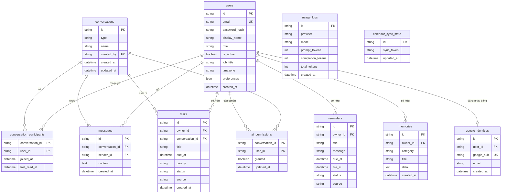
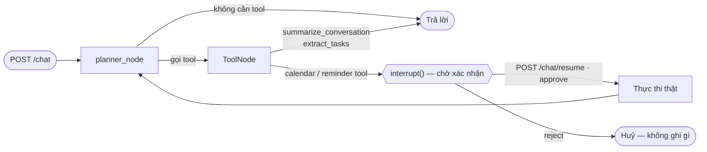

# PRD — Orbit

> Product Requirements Document · AI Agent Trợ lý cá nhân trong Chat
> Team DRIVER ENGINEER (P-132) · Cập nhật 2026-08-04

Tài liệu này mô tả **yêu cầu sản phẩm và trạng thái thực tế đã build**. Kiến trúc kỹ thuật chi tiết
xem [../ARCHITECTURE.md](../ARCHITECTURE.md); tiến độ theo đề bài xem [../ROADMAP.md](../ROADMAP.md);
luồng màn hình xem [UI_FLOW.md](UI_FLOW.md).

**Chú thích trạng thái:** 🟢 Xong · 🟡 Một phần · 🔴 Chưa có · ⚪ Không áp dụng

---

## 1. Mục tiêu sản phẩm

Biến luồng chat hỗn độn thành **việc cần làm có deadline** và **lịch có nhắc**, mà không bắt người
dùng rời khỏi app chat và không bao giờ tự ý hành động thay họ.

**Non-goals:** thay thế app quản lý dự án; làm chatbot tri thức tổng quát; mã hoá E2E tự implement.

## 2. Personas

| Persona | Mô tả | Job-to-be-done |
| --- | --- | --- |
| **Minh — nhân viên kinh doanh** | 6 nhóm chat công việc, ~300 tin/ngày | "Cho tôi biết nhóm này chốt gì, tôi phải làm gì, khi nào" |
| **Lan — trưởng nhóm** | Giao việc qua chat, hay quên lịch họp | "Tự ghi lại lời hứa của tôi và nhắc trước giờ" |
| **Admin hệ thống** | Vận hành nền tảng | "Ai đang dùng, hội thoại nào cần kiểm duyệt, AI đang tốn bao nhiêu token" |

## 3. User Stories & Acceptance Criteria

### US-1 — Đăng ký / Đăng nhập / Phân quyền 🟢

**Là** người dùng, **tôi muốn** đăng nhập an toàn **để** dữ liệu chat và task của tôi là riêng tư.

- [x] Đăng ký bằng email + mật khẩu, mật khẩu hash bằng **bcrypt** (không lưu plaintext).
- [x] Đăng nhập trả **JWT access token**; frontend gửi qua `Authorization: Bearer`.
- [x] Mọi route ứng dụng nằm sau `ProtectedRoute`; chưa đăng nhập → redirect `/login`.
- [x] Hai role: `user` và `admin`. Admin đầu tiên bootstrap qua `INITIAL_ADMIN_EMAIL` (áp dụng cho
      cả tài khoản tạo qua Google, không riêng `/register`).
- [x] Route `/admin/*` chặn bằng `AdminRoute` (FE) **và** `require_admin` dependency (BE).
- [x] **Đăng nhập bằng Google** (cộng thêm, không thay email/mật khẩu): `POST /auth/google` xác
      minh ID token, find-or-create qua bảng `google_identities` riêng — không đổi cấu trúc bảng
      `users`/JWT hiện có. Chỉ tự liên kết vào tài khoản mật khẩu có sẵn khi Google xác nhận
      `email_verified`.

### US-2 — Nhắn tin 1-1 và nhóm realtime 🟢

**Là** người dùng, **tôi muốn** nhắn tin realtime **để** agent có dữ liệu thật để xử lý.

- [x] Tạo hội thoại 1-1 (dedupe: không tạo trùng) và hội thoại nhóm.
- [x] Tin nhắn đẩy realtime qua WebSocket tới đúng participant.
- [x] Lịch sử tin nhắn có phân trang; đếm số tin chưa đọc; đánh dấu đã đọc.
- [x] Một kết nối WebSocket dùng chung cho cả app (mở ở `AppLayout`, chia sẻ qua Outlet context).

### US-3 — Tóm tắt hội thoại 🟢

**Là** người dùng, **tôi muốn** bấm 1 nút để tóm tắt nhóm chat dài.

- [x] Nút **Summarize** trong `AIPanel` (khung AI cạnh khung chat) gọi `POST /api/v1/chat` thật.
- [x] Trả về **đúng 1 định dạng tóm tắt** (bug lặp 3 định dạng đã sửa ở `summarize_tool.py`).
- [x] Agent kết thúc ngay sau tool tóm tắt, không gọi LLM lần 2 để "kể lại" (tránh lỗi 400 tool-call).

### US-4 — Trích xuất task 🟢

**Là** người dùng, **tôi muốn** agent tìm việc cần làm trong hội thoại **để** tôi không bỏ sót.

- [x] Tool `extract_tasks` trả JSON chuẩn (title, due_at, priority).
- [x] Task AI đề xuất vào mục **"AI suggestions"** trên `/tasks` với `status="suggested"`, chờ
      **Accept / Dismiss** — không tự động thành task chính thức.
- [x] Danh sách task sort theo `due_at` + `priority`.
- [x] Có bộ eval đo Precision/Recall/F1 (`scripts/eval_extract_tasks.py`).

### US-5 — Nhắc việc có xác nhận 🟢

**Là** người dùng, **tôi muốn** được nhắc đúng giờ, nhưng **chỉ sau khi tôi đồng ý**.

- [x] Tool `create_reminder` **bắt buộc** dừng ở `interrupt()` → UI hiện thẻ Xác nhận/Huỷ.
- [x] Reminder lưu DB (bảng `reminders`) + APScheduler dùng `SQLAlchemyJobStore` → **sống sót qua
      restart backend** (đã test thật: tạo → restart → vẫn fire đúng giờ).
- [x] Khi fire, đẩy sự kiện WebSocket `reminder_fired` tới đúng chủ nhân.
- [x] Quick action **"Suggest reminder"** trong `AIPanel` cho luồng 1 chạm.

### US-6 — Lịch cá nhân + Google Calendar 2 chiều 🟢

**Là** người dùng, **tôi muốn** lịch chốt trong chat tự vào Google Calendar của tôi.

- [x] `/calendar` gọi Google Calendar API thật (list/create/update/delete), đúng timezone.
- [x] 3 tool agent `create/update/delete_calendar_event` — **cả 3 đều human-in-the-loop**.
- [x] Chiều ngược lại (Google → app): polling `syncToken` mỗi 20s (`CALENDAR_POLL_INTERVAL_SECONDS`),
      broadcast `calendar_event_updated` / `calendar_event_deleted` qua WebSocket. Tự resync khi
      Google trả 410 (token hết hạn).
- [x] Chọn polling thay vì webhook `events.watch` vì chưa có domain public HTTPS (Google không nhận
      callback `localhost`) — sẽ nâng cấp sau khi deploy.

### US-7 — Agent chủ động (proactive) 🟢

**Là** người dùng, **tôi muốn** agent tự phát hiện cam kết ngay khi tin nhắn tới.

- [x] Sau mỗi tin nhắn mới (cả REST lẫn WebSocket): pre-filter regex (VI+EN) → kiểm tra người gửi đã
      cấp `ai_permissions` cho hội thoại đó chưa (tắt là bỏ qua, không gọi LLM) → hỏi LLM xác nhận.
- [x] Nếu là cam kết/lịch hẹn → tạo `Task` (`source="proactive"`, `status="suggested"`) cho người gửi.
- [x] Đẩy WebSocket `task_suggested` → toast trỏ tới Tasks inbox.
- [x] Chạy nền (`asyncio.create_task` / `BackgroundTasks`), **không chặn gửi tin nhắn**, không raise
      ra ngoài. Pre-filter regex + kiểm tra quyền trước khi gọi LLM là tối ưu chi phí thực tế của hệ
      thống.
- [x] **Accept** một suggestion có `due_at` trong `/tasks` (chính là bước xác nhận human-in-the-loop)
      tự tạo thêm 1 sự kiện Google Calendar thật + 1 Reminder thật (`task_routes.py::
      _add_to_calendar_and_reminder`) — best-effort, lỗi Google Calendar không chặn việc Accept task.

### US-8 — Memory 🟢

- [x] **Memory hội thoại**: LangGraph checkpointer — `AsyncPostgresSaver`, bền vững qua restart.
- [x] **Memory dài hạn**: bảng `memories` (category/title/detail) + CRUD + trang `/memory` có
      search và tab lọc theo category sinh động từ dữ liệu thật.

### US-9 — Trang AI Assistant cá nhân 🟢

- [x] `/assistant` chat trực tiếp với agent, giữ `thread_id` xuyên suốt hội thoại.
- [x] Khi agent trả `status: "interrupted"` → hiện nút **Xác nhận / Huỷ** ngay trong bong bóng chat.

### US-10 — Admin dashboard + cảnh báo token 🟢

- [x] Dashboard: thống kê user/hội thoại/tin nhắn; quản lý user (đổi role, khoá/mở); kiểm duyệt và
      xoá hội thoại; xem/xoá Task, Reminder, Memory toàn hệ thống.
- [x] Bảng `usage_logs` ghi token mỗi lần gọi LLM (best-effort, không phá luồng chat nếu lỗi).
- [x] Stat card tổng token + số request hôm nay + % so với `DAILY_TOKEN_BUDGET`; banner đỏ khi ≥80%.
- [x] `usage_service._maybe_alert_budget` đẩy WebSocket `usage_budget_alert` tới **mọi admin đang
      online** ngay khi vượt 80%/100% (không chỉ khi admin chủ động mở trang Admin — hiện qua
      `BudgetAlertToast` ở bất kỳ trang nào), **và** `usage_service.is_over_budget()` chặn hẳn cuộc
      gọi LLM mới (`/chat`, proactive detection) một khi đã chạm ngân sách — `/chat/resume` được
      miễn trừ để không treo `interrupt()` dở dang.

### US-11 — Xử lý lỗi 🟢

- [x] `ChatResponse` có `status: "error"` — agent không "nuốt" exception thành response rỗng.
- [x] UI hiển thị đúng thông báo lỗi (phát hiện khi LLM provider trả rate-limit).

## 4. Yêu cầu phi chức năng

| Nhóm | Yêu cầu | Trạng thái |
| --- | --- | --- |
| **Bảo mật** | Mật khẩu bcrypt; JWT; không hardcode secret (đọc từ `.env`) | 🟢 |
| **Bảo mật** | `/chat` và `/chat/resume` yêu cầu đăng nhập + kiểm tra quyền sở hữu `thread_id` | 🟢 |
| **Quyền riêng tư** | Backend verify người gọi là participant của `conversation_id` | 🟢 |
| **Quyền riêng tư** | Bảng quyền `ai_permissions` theo từng conversation, mặc định chưa cấp quyền, `POST /api/v1/chat` từ chối (403) khi chưa cấp | 🟢 |
| **Quyền riêng tư** | Minh bạch: UI báo rõ nội dung tin nhắn được gửi sang Gemini/Groq | 🟢 |
| **Quyền riêng tư** | Mã hoá E2E thật | ⚪ Ngoài phạm vi (ghi rõ trong ROADMAP) |
| **Độ trễ/chi phí** | Chỉ tóm tắt khi người dùng yêu cầu; pre-filter regex trước LLM ở proactive | 🟢 |
| **Độ trễ/chi phí** | Cache embedding / batch LLM call | ⚪ Không áp dụng — app không dùng vector store |
| **Múi giờ** | Toàn hệ thống dùng `Asia/Ho_Chi_Minh` (scheduler, usage, FE `utils/datetime.js`, FullCalendar) | 🟢 |
| **Realtime** | Chat, Reminder, Task, Calendar đều đẩy realtime qua **một** kênh WebSocket dùng chung | 🟢 |
| **Chất lượng** | `pytest tests/ -v` + `ruff check .` sạch + `npm run build` sạch, chạy CI trên GitHub Actions | 🟢 |
| **Vận hành** | Rate limiting trên API | 🔴 Cần trước khi mở public |
| **Vận hành** | Deploy online + CD | 🔴 Hạng mục lớn nhất còn lại |

## 5. Mô hình dữ liệu

`conversation_participants` dùng **khoá chính kép** `(conversation_id, user_id)` — cả hai đồng thời
là khoá ngoại.

**Enum giá trị:**

- `users.role`: `user` | `admin`
- `conversations.type`: `direct` | `group`
- `tasks.status`: `suggested` | `pending` | `in_progress` | `completed` | `dismissed`
- `tasks.source`: `manual` | `proactive` · `tasks.priority`: `High` | `Medium` | `Low`
- `reminders.status`: `scheduled` | `fired` | `cancelled` · `reminders.source`: `manual` | `agent` | `proactive`

Sự kiện lịch **không lưu trong DB** — nguồn sự thật là Google Calendar; `calendar_sync_state` chỉ giữ
con trỏ đồng bộ (1 dòng, `id="default"`).

## 6. API Surface

Tất cả dưới prefix `/api/v1`, đều yêu cầu JWT trừ `/auth/register`, `/auth/login`, `/auth/google`.

| Nhóm | Endpoint |
| --- | --- |
| **Auth** | `POST /auth/register` · `POST /auth/login` · `POST /auth/google` · `GET /auth/me` · `PATCH /auth/me` · `POST /auth/me/password` |
| **Chat** | `GET /users` · `GET|POST /conversations` · `GET|POST /conversations/{id}/messages` · `POST /conversations/{id}/read` · `GET|PUT /conversations/{id}/ai-permission` |
| **Agent** | `POST /chat` · `POST /chat/resume` · `GET /status` |
| **Tasks** | `GET|POST /tasks` · `PATCH /tasks/{id}/status` · `DELETE /tasks/{id}` |
| **Calendar** | `GET|POST /calendar/events` · `PATCH|DELETE /calendar/events/{id}` |
| **Reminders** | `GET|POST /reminders` · `DELETE /reminders/{id}` |
| **Memories** | `GET|POST /memories` · `PATCH|DELETE /memories/{id}` |
| **Admin** | `GET /admin/stats` · `GET /admin/users` · `PATCH /admin/users/{id}/role|status` · `GET /admin/conversations` · `GET /admin/conversations/{id}/messages` · `DELETE /admin/conversations/{id}` · `GET|DELETE /admin/tasks` · `GET|DELETE /admin/reminders` · `GET|DELETE /admin/memories` |
| **Realtime** | `WS /api/v1/ws` |

**Sự kiện WebSocket:** `new_message` · `reminder_fired` · `task_suggested` · `task_created` ·
`task_updated` · `task_deleted` · `calendar_event_updated` · `calendar_event_deleted`

**Payload `interrupt()` (human-in-the-loop):** `type` = `calendar_event` | `calendar_event_update` |
`calendar_event_delete` | `reminder`, kèm `draft` chứa nội dung sẽ được ghi.

**Tool của agent (9 tool trong `ALL_TOOLS`):** `summarize_conversation` · `extract_tasks` ·
`search_messages` · `create_calendar_event` · `list_calendar_events` · `update_calendar_event` ·
`delete_calendar_event` · `create_reminder` · `list_reminders`. Bốn tool có `interrupt()`:
`create/update/delete_calendar_event` và `create_reminder`.

## 7. Luồng Agent (LangGraph)

**Quy tắc bắt buộc:** mọi tool có tác dụng phụ đều đi qua `interrupt()`. Hai tool "terminal"
(`summarize_conversation`, `extract_tasks`) kết thúc ngay sau khi chạy — output của chúng chính là câu
trả lời, không gọi LLM lần 2 (tránh lỗi model tự sinh giả cú pháp gọi tool).

## 8. Ràng buộc kỹ thuật

- **LLM:** đổi provider qua `LLM_PROVIDER` (`google` → `gemini-2.5-flash`, hoặc `groq`) — thiết kế
  này sinh ra từ sự cố hết quota free-tier thật.
- **Database:** PostgreSQL (bắt buộc, không còn hỗ trợ SQLite). Trên Windows **phải** chạy
  `python scripts/run_dev.py` thay vì `uvicorn` CLI (`AsyncPostgresSaver` cần `SelectorEventLoop`;
  uvicorn CLI trên Windows luôn chọn `ProactorEventLoop` trước khi app được import).
- **Backend:** FastAPI + SQLAlchemy async · **Frontend:** React 18 + Vite + Bootstrap 5.
- **Scheduler:** APScheduler với `SQLAlchemyJobStore`, timezone `Asia/Ho_Chi_Minh`.

## 9. Rủi ro đã biết

| Rủi ro | Mức | Giảm thiểu |
| --- | --- | --- |
| Chưa deploy online — yêu cầu bắt buộc của đề bài | **Cao** | Ưu tiên #1 trong ROADMAP; Dockerfile/compose đã sẵn |
| Người dùng quên cấp quyền AI, tưởng lỗi | Thấp | `AIPanel.jsx` disable quick action + báo rõ "Permission required" khi chưa cấp quyền cho hội thoại đó |
| Eval trích task chỉ 8 case | Trung bình | Coi là bằng chứng ban đầu, không báo cáo như benchmark |
| Không có rate limiting | Trung bình | Bắt buộc làm trước khi mở public |
| Nội dung tin nhắn gửi sang LLM bên thứ ba | Trung bình | Minh bạch trong UI; không lưu nội dung thô ngoài DB của app |

---

*Trạng thái trong tài liệu này phản ánh code tại commit `d431b71` (2026-08-04). Khi hoàn thành một
mục, cập nhật cả đây lẫn [../ROADMAP.md](../ROADMAP.md).*
