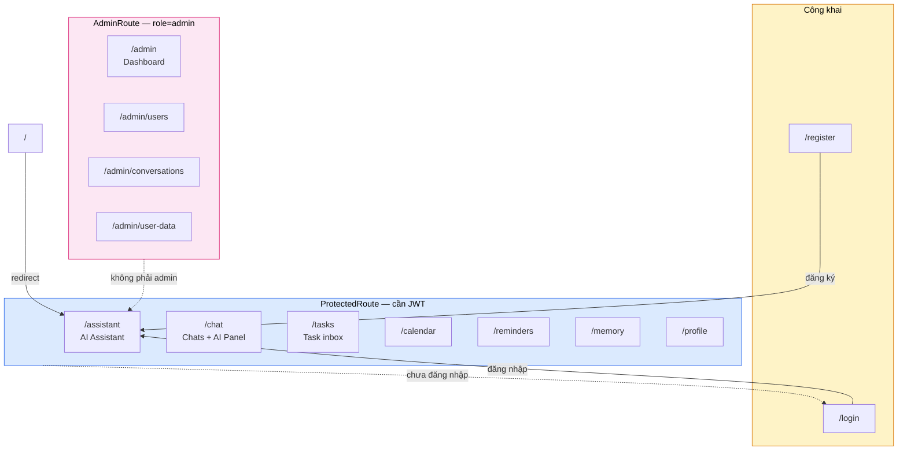
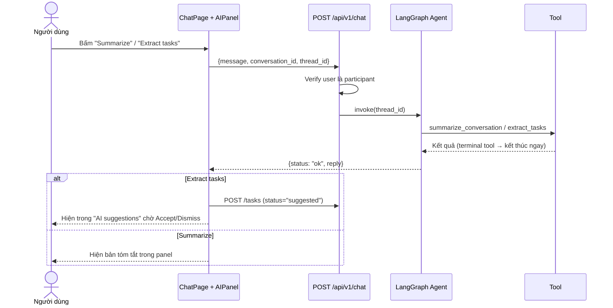
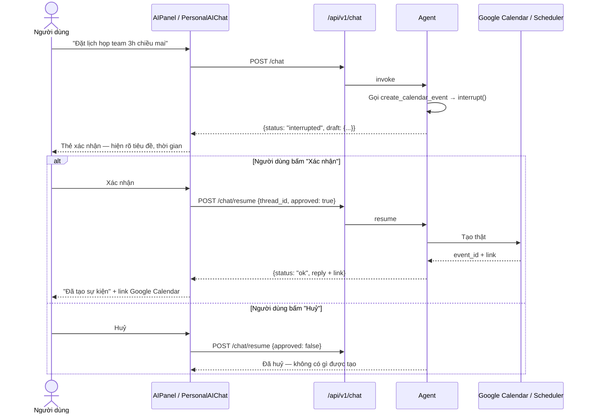
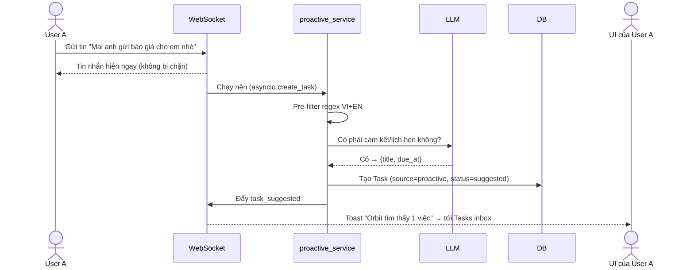
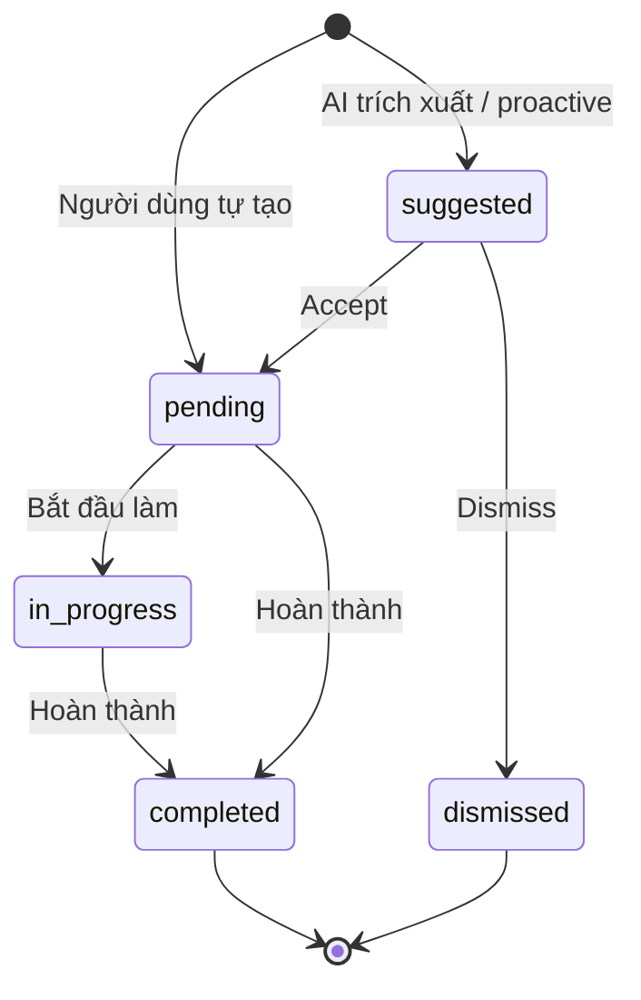

# UI Flow & Wireframe — Orbit

> Bản đồ màn hình và luồng người dùng · Cập nhật 2026-08-04
> Wireframe trực quan: mở [wireframes.html](wireframes.html) bằng trình duyệt.

---

## 1. Sitemap

**Layout chung (`AppLayout`):** Sidebar trái (Workspace: AI Assistant · Chats · Tasks · Calendar ·
Reminders · Memory · Profile; mục Admin chỉ hiện với role admin) + TopNavbar + vùng nội dung.
Một kết nối WebSocket duy nhất mở ở `AppLayout` và chia sẻ xuống các trang qua Outlet context.

## 2. Luồng chính — Tóm tắt & trích xuất task từ chat

## 3. Luồng human-in-the-loop — Tạo lịch / nhắc việc

Đây là luồng **bắt buộc** cho mọi hành động có tác dụng phụ.

**Nguyên tắc UI:** thẻ xác nhận phải hiện **đủ thông tin sẽ được ghi** (tiêu đề, ngày giờ, người
nhận) trước khi người dùng bấm — không được chỉ hiện "Bạn có chắc không?".

## 4. Luồng proactive — Agent tự phát hiện cam kết

Pre-filter regex chạy **trước** khi gọi LLM để không tốn token cho tin nhắn hiển nhiên không phải
cam kết ("ok", "haha", emoji…).

## 5. Trạng thái Task

## 6. Mô tả từng màn hình

| Màn hình | Thành phần chính | Nguồn dữ liệu |
| --- | --- | --- |
| **/login, /register** | Form email + mật khẩu, link chuyển qua lại | `POST /auth/login`, `/auth/register` |
| **/assistant** | Chat trực tiếp với agent; giữ `thread_id`; nút Xác nhận/Huỷ trong bong bóng chat; panel ngữ cảnh bên phải | `POST /chat`, `/chat/resume` |
| **/chat** | 3 cột: danh sách hội thoại · khung tin nhắn realtime · **AIPanel** (Summarize, Extract tasks, Suggest reminder, Find schedule, Deadlines, ô Ask Orbit, thẻ quyền AI) | `/conversations`, `/messages`, WS, `POST /chat` |
| **/tasks** | Stat card · mục "AI suggestions" (Accept/Dismiss) · bảng task chính sort theo due_at + priority · ô search | `GET/POST /tasks`, WS `task_*` |
| **/calendar** | FullCalendar (timezone Asia/Ho_Chi_Minh) · modal chi tiết sự kiện có nút xoá | `/calendar/events`, WS `calendar_event_*` |
| **/reminders** | Danh sách nhắc việc theo trạng thái; toast realtime khi fire | `/reminders`, WS `reminder_fired` |
| **/memory** | Search + tab lọc theo category (sinh từ dữ liệu thật) · modal thêm/sửa · dropdown Edit/Delete | `/memories` |
| **/profile** | Thông tin cá nhân (tên, chức danh, timezone) · đổi mật khẩu (verify mật khẩu cũ) | `PATCH /auth/me`, `POST /auth/me/password` |
| **/admin** | Stat card user/hội thoại/tin nhắn + **token hôm nay & % ngân sách** · banner đỏ khi ≥80% | `GET /admin/stats` |
| **/admin/users** | Bảng user, đổi role, khoá/mở tài khoản | `/admin/users` |
| **/admin/conversations** | Danh sách hội thoại, xem tin nhắn, xoá | `/admin/conversations` |
| **/admin/user-data** | Task / Reminder / Memory toàn hệ thống, xoá được | `/admin/tasks`, `/reminders`, `/memories` |

## 7. Quy ước thiết kế

- **Sidebar cố định** ở desktop, thu vào drawer ở mobile (Bootstrap 5, mobile-friendly theo đề bài).
- **Mọi thao tác AI có tác dụng phụ** → thẻ xác nhận màu nổi bật, 2 nút Xác nhận / Huỷ.
- **Task do AI đề xuất** luôn tách khỏi task chính thức bằng khối "AI suggestions" riêng.
- **Ngày giờ** hiển thị qua `Frontend/src/utils/datetime.js` (Intl, cố định `Asia/Ho_Chi_Minh`) —
  không tự format rải rác trong component.
- **Trạng thái rỗng** (chưa có task/reminder/memory) có hướng dẫn hành động, không để trắng.
