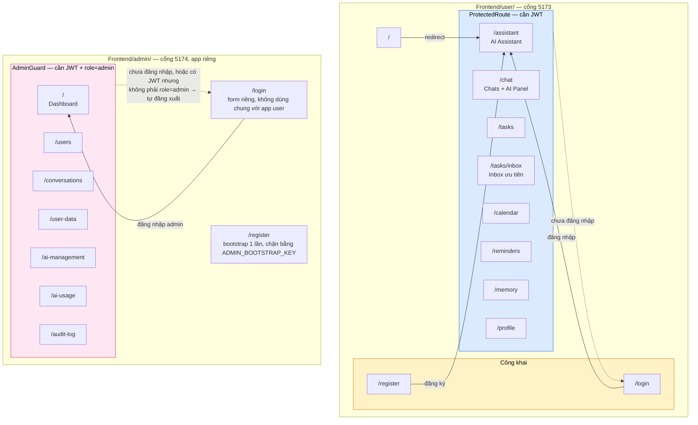
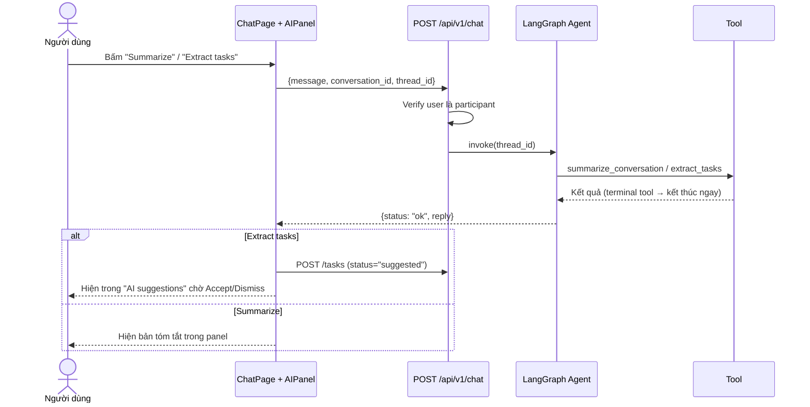
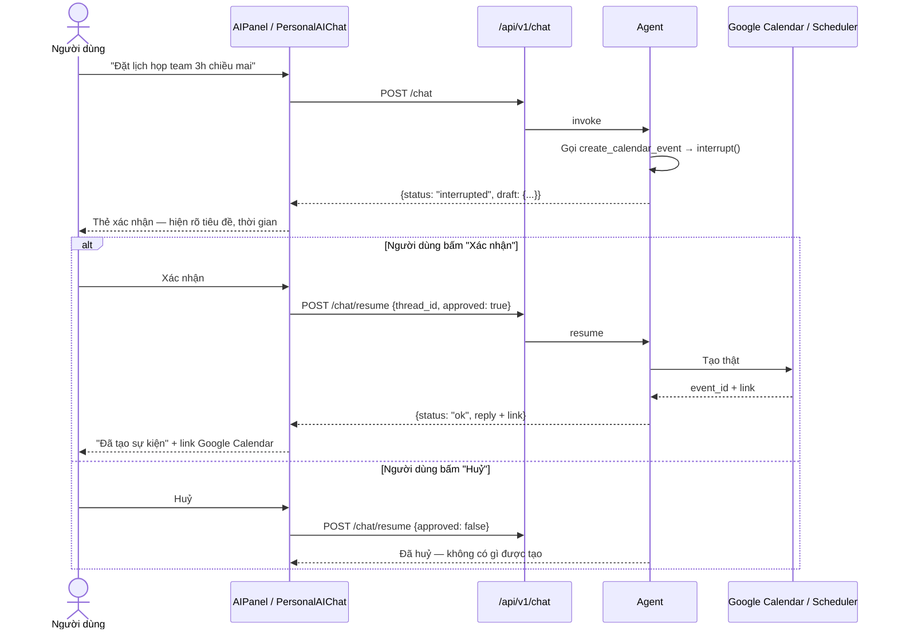
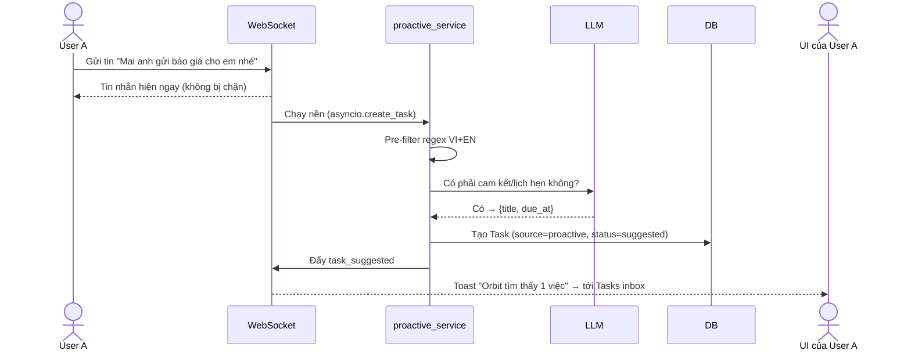
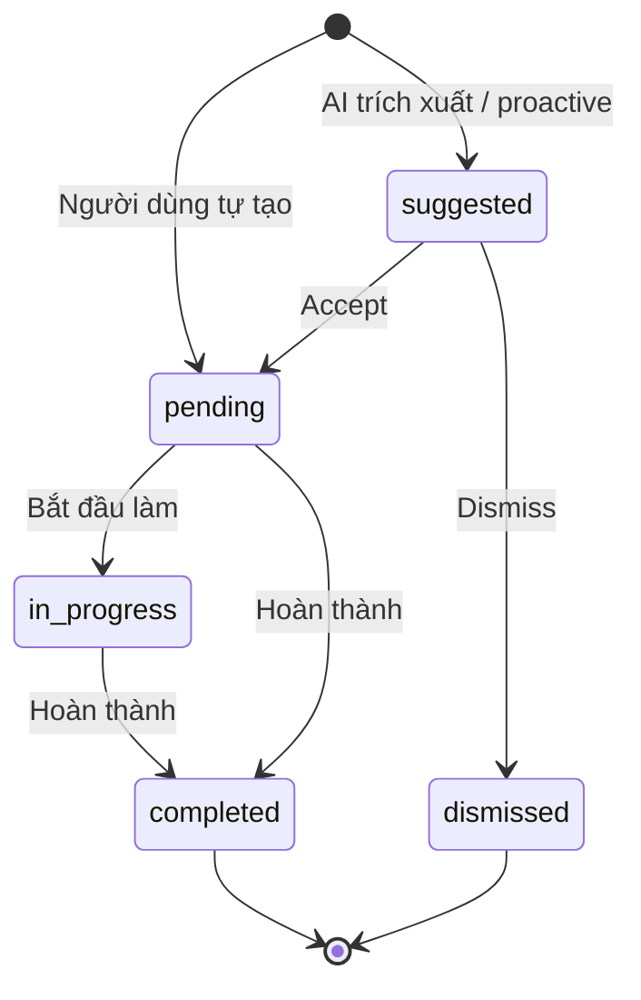

# UI Flow & Wireframe — Orbit

> Bản đồ màn hình và luồng người dùng · Cập nhật 2026-08-15
> Wireframe trực quan: mở [wireframes.html](wireframes.html) bằng trình duyệt (vẽ trước khi tách app
> admin — không còn khớp 100% với layout admin hiện tại, xem mục 6 bên dưới cho danh sách màn hình
> đúng thật).

---

## 1. Sitemap

Từ 2026-08-14, admin **không còn** là route con của app người dùng — đây là **2 app Vite độc lập**,
mỗi app tự có `BrowserRouter` riêng và chạy ở cổng khác nhau, không share client-side router:

**Layout app người dùng (`AppLayout`):** Sidebar trái (Workspace: AI Assistant · Chats · Tasks ·
Task Inbox · Calendar · Reminders · Memory · Profile — **không còn mục Admin**, đã bỏ hẳn khỏi
Sidebar khi tách app) + TopNavbar (search, help, chuông thông báo, widget "AI credits", avatar) +
vùng nội dung. Một kết nối WebSocket duy nhất mở ở `AppLayout` và chia sẻ xuống các trang qua Outlet
context.

**Layout app admin (`AdminShell`):** Sidebar/nav riêng cho 7 trang admin + kết nối WebSocket riêng
của chính app này (nhận `usage_budget_alert` độc lập với app người dùng).

## 2. Luồng chính — Tóm tắt & trích xuất task từ chat

## 3. Luồng human-in-the-loop — Tạo lịch / nhắc việc

Đây là luồng **bắt buộc** cho mọi hành động có tác dụng phụ.

**Nguyên tắc UI:** thẻ xác nhận phải hiện **đủ thông tin sẽ được ghi** (tiêu đề, ngày giờ, người
nhận) trước khi người dùng bấm — không được chỉ hiện "Bạn có chắc không?".

## 4. Luồng proactive — Agent tự phát hiện cam kết

Pre-filter regex chạy **trước** khi gọi LLM để không tốn token cho tin nhắn hiển nhiên không phải
cam kết ("ok", "haha", emoji…).

## 5. Trạng thái Task

## 6. Mô tả từng màn hình

### App người dùng (`Frontend/user/`, cổng 5173)

| Màn hình | Thành phần chính | Nguồn dữ liệu |
| --- | --- | --- |
| **/login, /register** | Form email + mật khẩu, nút "Sign in with Google", link chuyển qua lại | `POST /auth/login`, `/auth/register`, `/auth/google` |
| **/assistant** | Danh sách phiên chat trước đó bên trái (dữ liệu thật, `AssistantThread`) · chat trực tiếp với agent ở giữa, giữ `thread_id`, nút Xác nhận/Huỷ trong bong bóng chat, trả lời render markdown thật · panel ngữ cảnh bên phải (task cần chú ý/lịch sắp tới/memory, dữ liệu thật) | `POST /chat`, `/chat/resume`, `GET /assistant/threads`, `/threads/{id}/messages` |
| **/chat** | 3 cột: danh sách hội thoại (mỗi dòng có công tắc AI riêng, nút nhảy tới tin chưa đọc) · khung tin nhắn realtime · **AIPanel** (Summarize, Extract tasks, Suggest reminder, Find schedule, Deadlines, ô Ask Orbit, thẻ quyền AI) — menu "..." trên header có Delete (chỉ với tôi)/Leave group | `/conversations`, `/messages`, WS, `POST /chat` |
| **/tasks** | Stat card · mục "AI suggestions" (Accept/Dismiss) · bảng task chính sort theo due_at + priority · ô search · nút "Add task" | `GET/POST /tasks`, WS `task_*` |
| **/tasks/inbox** | View tách riêng khỏi `/tasks`, nhóm 4 mức: cần quyết định / quá hạn / sắp đến hạn 48h / priority cao | `GET /tasks` (tính phía client) |
| **/calendar** | Chưa Connect: thẻ mời kết nối. Đã Connect: FullCalendar (timezone Asia/Ho_Chi_Minh, plugin moment-timezone) · modal chi tiết sự kiện có nút xoá · agent tạo event tự kiểm tra trùng lịch, gợi ý khung giờ thay thế nếu xung đột | `/calendar/events`, `/calendar/connection`, `/calendar/oauth/url`, WS `calendar_event_*` |
| **/reminders** | Danh sách nhắc việc theo trạng thái; toast realtime khi fire | `/reminders`, WS `reminder_fired` |
| **/memory** | Search + tab lọc theo category (sinh từ dữ liệu thật) · modal thêm/sửa · dropdown Edit/Delete | `/memories` |
| **/profile** | Thông tin cá nhân (tên, chức danh, timezone) · đổi mật khẩu (verify mật khẩu cũ) | `PATCH /auth/me`, `POST /auth/me/password` |

Sidebar app này còn có widget "AI credits" (đọc `GET /usage/status`) và toast/confirm dùng chung
(`ToastContext`, `ConfirmDialog`) cho mọi lỗi API thay vì `window.alert`/`confirm` của trình duyệt.

### App admin (`Frontend/admin/`, cổng 5174 — app riêng, không nằm trong Sidebar app người dùng)

| Màn hình | Thành phần chính | Nguồn dữ liệu |
| --- | --- | --- |
| **/login, /register** | Form đăng nhập/đăng ký **riêng** của app admin — `/register` chỉ dùng được 1 lần lúc chưa có admin nào, chặn bằng `ADMIN_BOOTSTRAP_KEY` | `POST /auth/admin/login`, `/auth/admin/register` |
| **/** (Dashboard) | Stat card user/hội thoại/tin nhắn + **token hôm nay & % ngân sách** · banner đỏ khi ≥80% · form đổi `DAILY_TOKEN_BUDGET` ngay lúc đang chạy · banner retry khi fetch lỗi | `GET /admin/stats`, `PATCH /admin/settings/budget` |
| **/users** | Bảng user, đổi role, khoá/mở tài khoản — mỗi dòng có trạng thái pending riêng khi đang gọi API, báo lỗi qua toast | `/admin/users` |
| **/conversations** | Danh sách hội thoại, xem tin nhắn, xoá (qua `ConfirmDialog`) | `/admin/conversations` |
| **/user-data** | Task / Reminder / Memory toàn hệ thống, xoá được | `/admin/tasks`, `/reminders`, `/memories` |
| **/ai-management** | Đổi provider/model/temperature LLM không cần restart · thống kê quyền AI/gợi ý proactive · tình trạng hệ thống (DB, scheduler, WebSocket, LLM credential, Calendar OAuth) | `GET/PATCH /admin/ai-management`, `GET /admin/system-health` |
| **/ai-usage** | Token đã dùng + chi phí ước tính, xu hướng theo ngày/theo model | `GET /admin/ai-usage` |
| **/audit-log** | Ai làm gì trên hệ thống, tìm/lọc được (đổi role/status/budget, xoá hội thoại/task/reminder/memory) | `GET /admin/audit-log` |

## 7. Quy ước thiết kế

- **Sidebar cố định** ở desktop, thu vào drawer ở mobile (Bootstrap 5, mobile-friendly theo đề bài).
- **Mọi thao tác AI có tác dụng phụ** → thẻ xác nhận màu nổi bật, 2 nút Xác nhận / Huỷ.
- **Task do AI đề xuất** luôn tách khỏi task chính thức bằng khối "AI suggestions" riêng.
- **Ngày giờ** hiển thị qua `Frontend/src/utils/datetime.js` (Intl, cố định `Asia/Ho_Chi_Minh`) —
  không tự format rải rác trong component.
- **Trạng thái rỗng** (chưa có task/reminder/memory) có hướng dẫn hành động, không để trắng.
