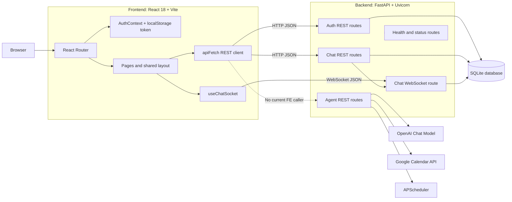
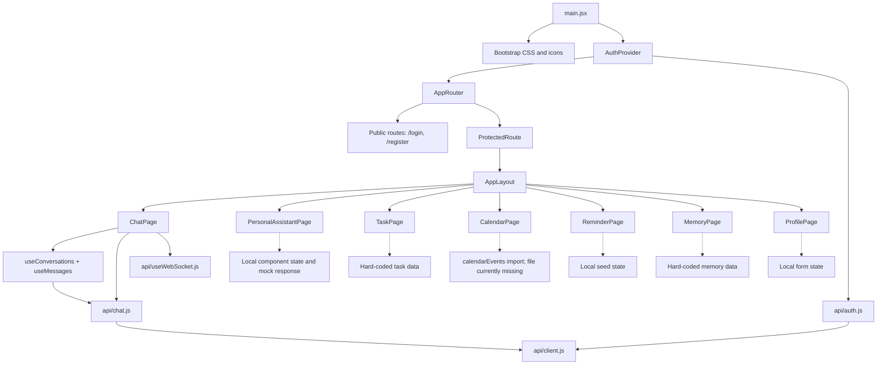
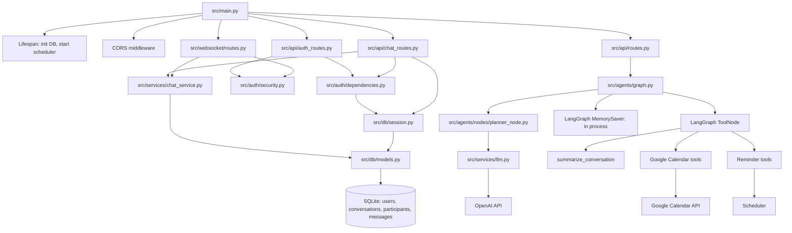
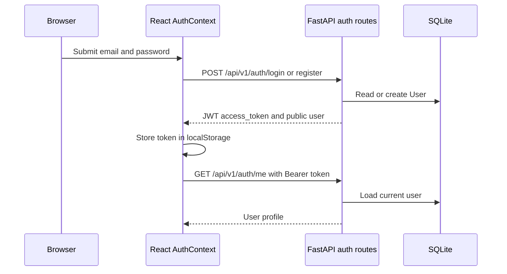
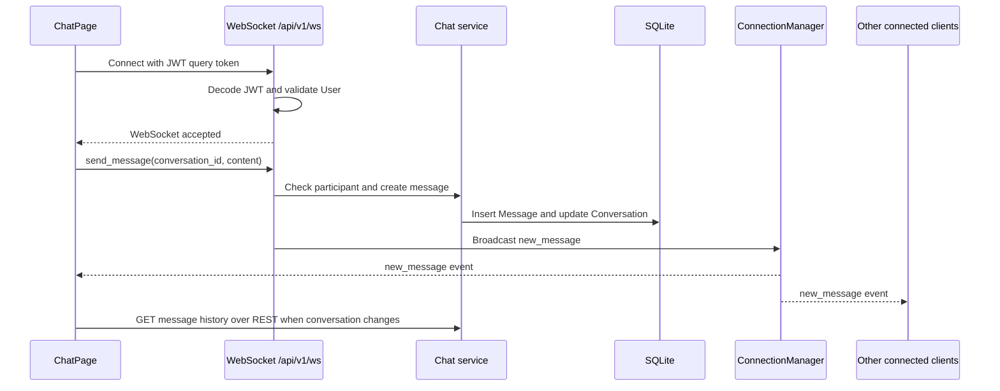
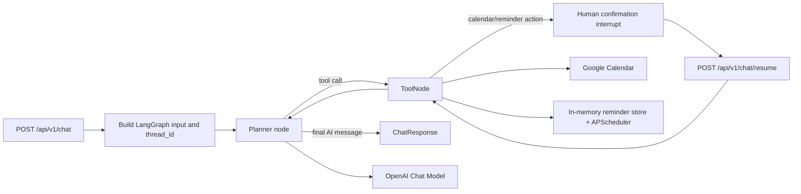
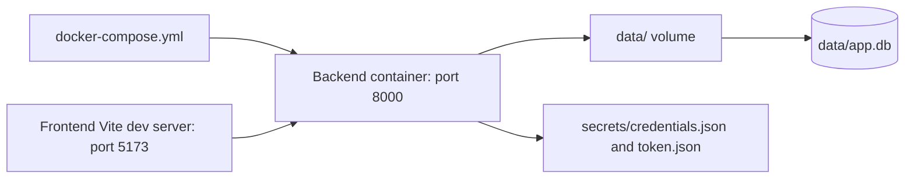

# Project Architecture Diagram

This document describes the architecture implemented by `Frontend/` and `src/`.
It intentionally separates working integrations from UI-only or planned parts.

## 1. System Context

## 2. Frontend Architecture

### Frontend integration status

| Area | Current implementation | Backend connection |
| --- | --- | --- |
| Login and registration | `AuthContext` calls `api/auth.js` | Connected to `/api/v1/auth/*` |
| User session | Bearer token stored as `orbit_token` | Connected to `/api/v1/auth/me` |
| Conversations | REST list/create/read plus WebSocket messages | Connected |
| Chat history | `useMessages` loads REST history | Connected |
| Personal Assistant | Local React state and placeholder reply | Not connected to `/api/v1/chat` |
| Tasks, Calendar, Reminders, Memory, Profile | Mock or local UI state | No corresponding FE API client |

## 3. Backend Modules

## 4. API and Message Flows

### Authentication

### Real-time chat

### AI agent flow

## 5. Runtime and Persistence

- The Docker Compose file runs the backend only. The frontend is run separately with Vite.
- The default database is SQLite at `./data/app.db`; database tables are created at startup.
- There is no Alembic migration setup in the current runtime.
- LangGraph uses `MemorySaver`, so agent thread checkpoints are lost on process restart.
- Reminders are held in module-level memory and scheduled by APScheduler; they are lost on restart and do not currently push a notification through WebSocket.
- Chroma is present only as configuration; no vector store is wired into the active graph.

## 6. Findings and Gaps

1. `Frontend/src/pages/CalendarPage.jsx` imports `Frontend/src/data/mockData`, but that module is absent, so the frontend build currently fails before runtime.
2. `PersonalAssistantPage` does not call the agent REST endpoints. The visible assistant response is a placeholder generated in `PersonalAIChat.jsx`.
3. The agent endpoints in `src/api/routes.py` do not depend on `get_current_user`; unlike chat and auth-me routes, they are not protected by JWT at the route layer.
4. The WebSocket authenticates with a JWT in the URL query string. This works with the current client but exposes tokens to URL-level logging unless deployment logging is controlled.
5. `@orbit` is presented as a UI hint in the chat composer, but the WebSocket handler currently treats every `send_message` as a normal persisted chat message and does not invoke the AI agent.
