# Kiến trúc và sơ đồ các nhánh — Orbit CHAT-01

> Ba vai trò nghiệp vụ · Ba role-agent · Một Orchestrator · Policy trước tool · HITL trước side effect

## 1. Hiện trạng và kiến trúc đích

### CURRENT — nền tảng đang có trên `origin/main`

Hệ thống hiện có một planner dùng chung trong `src/agents`, gọi các tool tóm tắt, task, reminder,
calendar, memory, people và search. Graph cơ bản là `planner → tools → planner/end`; user UI và admin
UI đã tách riêng, còn short-term state dùng LangGraph checkpoint. Đây là nền tảng tốt để mở rộng
nhưng **chưa phải ba agent độc lập theo vai trò**. Compact node, thread TTL, personal timeline và
governed long-term memory ở phần kế tiếp là thiết kế đích; tại thời điểm tài liệu được nhập vào
`main`, phần code tương ứng vẫn đang được phát triển trên nhánh tích hợp.

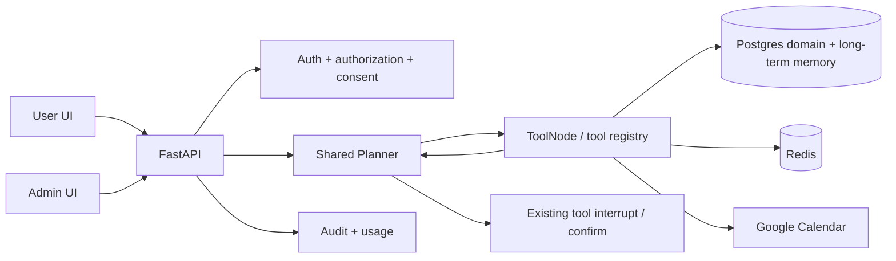

### TARGET foundation — Timeline và memory cần tích hợp

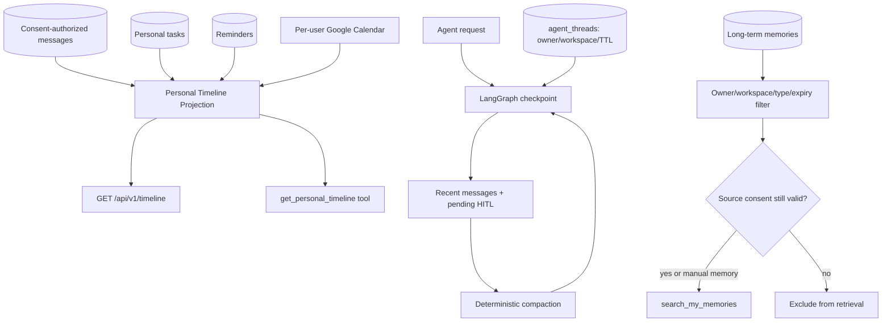

- Timeline sẽ là projection read-only, mặc định gộp task/reminder/calendar; message chỉ được thêm khi
  yêu cầu rõ và vẫn qua membership + consent. Calendar lỗi trả partial result cùng source status.
- Short-term checkpoint sẽ sống theo `thread_id`, persist bằng PostgreSQL ở production và được compact khi
  quá `AGENT_MAX_THREAD_MESSAGES`; thread metadata hết hạn theo `AGENT_THREAD_RETENTION_DAYS`.
- Long-term memory sẽ hỗ trợ `preference|relationship|episodic|semantic`, `source_message_ids`,
  `consent_scope_hash`, `sensitivity`, `confidence`, `expires_at` và `last_accessed_at`.
- Retrieval giai đoạn đầu dùng keyword search có governance; semantic/vector ranking là TARGET/P1.

### TARGET — vertical slice trong 7 ngày

Không nhân ba toàn bộ hạ tầng. Ba agent là ba policy/prompt/tool profile chạy trên một orchestration
core chung.

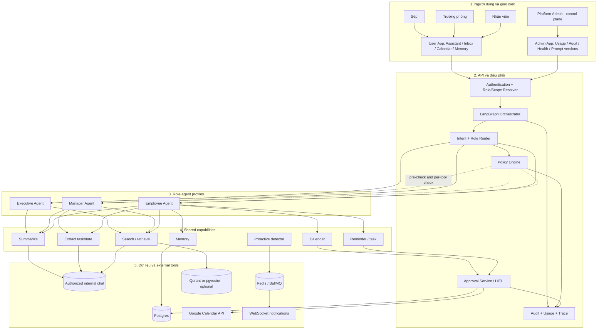

## 2. Trục điều phối chung

Mọi nhánh đều dùng cùng một trục; role-agent không tự gọi tool ngoài trục này.

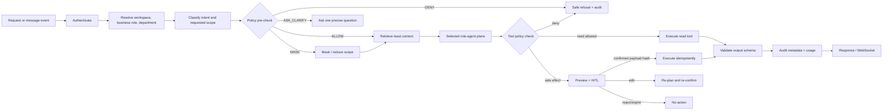

## 3. Ba nhánh agent

### Nhánh A — Employee Agent

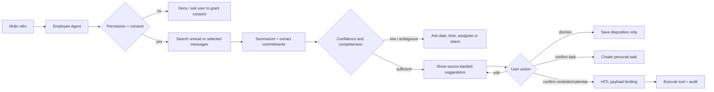

Đầu vào thường gặp: “Tóm tắt tin chưa đọc”, “Tôi có việc gì?”, “Tạo lịch chiều mai”. Đầu ra chuẩn:
summary, decisions, tasks, open questions, sources và action cards. Agent chỉ dùng personal scope.

### Nhánh B — Manager Agent

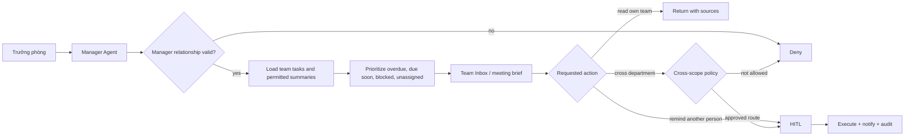

Manager Agent không được lấy chat riêng của nhân viên chỉ vì user là trưởng phòng. Nó ưu tiên task
records và summary đã cấp quyền; raw message cần conversation membership/entitlement riêng.

### Nhánh C — Executive Agent

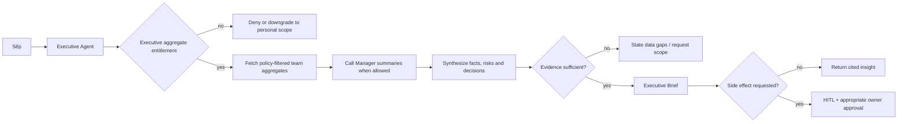

Executive Agent là agent tổng hợp, không phải “superuser đọc hết”. Nó dùng aggregate scope và có thể
gọi capability tổng hợp của Manager Agent qua Orchestrator; không bypass Policy Engine.

## 4. Nhánh proactive

Đường proactive phải bất đồng bộ để không làm chậm gửi tin.

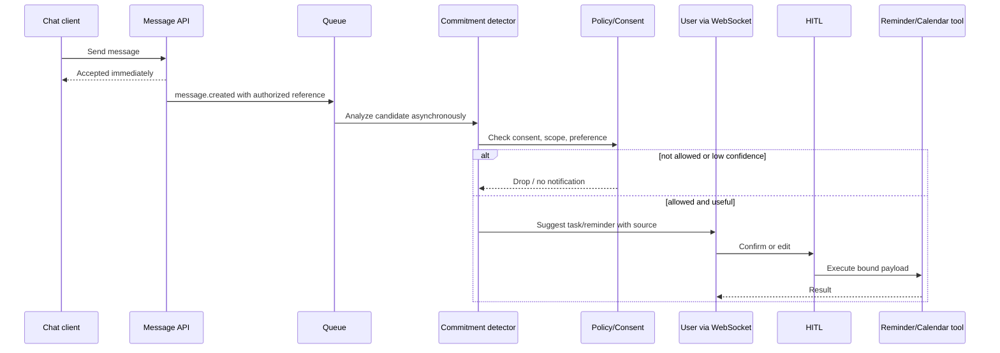

Rule gate trước model: bỏ qua reaction, emoji-only, system event và message không có tín hiệu hành
động; batch thread ngắn; dedupe theo source fingerprint.

## 5. Cây quyết định Policy Engine

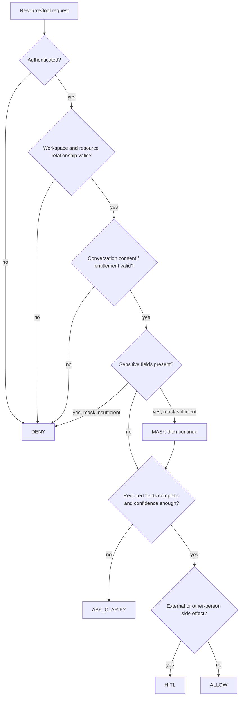

## 6. Scope dữ liệu trực quan

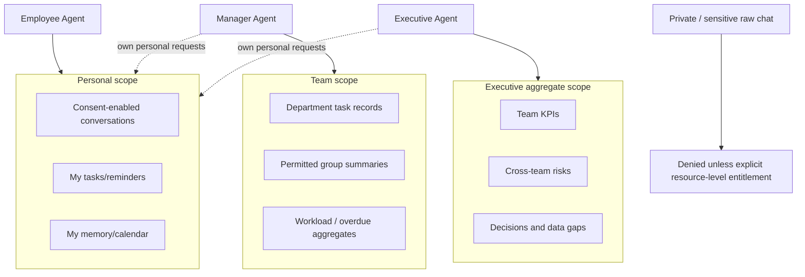

Scope không phải vòng tròn kế thừa “sếp thấy mọi thứ”. Aggregate scope là một projection an toàn,
không đồng nghĩa union của toàn bộ raw messages.

## 7. LangGraph đích

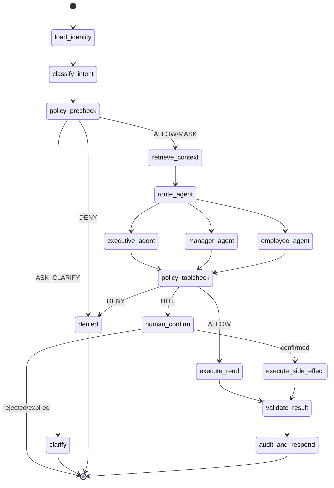

`AgentState` đích cần thêm: `business_role`, `department_ids`, `requested_scope`, `selected_agent`,
`intent`, `policy_decisions`, `consent_scope_hash`, `retrieved_source_ids`, `approval_request`,
`prompt_version`, `model_route`, `cost`, `trace_id` và `errors`.

## 8. Tool access matrix

| Tool/capability | Employee | Manager | Executive | Policy/HITL |
|---|:---:|:---:|:---:|---|
| `summarize_messages` | Personal | Team-permitted | Aggregate | Consent/scope check |
| `search_messages` | Personal | Team-permitted | Không mặc định raw | Resource authorization |
| `extract_tasks` | Personal | Team-permitted | Aggregate only | Confidence + schema |
| `get_team_inbox` | — | Own department | Aggregate view | Manager relation |
| `get_executive_brief` | — | — | Entitled unit | Aggregate policy |
| `create/update task` | Own | Own/team allowed | Usually delegate | Other person → HITL |
| `calendar create/update/delete` | Own | Own/allowed | Own/allowed | Luôn HITL |
| `create reminder` | Own | Own/team allowed | Usually delegate | Other person → HITL |
| `memory read/write/delete` | Own | Own + approved team aggregate | Own + aggregate | Owner/purpose/TTL |

## 9. Model routing, latency và cost

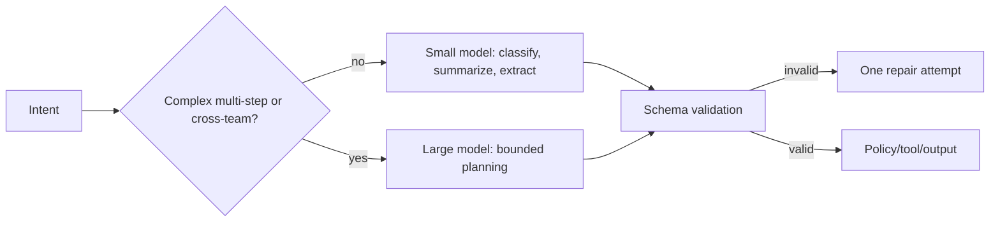

- Small model là mặc định; large model chỉ được router chọn cho reasoning tổng hợp phức tạp.
- Giới hạn số bước, tool calls, context tokens và wall-clock theo run.
- Search-first, summary cache và prompt version trong cache key.
- Không cache kết quả side effect hoặc dữ liệu sau khi consent bị revoke.

## 10. Triển khai

```mermaid
flowchart LR
    WEB[User/Admin web on Vercel] --> API[FastAPI container]
    API --> PG[(Postgres)]
    API --> RD[(Redis)]
    API --> WK[Worker: proactive/scheduler]
    WK --> RD
    WK --> PG
    API --> LLM[LLM providers]
    API --> GC[Google Calendar]
    API --> WS[WebSocket gateway]
    OBS[Metrics/log/audit without raw content] <-- API
    OBS <-- WK
```

Trong MVP, FastAPI hiện tại được giữ. BullMQ/NestJS không cần thêm chỉ vì đề bài gợi ý; dùng queue
hiện có hoặc một worker tương thích Redis để tránh tăng công nghệ trong tuần.

## 11. Ranh giới bảo mật bắt buộc

1. Authorization lọc resource trước khi nội dung vào model.
2. Tool registry chọn allowlist theo agent và policy; model không tự đặt tên endpoint tùy ý.
3. Raw message không vào audit/log/analytics; source ID có thể hash khi cần.
4. Prompt injection trong chat được xem là dữ liệu, không phải lệnh hệ thống.
5. Confirmation token gắn payload hash; chỉnh title/time/participants làm token cũ vô hiệu.
6. OAuth token mã hóa và thuộc từng user; platform admin không dùng token của user.
7. Consent revoke xóa/invalidate index/cache/memory liên quan theo retention policy.

## 12. Thứ tự triển khai hợp lý

`role/scope contract → policy decisions → role router → three prompt profiles → Employee vertical
slice → Manager Inbox → Executive aggregate brief → proactive → eval/hardening`.

Không merge/viết ba UI lớn trước khi chốt scope và policy, vì phần khó nhất không phải giao diện mà là
ngăn agent lấy sai dữ liệu. Kế hoạch triển khai và bản đồ coverage chỉ nên được nhập vào `main` sau
khi trạng thái test của các thành phần timeline, compaction và governed memory khớp với code thực tế.
